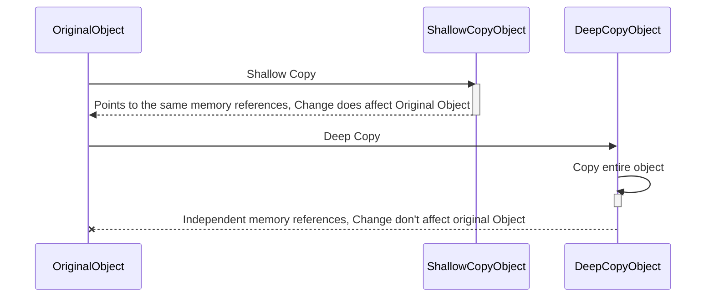

## Creating a Deep vs. Shallow Copy of an Object in Java

### 1. Introduction

Understanding the difference between shallow and deep copies is crucial for managing object references in Java. In this article, we will explore these concepts using a simple system configuration example. By the end, you will understand how and when to use
shallow and deep copies effectively.



### 2. Use case : System configuration

Suppose we have a `SystemConfig` class representing the configuration of an application, and `Setting` class for individual settings. We'll demonstrate how Shallow and Deep copies are created using these classes.

#### SystemConfig Class

```java
public class SystemConfig {

    private int id;
    private Setting setting;

    public SystemConfig(int id, Setting setting) {
        this.id = id;
        this.setting = setting;
    }

    public SystemConfig(SystemConfig systemConfig) {
        this.id = systemConfig.id;
        this.setting = new Setting(systemConfig.setting);
    }

    public void setId(int id) {
        this.id = id;
    }

    public void setSetting(Setting setting) {
        this.setting = setting;
    }

    public int getId() {
        return id;
    }

    public Setting getSetting() {
        return setting;
    }
}
```

#### Setting Class

```java
public class Setting {

    private String name;
    private String value;

    public Setting(String name, String value) {
        this.name = name;
        this.value = value;
    }

    public Setting(Setting setting) {
        this.name = setting.name;
        this.value = setting.value;
    }

    @Override
    public String toString() {
        return "Setting{name='" + name + "', value='" + value + "'}";
    }
}
```

### 3. Shallow Copy

A shallow copy creates a new instance that shares references with the original object. This means any change in one object is reflected in the other. Shallow copies are beneficial for immutable objects, as they minimize the risk of unintended modifications and
reduce potential bugs.

```java
Setting initialSetting = new Setting("MaxConnections", "120");
SystemConfig config1 = new SystemConfig(1, initialSetting);

//        Shallow copy  
SystemConfig config2 = config1;  
config2.

setId(2);  
config2.

setSetting(new Setting("Timeout", "20s"));

    System.out.

println("Original Config ID: "+config1.getId() +"\nOriginal Config Setting: "+config1.

getSetting());
    System.out.

println("Shallow Copy Config ID: "+config2.getId() +"\nShallow copy Config Setting: "+config2.

getSetting());
```

#### Output

```sh
Original Config ID: 2
Original Config Setting: Setting{name='Timeout', value='20s'}
Shallow Copy Config ID: 2
Shallow copy Config Setting: Setting{name='Timeout', value='20s'}
```

> In the code snippet above, `config1` and `config2` reference the same memory area. Therefore, changes to `config2` also affect `config1`. This behavior demonstrates that a shallow copy results in both objects sharing the same underlying data, which is why
> updates to `config2` impact the original `config1` object.

### 4. Deep Copy

A deep copy creates a completely independent copy of the original object, including all objects it references. Unlike a shallow copy, which only duplicates the top-level structure and shares references to nested objects, a deep copy recursively duplicates
every object within the original structure. This ensures that changes to the copied object do not affect the original object and vice versa.

```java
//        Deep copy  
Setting initialSetting = new Setting("MaxConnections", "120");
SystemConfig config1 = new SystemConfig(1, initialSetting);

SystemConfig config3 = new SystemConfig(config1);  
config3.

setId(3);  
config3.

setSetting(new Setting("MemoryLimit", "2GB"));

    System.out.

println("Original Config ID: "+config1.getId() +"\nOriginal Config Setting: "+config1.

getSetting());
    System.out.

println("Deep Copy Config ID: "+config3.getId() +"\nDeep copy Config Setting: "+config3.

getSetting());
```

#### Output

```sh
Original Config ID: 1
Original Config Setting: Setting{name='MaxConnections', value='120'}
Deep Copy Config ID: 3
Deep copy Config Setting: Setting{name='MemoryLimit', value='2GB'}
```

> In the code snippet above, `config3` is an independent copy of `config1`. Changes to `config3` do not affect or reflect in `config1`. This demonstrates the behavior of a deep copy, where each object and its references are fully duplicated, ensuring complete
> separation between the original and the copied object.

### 5. Unit test

#### 5.1. Shallow Copy

This unit test verifies the behavior of shallow copying in Java. It checks that changes to the shallow-copied object also affect the original object, confirming that both objects share references to the same underlying data. This ensures the test correctly
identifies the shared reference nature of shallow copies.

```java
public class ShallowCopyTest {

    @Test
    public void shallowCopy() {
        Setting originalSetting = new Setting("MaxConnections", "120");
        SystemConfig originalConfig = new SystemConfig(1, originalSetting);

        //        Create a Shallow copy  
        SystemConfig shallowCopyConfig = originalConfig;
        shallowCopyConfig.setId(2);
        shallowCopyConfig.setSetting(new Setting("Timeout", "20s"));

        //        Assert if changes affect the original object  
        assertEquals(2, originalConfig.getId());
        assertEquals("Setting{name='Timeout', value='20s'}", originalConfig.getSetting()
            .toString());
    }
}
```

#### 5.2. Deep Copy

This unit test verifies the behavior of deep copying in Java. It ensures that changes to the deep-copied object do not affect the original object, confirming that both objects are completely independent with their own distinct copies of all referenced objects.

```java
public class DeepCopyTest {

    @Test
    public void deepCopy() {
        Setting originalSetting = new Setting("MaxConnections", "120");
        SystemConfig originalConfig = new SystemConfig(1, originalSetting);

        //        Create a Deep copy  
        SystemConfig copiedConfig = new SystemConfig(originalConfig);
        copiedConfig.setId(3);
        copiedConfig.setSetting(new Setting("MemoryLimit", "2GB"));

        //        Assert if original object remains unchanged  
        assertEquals(1, originalConfig.getId());
        assertEquals("Setting{name='MaxConnections', value='120'}", originalConfig.getSetting()
            .toString());

        //        Assert if copied object has new values  
        assertEquals(3, copiedConfig.getId());
        assertEquals("Setting{name='MemoryLimit', value='2GB'}", copiedConfig.getSetting()
            .toString());
    }
}
```

### 6. Summary

In a shallow copy, objects share references, leading to potential side effects. If a copied shallow object is updated, the original object is also changed. Conversely, a deep copy creates completely independent objects, so changes to the copied object do not
affect the original. Understanding these concepts helps in managing object states effectively and choosing the appropriate copying method. For the full source code, kindly find it on this link **[Github](https://github.com/shyakadev/java-copy-object)**.


