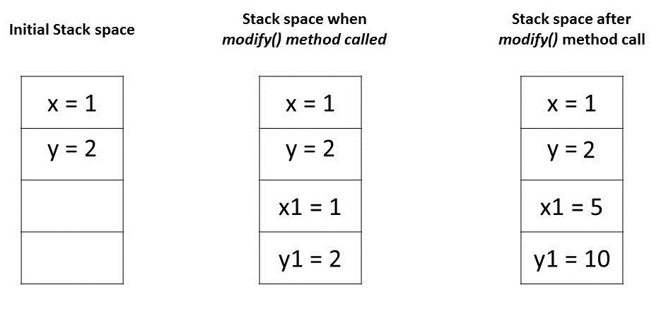
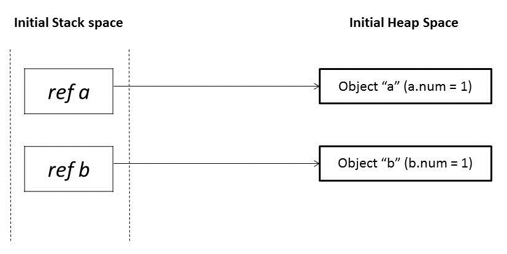
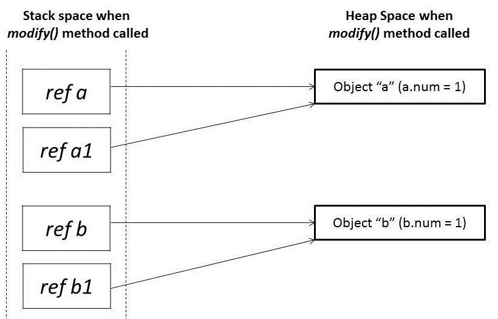
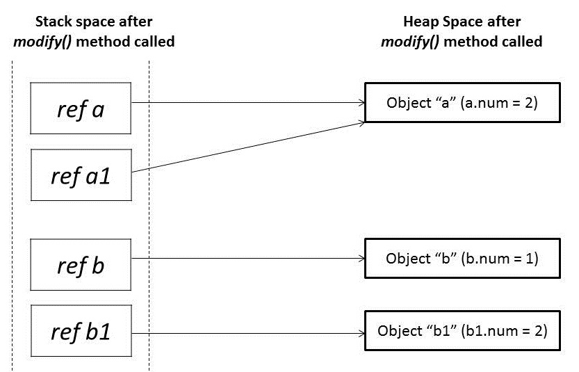

# Core Java Lang OOP - Others

This module contains articles about Object Oriented Programming (OOP) in Java

## 在Java中作为参数传递机制的 "逐值传递"（Pass-By-Value）。

1. 简介

    向方法传递参数的两种最普遍的模式是 "按值传递" 和 "按参考传递"。不同的编程语言以不同的方式使用这些概念。就Java而言，一切都是严格的逐值传递。

    在本教程中，我们将说明Java如何传递各种类型的参数。

2. 逐值传递与逐指传递

    让我们先来看看向函数传递参数的一些不同机制。

    - 值
    - 参考 reference
    - 结果
    - 值-结果 value-result
    - 名称 name

    现代编程语言中最常见的两种机制是 "逐值传递 "和 "逐指传递"。在我们继续之前，让我们先讨论一下这些。

    1. 逐值传递

        当一个参数是逐值传递时，调用者和被调用者方法对两个不同的变量进行操作，这些变量是彼此的副本。对一个变量的任何改变都不会修改另一个。

        这意味着在调用一个方法时，传递给被调用方法的参数将是原始参数的克隆。在被调用者方法中做的任何修改都不会对调用者方法中的原始参数产生影响。

    2. 通过引用的传递

        当一个参数是通过引用的时候，调用者和被调用者在同一个对象上操作。

        这意味着，当一个变量被传递给参考时，该对象的唯一标识符被发送到方法中。对参数的实例成员的任何改变都会导致对原始值的这种改变。

3. Java中的参数传递

    任何编程语言的基本概念都是 "值" 和 "引用"。在Java中，原始变量存储实际值，而非原始变量存储引用变量，这些变量指向它们所引用的对象的地址。值和引用都存储在堆栈内存中。

    Java中的参数总是按值传递的。在方法调用过程中，每个参数的副本，无论是值还是引用，都会在堆栈内存中创建，然后传递给方法。

    如果是基元，值被简单地复制到堆栈内存中，然后传递给被调用的方法；如果是非基元，堆栈内存中的引用指向驻留在堆中的实际数据。当我们传递一个对象时，堆栈内存中的引用被复制，新的引用被传递给方法。

    现在让我们在一些代码例子的帮助下看看这个动作。

    1. 传递原始类型

        Java编程语言有八个[原始数据类型](https://www.baeldung.com/java-primitives)。原始变量直接存储在堆栈内存中。每当任何原始数据类型的变量被作为参数传递时，实际参数被复制到形式参数，这些形式参数在堆栈内存中积累了自己的空间。

        这些形式参数的寿命只持续到该方法运行时，在返回时，这些形式参数会从堆栈中清除并被丢弃。

        让我们试着借助一个代码例子来理解它。

        parameterpassing/PrimitivesUnitTest.java

        让我们试着通过分析这些值是如何存储在内存中的，来理解上述程序中的断言。

        - 主方法中的变量 "x "和 "y "是原始类型，它们的值直接存储在堆栈内存中。
        - 当我们调用方法modify()时，这些变量的每一个副本都被创建并存储在堆栈内存中的不同位置。
        - 对这些副本的任何修改都只影响它们，而使原始变量不被改变。

        

    2. 传递对象引用

        在Java中，所有的对象都动态地存储在引擎盖下的Heap空间中。这些对象从被称为引用变量的参考中被引用。

        一个Java对象，与Primitives相反，是分两个阶段存储的。引用变量被存储在堆栈内存中，而它们所引用的对象则被存储在堆内存中。

        每当一个对象被作为参数传递时，就会创建一个引用变量的精确副本，它与原始引用变量一样，指向堆内存中的对象的相同位置。

        因此，每当我们在方法中对同一对象做任何改变时，这种改变就会反映在原始对象上。然而，如果我们为传递的引用变量分配一个新的对象，那么它将不会反映在原始对象中。

        让我们借助于一个代码例子来理解这个问题。

        parameterpassing/NonPrimitivesUnitTest.java

        让我们分析一下上述程序中的断言。我们在modify()方法中传递了具有相同值1的对象a和b。最初，这些对象引用是指向堆(heap)空间中两个不同的对象位置。

        

        当这些引用a和b被传递到modify()方法中时，它创建了这些引用a1和b1的镜像副本，它们指向相同的旧对象。

        

        在modify()方法中，当我们修改引用a1时，它改变了原始对象。然而，对于引用b1，我们已经分配了一个新的对象。所以它现在是指向堆内存中的一个新对象。

        对b1所做的任何改变都不会反映在原始对象中。

        

4. 总结

    在这篇文章中，我们看了在基元和非基元的情况下是如何处理参数传递的。

    我们了解到，Java中的参数传递始终是逐值传递。然而，根据我们处理的是基元还是对象，情况会发生变化。

    - 对于基元类型，参数是逐值传递的。
    - 对于对象类型，对象引用是逐值传递的。

    本文中使用的代码片段可以在[GitHub](https://github.com/eugenp/tutorials/tree/master/core-java-modules/core-java-lang-oop-others)上找到。

## Relevant Articles

- [Object-Oriented-Programming Concepts in Java](https://www.baeldung.com/java-oop)
- [Static and Dynamic Binding in Java](https://www.baeldung.com/java-static-dynamic-binding)
- [x] [Pass-By-Value as a Parameter Passing Mechanism in Java](https://www.baeldung.com/java-pass-by-value-or-pass-by-reference)
- [Check If All the Variables of an Object Are Null](https://www.baeldung.com/java-check-all-variables-object-null)
