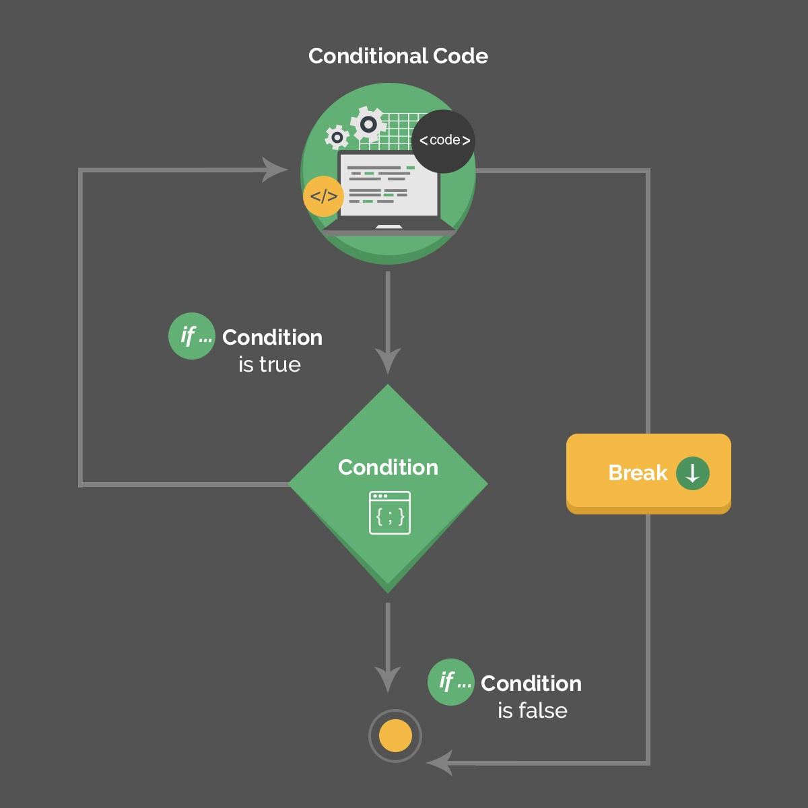
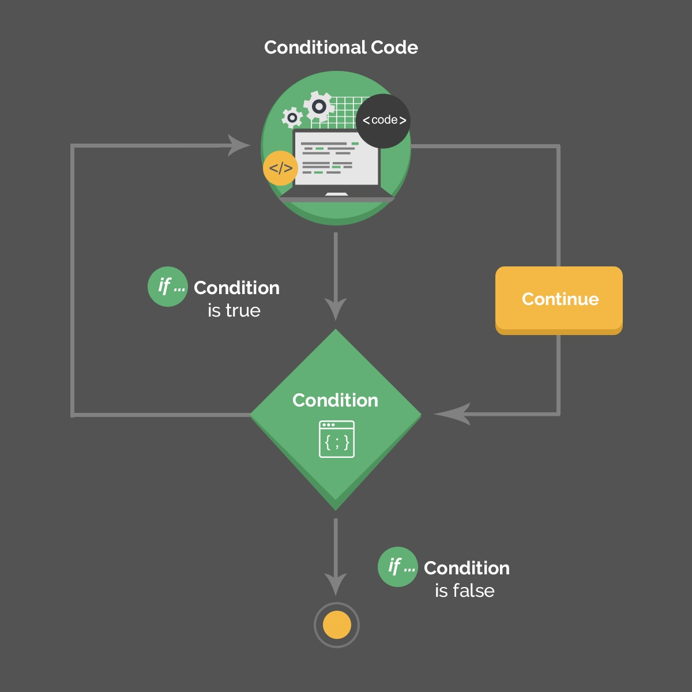

# Core Java Lang

## 用Eclipse生成equals()和hashCode()

1. 简介

    在这篇文章中，我们将探讨如何使用 Eclipse IDE 生成 equals() 和 hashCode() 方法。我们将说明Eclipse的代码自动生成功能是多么强大和方便，同时也强调对代码进行勤奋的测试仍然是必要的。

2. 规则

    Java中的equals()是用来检查2个对象是否相等的。测试的一个好方法是确保对象是对称的、反身的和传递的。也就是说，对于三个非空对象a、b和c。

    - 对称的 Symmetric - a.equals(b)当且仅当b.equals(a)。
    - 反射的 Reflexive - a.equals(a)
    - 传递性 Transitive - 如果a.equals(b)和b.equals(c)，那么a.equals(c)

    hashCode()必须遵守一条规则。

    - 2个被equals()的对象必须有相同的hashCode()值。

3. 带有原语的类

    让我们考虑一个只由原始成员变量组成的Java类。

    equalshashcode.entities/PrimitiveClass.java

    我们使用Eclipse IDE，用'Source->Generate hashCode() and equals()'来生成equals()和hashCode()。

    我们可以通过选择'Select All'来确保所有的成员变量都包括在内。

    请注意，在插入点下面列出的选项：影响生成的代码的风格。在这里，我们不选择任何一个选项，选择'OK'，hashCode()、equals(Object obj)方法就被添加到我们的类中。

    生成的hashCode()方法以一个质数（31）的声明开始，对原始对象进行各种操作，并根据对象的状态返回其结果。

    equals()首先检查两个对象是否是同一个实例（==），如果是则返回真。

    接下来，它检查比较对象是否为非空，两个对象是否属于同一类别，如果不是则返回false。

    最后，equals()检查每个成员变量是否相等，如果其中任何一个不相等，则返回false。

    所以我们可以编写简单的测试。

    参见 PrimitiveClassUnitTest.java

4. 带有集合和泛型的类

    现在，让我们考虑一个带有集合和泛型的更复杂的Java类。

    equalshashcode.entities/ComplexClass.java

    我们再次使用Eclipse'Source->Generate hashCode() and equals()'。注意hashCode()使用instanceOf来比较类对象，因为我们在对话框的Eclipse选项中选择了'使用'instanceof'来比较类型'。

    生成的hashCode()方法依赖于AbstractList.hashCode()和AbstractSet.hashCode()的核心Java方法。这些方法遍历一个集合，将每个项目的hashCode()值相加，并返回一个结果。

    同样，生成的equals()方法使用AbstractList.equals()和AbstractSet.equals()，它们通过比较集合的字段来比较它们是否相等。

    我们可以通过测试一些例子来验证其健壮性。

    参见 ComplexClassUnitTest.java

5. 继承

    让我们考虑一下使用继承的Java类。

    ```java
    public abstract class Shape {
        public abstract double area();
        public abstract double perimeter();
    }
    ```

    如果我们在 Square 类（extends Shape）上尝试 "Source->Generate hashCode() and equals() "，Eclipse 警告我们 ‘the superclass ‘Rectangle' does not redeclare equals() and hashCode() : the resulting code may not function correctly'。

    同样地，当我们试图在矩形类上生成hashCode()和equals()时，我们得到了一个关于超类'Shape'的警告。

    尽管有警告，Eclipse还是会允许我们继续前进。在 Rectangle 的情况下，它扩展了一个抽象的 Shape 类，它不能实现 hashCode() 或 equals() ，因为它没有具体的成员变量。对于这种情况，我们可以不理会 Eclipse。

    然而，Square 类从 Rectangle 继承了宽度和长度成员变量，以及它自己的颜色变量。在Square中创建hashCode()和equals()，而不先对Rectangle做同样的事情，意味着在equals()/hashCode()中只使用颜色。

    一个简单的测试告诉我们，如果只是宽度不同，Square的equals()/hashCode()是不够的，因为宽度不包括在equals()/hashCode()的计算中。

    让我们通过使用Eclipse为矩形类生成equals()/hashCode()来解决这个问题。

    我们必须在Square类中重新生成equals()/hashCode()，所以Rectangle的equals()/hashCode()被调用。在这次生成的代码中，我们选择了Eclipse对话框中的所有选项，所以我们看到了注释、instanceOf比较和if块。

    重新运行上面的测试，我们现在通过了，因为Square的hashCode()/equals()被正确计算。

    > With Java 8’s "default method" feature, any abstract class without direct or inherited field should be converted into an interface. However, this change may not be appropriate in libraries or other applications where the class is intended to be used as an API. 将 Shape 改为接口.

## Java中的比较器和可比性

1. 简介

    在Java中，比较是很容易的，直到它们不那么容易。

    当使用自定义类型时，或者试图比较不能直接比较的对象时，我们需要使用一个比较策略。我们可以通过使用比较器或可比较接口来建立一个比较策略。

2. 设置实例

    让我们用一个足球队的例子来说明，我们想按照球员的排名来排队。

    我们将从创建一个简单的球员类开始。

    ```java
    public class Player {
        private int ranking;
        private String name;
        private int age;
        // constructor, getters, setters  
    }
    ```

    接下来，我们将创建一个PlayerSorter类来创建我们的集合，并尝试使用Collections.sort对其进行排序。

    comparable/PlayerSorter.java

    正如所料，这导致了一个编译时错误。

    ```log
    The method sort(List<T>) in the type Collections 
    is not applicable for the arguments (ArrayList<Player>)
    ```

    现在让我们试着理解我们在这里做错了什么。

3. 可比

    顾名思义，Comparable是一个接口，定义了一个对象与其他相同类型的对象进行比较的策略。这被称为该类的 "自然排序"。

    为了能够进行排序，我们必须通过实现可比较接口将我们的播放器对象定义为可比较对象。

    `public class Player implements Comparable<Player>`

    comparable/Player.java

    排序顺序是由compareTo()方法的返回值决定的。Integer.compare(x, y)如果x小于y，返回-1，如果它们相等，返回0，否则返回1。

    该方法返回一个数字，表明被比较的对象是否小于、等于或大于作为参数传递的对象。

    现在当我们运行我们的PlayerSorter时，我们可以看到我们的球员按照他们的排名进行排序。

    ```log
    Before Sorting : [John, Roger, Steven]
    After Sorting : [Steven, John, Roger]
    ```

    现在我们对使用Comparable的自然排序有了清楚的了解，让我们看看如何以比直接实现接口更灵活的方式使用其他类型的排序。

4. 比较器

    比较器接口定义了一个有两个参数的compare(arg1, arg2)方法，这两个参数代表被比较的对象，其工作原理与Comparable.compareTo()方法类似。

    1. 创建比较器

        为了创建一个比较器，我们必须实现比较器接口。

        对于我们的第一个例子，我们将创建一个比较器来使用Player的排名属性来对球员进行排序。

        comparator/PlayerRankingComparator.java

        同样地，我们可以创建一个比较器来使用播放器的年龄属性来对球员进行排序。

        comparator/PlayerAgeComparator.java

    2. 行动中的比较器

        为了演示这个概念，让我们修改我们的PlayerSorter，为Collections.sort方法引入第二个参数，这实际上是我们想要使用的比较器的实例。

        使用这种方法，我们可以覆盖自然排序。

        ```java
        // comparator/PlayerRankingSorter.java
        PlayerRankingComparator playerComparator = new PlayerRankingComparator();
        Collections.sort(footballTeam, playerComparator);
        ```

        现在让我们运行我们的 PlayerRankingSorter 来看看结果。

        ```log
        Before Sorting : [John, Roger, Steven]
        After Sorting by age : [Roger, John, Steven]
        ```

        如果我们想要一个不同的排序顺序，我们只需要改变我们使用的比较器。

        ```java
        // comparator/PlayerAgeSorter.java
        PlayerAgeComparator playerComparator = new PlayerAgeComparator();
        Collections.sort(footballTeam, playerComparator);
        ```

        现在当我们运行我们的PlayerAgeSorter时，我们可以看到不同的按年龄排序的顺序。

        ```log
        Before Sorting : [John, Roger, Steven]
        After Sorting by age : [Roger, John, Steven]
        ```

    3. Java 8的比较器

        Java 8提供了通过使用lambda表达式和comparing()静态工厂方法来定义比较器的新方法。

        参见 Java8ComparatorUnitTest.java

        让我们看看如何使用lambda表达式来创建比较器的一个快速例子。

        ```java
        Comparator byRanking = 
        (Player player1, Player player2) -> Integer.compare(player1.getRanking(), player2.getRanking());
        ```

        Comparator.comparing方法接收一个计算将用于比较项目的属性的方法，并返回一个匹配的比较器实例。

        ```java
        Comparator<Player> byRanking = Comparator
        .comparing(Player::getRanking);
        Comparator<Player> byAge = Comparator
        .comparing(Player::getAge);
        ```

5. 比较器与可比较接口

    对于定义默认排序，或者换句话说，如果它是比较对象的主要方式，那么使用Comparable接口是个不错的选择。

    那么如果我们已经有了Comparable，为什么还要使用 Comparator 呢？

    有几个原因。

    - 有时我们无法修改我们想要排序的对象的类的源代码，因此不可能使用Comparable
    - 使用Comparator可以让我们避免在我们的领域类中添加额外的代码
    - 我们可以定义多种不同的比较策略，这在使用Comparable是不可能的

6. 避开减法技巧

    在本教程的过程中，我们已经使用Integer.compare()方法来比较两个整数。然而，有人可能会说，我们应该用这个聪明的 one-liner 方法来代替。

    `Comparator<Player> comparator = (p1, p2) -> p1.getRanking() - p2.getRanking();`

    虽然它比其他解决方案要简洁得多，但在Java中它可能是整数溢出的受害者。

    Comparator/AvoidingSubtractionUnitTest.java

    由于-1远远小于Integer.MAX_VALUE，在排序后的集合中，"Roger"应该排在 "John"之前。然而，由于整数溢出，"Integer.MAX_VALUE - (-1)"将小于零。所以根据比较器/可比较契约，Integer.MAX_VALUE小于-1，这显然是不正确的。

    因此，尽管我们预期，在排序的集合中 "John"排在 "Roger"之前。

    > 运行结果: Roger,John 正常？

7. 总结

    在这篇文章中，我们探讨了Comparable和Comparator接口，并讨论了它们之间的区别。

    要了解更多关于排序的高级话题，请查看我们的其他文章，如[Java 8 Comparator.comparing](https://www.baeldung.com/java-8-comparator-comparing)，以及[Java 8与Lambdas的比较](https://github.com/eugenp/tutorials/tree/master/core-java-modules/core-java-lambdas)。

## Java中的递归

1. 简介

    在这篇文章中，我们将重点讨论任何编程语言中的一个核心概念--递归(recursive)。

    我们将解释递归函数的特点，并展示如何使用递归来解决Java中的各种问题。

2. 理解递归

    1. 定义

        在Java中，函数调用机制支持让一个方法调用自己的可能性。这种功能被称为递归。

        例如，假设我们要对从0到某个数值n的整数进行求和。

        ```java
        public int sum(int n) {
            if (n >= 1) {
                return sum(n - 1) + n;
            }
            return n;
        }
        ```

        递归函数有两个主要要求。

        - 一个停止条件--当某个条件得到满足时，函数返回一个值，而不需要进一步的递归调用
        - 递归调用--函数用一个离停止条件更近一步的输入来调用自己
        每一次递归调用都会在JVM的堆栈内存中增加一个新的框架。因此，如果我们不注意我们的递归调用可以潜入多深，可能会发生内存不足的异常。

        这个潜在的问题可以通过利用尾部递归优化(tail-recursion)来避免。

    2. 尾部递归与头部递归的比较

        当递归调用是该函数执行的最后一件事时，我们把递归函数称为尾部递归(Tail Recursion)。否则，它就被称为头部递归(Head Recursion)。

        我们上面的sum()函数的实现是头部递归的一个例子，可以改为尾部递归。

        ```java
        public int tailSum(int currentSum, int n) {
            if (n <= 1) {
                return currentSum + n;
            }
            return tailSum(currentSum + n, n - 1);
        }
        ```

        在尾部递归中，递归调用是方法的最后一件事，所以在当前函数中没有任何东西可以执行。

        因此，从逻辑上讲，不需要存储当前函数的堆栈框架。

        尽管编译器可以利用这一点来优化内存，但需要注意的是，Java编译器暂时没有对尾部递归进行优化。

    3. 递归与迭代

        递归可以帮助简化一些复杂问题的实现，使代码更清晰、更易读。

        但是正如我们已经看到的，递归方法往往需要更多的内存，因为每次递归调用所需的堆栈内存都会增加。

        作为一种选择，如果我们可以用递归来解决一个问题，我们也可以用迭代(Iteration)来解决它。

        例如，我们的求和方法就可以用迭代来实现。

        ```java
        public int iterativeSum(int n) {
            int sum = 0;
            if(n < 0) {
                return -1;
            }
            for(int i=0; i<=n; i++) {
                sum += i;
            }
            return sum;
        }
        ```

        与递归相比，迭代方法有可能带来更好的性能。也就是说，与递归相比，迭代会更复杂，更难理解，例如：遍历二叉树(traversing a binary tree)。

        在头部递归、尾部递归和迭代方法之间做出正确的选择，都取决于具体问题和情况。

3. 例子

    现在，让我们试着用递归的方式解决一些问题。

    1. 寻找10的N次方

        假设我们需要计算10的N次方。以递归的方式思考，我们可以先计算10的(n-1)次方，然后将结果乘以10。

        然后，计算10的(n-1)-次方，将是10的(n-2)-次方，并将结果乘以10，如此类推。我们将继续这样做，直到我们需要计算10的（n-n）次方，也就是1。

        RecursionExample.powerOf10(int n)

    2. 寻找斐波那契数列的N-Th元素

        从0和1开始，斐波那契数列(Fibonacci Sequence)是一个数字序列，每个数字都被定义为它前面两个数字的总和。0 1 1 2 3 5 8 13 21 34 55 ...

        因此，给定一个数字n，我们的问题是找到斐波那契数列的第n个元素。为了实现递归解决方案，我们需要弄清楚停止条件和递归调用。

        幸运的是，这其实是很简单的。

        让我们称f(n)为序列的第n个值。然后我们将有f(n)=f(n-1)+f(n-2)（递归调用）。

        同时，f(0)=0，f(1)=1（停止条件）。

        那么，对我们来说，定义一个递归方法来解决这个问题真的很明显。

        RecursionExample.fibonacci(int n)

    3. 从十进制到二进制的转换

        现在，让我们考虑将一个十进制数转换为二进制数的问题。我们的要求是实现一个接收正整数值n并返回二进制字符串表示的方法。

        将十进制数转换为二进制的一种方法是将该值除以2，记录余数，然后继续除以2的商。

        我们一直这样除下去，直到得到一个0的商。然后，通过按保留顺序写出所有的余数，我们得到二进制字符串。

        因此，我们的问题是写一个方法，按保留顺序返回这些余数。

        RecursionExample.toBinary(int n)

    4. 二叉树的高度

        二叉树的高度被定义为从根到最深的叶子的边的数量。我们现在的问题是为一个给定的二叉树计算这个值。

        一个简单的方法是找到最深的叶子，然后计算根和该叶子之间的边。

        但是，为了考虑一个递归的解决方案，我们可以把二叉树的高度定义重述为根的左分支和根的右分支的最大高度，再加上1。

        如果根没有左分支和右分支，其高度为零。

        下面是我们的实现。

        RecursionExample.calculateTreeHeight(BinaryNode root)

        因此，我们看到，有些问题可以用递归的方式来解决，非常简单。

## Java中finalize方法的指南

1. 概述

    在本教程中，我们将重点讨论Java语言的一个核心方面--由根对象类提供的finalize方法。

    简单地说，这是在对某一特定对象进行垃圾收集之前调用的。

2. 使用终结者

    finalize()方法被称为finalizer。

    当JVM发现这个特定的实例应该被垃圾回收时，就会调用终结者。这样的终结者可以执行任何操作，包括让对象复活。

    然而，终结者的主要目的是在对象从内存中删除之前释放其使用的资源。终结器可以作为清理操作的主要机制，也可以作为其他方法失败时的安全网。

    为了理解终结器是如何工作的，我们来看看一个类的声明。

    finalize/Finalizable.java

    Finalizable类有一个字段阅读器，它引用一个可关闭的资源。当从这个类中创建一个对象时，它会构造一个新的BufferedReader实例，从classpath中的一个文件读取。

    这样一个实例被用于readFirstLine方法，以提取给定文件中的第一行。

    我们可以用一个终结者来做到这一点。

    很容易看出，最终器的声明就像任何普通的实例方法一样。

    实际上，垃圾收集器调用最终器的时间取决于JVM的实现和系统的条件，这些都是我们无法控制的。

    为了使垃圾收集在现场发生，我们将利用System.gc方法。在现实世界的系统中，我们不应该显式地调用该方法，原因有很多。

    它的成本很高

    - 它不会立即触发垃圾收集 - 它只是提示JVM开始GC
    - JVM更清楚什么时候需要调用GC
    - 如果我们需要强制GC，我们可以使用jconsole来实现。

    下面是一个测试案例，演示了一个终结者的操作。

    finalize/FinalizeUnitTest.whenGC_thenFinalizerExecuted()

    在第一条语句中，一个Finalizable对象被创建，然后它的readFirstLine方法被调用。这个对象没有分配给任何变量，因此当System.gc方法被调用时，它就有资格进行垃圾回收。

    测试中的断言验证了输入文件的内容，只是用来证明我们的自定义类如预期那样工作。

    当我们运行所提供的测试时，在控制台中会打印出一条关于缓冲的阅读器在finalizer中被关闭的信息。这意味着finalize方法被调用，它已经清理了资源。

    到此为止，终结者看起来是一个预销毁操作的好方法。然而，这并不完全正确。

    在下一节，我们将看到为什么要避免使用它们。

3. 避免终结者

    尽管终结者带来了很多好处，但也有很多弊端。

    1. 终结器的缺点

        让我们来看看在使用终结者来执行关键动作时，我们会遇到的几个问题。

        第一个明显的问题是缺乏及时性。我们无法知道终结者何时运行，因为垃圾回收可能随时发生。

        就其本身而言，这并不是一个问题，因为终结者还是会执行的，或早或晚。然而，系统资源并不是无限的。因此，我们可能在清理发生之前就耗尽了资源，这可能会导致系统崩溃。

        终结器对程序的可移植性也有影响。由于垃圾收集算法与JVM的实现有关，一个程序可能在一个系统上运行得非常好，而在另一个系统上的表现却不同。

        性能成本是终结者带来的另一个重要问题。具体来说，JVM在构造和销毁包含非空终结者的对象时必须执行更多的操作。

        我们要讨论的最后一个问题是在最终化过程中缺乏对异常的处理。如果一个终结者抛出一个异常，终结过程就会停止，使对象处于损坏的状态而没有任何通知。

    2. 终结器的效果演示

        现在是时候抛开理论，看看终结者在实践中的效果了。

        让我们定义一个带有非空终结器的新类。

        finalize/CrashedFinalizable.java

        注意finalize()方法 - 它只是向控制台打印一个空字符串。如果这个方法完全是空的，JVM就会把这个对象当作没有终结器的对象。因此，我们需要为finalize()提供一个实现，在这种情况下它几乎什么都不做。

        在main方法中，一个新的CrashedFinalizable实例在for循环的每个迭代中被创建。这个实例没有分配给任何变量，因此有资格进行垃圾回收。

        让我们添加一些语句，看看在运行时内存中存在多少对象。

        给出的语句访问JVM内部类中的一些字段，并在每百万次迭代后打印出对象引用的数量。

        让我们通过执行main方法来启动程序。我们可能期望它无限期地运行，但事实并非如此。几分钟后，我们应该看到系统崩溃，出现类似这样的错误。

        ```log
        ...
        There are 26231621 references in the queue
        There are 26975913 references in the queue
        Exception in thread "main" java.lang.OutOfMemoryError: GC overhead limit exceeded
            at java.lang.ref.Finalizer.register(Finalizer.java:91)
            at java.lang.Object.<init>(Object.java:37)
            at com.baeldung.finalize.CrashedFinalizable.<init>(CrashedFinalizable.java:6)
            at com.baeldung.finalize.CrashedFinalizable.main(CrashedFinalizable.java:9)
        Process finished with exit code 1
        ```

        看起来垃圾收集器没有做好它的工作--对象的数量不断增加，直到系统崩溃。

        如果我们去掉终结器，引用的数量通常为0，程序将永远运行下去。

    3. 解释

        为了理解为什么垃圾收集器没有按规定丢弃对象，我们需要看一下JVM的内部工作方式。

        当创建一个具有终结器的对象（也称为引用）时，JVM会创建一个附带的java.lang.ref.Finalizer类型的引用对象。在引用对象准备好进行垃圾回收后，JVM将引用对象标记为准备好进行处理，并将其放入一个引用队列中。

        我们可以通过java.lang.ref.Finalizer类中的静态字段队列访问这个队列。

        同时，一个名为Finalizer的特殊守护线程不断运行，并在引用队列中寻找对象。当它找到一个时，它会从队列中移除引用对象，并调用引用者的finalizer。

        在下一个垃圾收集周期中，参考对象将被丢弃--当它不再被参考对象引用时。

        如果一个线程一直在高速生产对象，这就是我们的例子中发生的情况，Finalizer线程无法跟上。最终，内存将无法存储所有的对象，我们最终会出现OutOfMemoryError。

        请注意，像本节中所示的对象以极快的速度被创建的情况在现实生活中并不经常发生。然而，它展示了一个重要的观点--终结者是非常昂贵的。

4. 无终结器实例

    让我们探讨一个提供相同功能但不使用finalize()方法的解决方案。请注意，下面的例子并不是取代最终处理程序的唯一方法。

    相反，它被用来证明一个重要的观点：总是有一些选项可以帮助我们避免使用终结者。

    下面是我们新类的声明。

    finalize/CloseableResource.java

    不难看出，新的CloseableResource类与我们之前的Finalizable类的唯一区别是实现了AutoCloseable接口，而不是定义了一个终结器。

    注意到CloseableResource的close方法的主体与Finalizable类中finalizer的主体几乎一样。

    下面是一个测试方法，它读取一个输入文件并在完成工作后释放资源。

    FinalizeUnitTest.whenTryWResourcesExits_thenResourceClosed()

    在上面的测试中，一个CloseableResource实例是在try-with-resources语句的try块中创建的，因此，当try-with-resources块执行完毕时，该资源会自动关闭。

    运行给定的测试方法，我们会看到从CloseableResource类的close方法中打印出来的信息。

5. 总结

    在本教程中，我们关注了Java中的一个核心概念--finalize方法。这在纸面上看起来很有用，但在运行时可能会产生丑陋的副作用。而且，更重要的是，除了使用finalizer之外，总是有其他的解决方案。

    需要注意的一个关键点是，finalize已经从Java 9开始被废弃了--而且最终会被删除。

## java.lang.System快速指南

快速了解java.lang.System类及其特点和核心功能。

1. IO

    System是java.lang的一部分，它的主要功能之一是让我们访问标准的I/O流。

    简单地说，它暴露了三个字段，每个字段都有一个。

    - out
    - err
    - in

    1. System.out

        System.out指向标准输出流，将其暴露为PrintStream，我们可以用它来打印文本到控制台。

        `System.out.print("some inline message");`

        System的一个高级用法是调用System.setOut，我们可以用它来定制System.out要写到的位置。

        重定向到一个文本文件：`System.setOut(new PrintStream("filename.txt"));`

    2. System.err

        System.err与System.out很像。两个字段都是PrintStream的实例，都是用于向控制台打印信息。

        但System.err代表标准错误，我们专门用它来输出错误信息。

        `System.err.print("some inline error message");`

        控制台通常会以不同于输出流的方式渲染错误流。

        欲了解更多信息，请查看[PrintStream](https://docs.oracle.com/en/java/javase/11/docs/api/java.base/java/io/PrintStream.html)文档。

    3. System.in

        System.in指向标准的in，将其暴露为一个InputStream，我们可以用它来读取控制台的输入。

        虽然有点麻烦，但我们还是可以做到的。

        system/UserCredentials.readUsername(int length) throws IOException {}

        通过调用System.in.read，应用程序停止并等待来自标准in的输入。无论下一个长度是多少字节，都将从流中读取并存储在字节数组中。

        用户输入的任何其他内容都会留在流中，等待另一次调用读取。

        当然，在这么低的水平上操作是很有挑战性和容易出错的，所以我们可以用BufferedReader把它清理一下。

        system/UserCredentials.readUsername()

        如上，readLine将从System.in中读取数据，直到用户点击返回，这有点接近我们可能期望的结果。

        注意，在这种情况下，我们特意没有关闭流。关闭标准的in意味着在程序的生命周期内不能再被读取了。

        最后，System.in的一个高级用法是调用System.setIn将其重定向到一个不同的InputStream。

2. 实用方法

    系统为我们提供了许多方法来帮助我们处理一些事情，比如。

    - Accessing the console
    - Copying arrays
    - Observing date and time
    - Exiting the JRE
    - Accessing runtime properties
    - Accessing environment variables, and
    - Administering garbage collection

    1. 访问控制台

        Java 1.6引入了另一种与控制台交互的方式，而不是简单地直接使用System.out和in。

        我们可以通过调用System.console来访问它。

        system/UserCredentials.readUsernameWithPrompt()

        注意，根据底层操作系统和我们启动Java运行当前程序的方式，console可能会返回null，所以使用前一定要检查。

        请查看[控制台](https://docs.oracle.com/en/java/javase/11/docs/api/java.base/java/io/Console.html)文档以了解更多的用途。

    2. 复制数组

        System.arraycopy是一种老式的C语言方式，可以将一个数组复制到另一个数组。

        大多数情况下，arraycopy的目的是将一个完整的数组复制到另一个数组中。

        SystemArrayCopyUnitTest.java

        然而，我们可以指定两个数组的起始位置，以及要复制多少个元素。

        例如，我们想从a中复制2个元素，从a[1]开始到b中，从b[3]开始。

        SystemArrayCopyUnitTest.java

        另外，记住arraycopy将抛出。

        - NullPointerException 如果其中一个数组是空的
        - IndexOutOfBoundsException，如果拷贝引用的任何一个数组超出了其范围。
        - 如果复制导致类型不匹配，ArrayStoreException。

    3. 观察日期和时间

        在System中，有两个与时间相关的方法。一个是currentTimeMillis，另一个是nanoTime。

        currentTimeMillis返回自Unix Epoch（即1970年1月1日上午12:00 UTC）以来的毫秒数。

        DateTimeService.nowPlusOneHour()

        DateTimeService.nowPrettyPrinted()

        nanoTime返回相对于JVM启动的时间。我们可以多次调用它来标记应用程序中的时间流逝。

        SystemNanoUnitTest.java

        注意，由于nanoTime是如此精细，由于[数字溢出的可能性](https://docs.oracle.com/en/java/javase/11/docs/api/java.base/java/lang/System.html#nanoTime())，做endTime - startTime < 10000比做endTime < startTime更安全。

    4. 退出程序

        如果我们想以编程方式退出当前执行的程序，System.exit就可以做到这一点。

        为了调用exit，我们需要指定一个退出代码，它将被发送到启动程序的控制台或shell中。

        根据Unix的惯例，状态为0意味着正常退出，而非0意味着发生了一些错误。

        SystemExitDemo.java

        注意，对于现在的大多数程序来说，需要调用这个是很奇怪的。

    5. 访问运行时属性

        系统通过getProperty提供对运行时属性的访问。

        我们可以用setProperty和clearProperty来管理它们。

        SystemPropertiesUnitTest.java

        通过-D指定的属性可以通过getProperty访问。

        我们也可以提供一个默认值。

        而System.getProperties提供了一个所有系统属性的集合。

        我们可以在其中进行任何属性操作。

    6. 访问环境变量

        System还通过getenv提供了对环境变量的只读访问。

        例如，如果我们想访问PATH环境变量，我们可以这样做。

        EnvironmentVariables.getPath()

    7. 管理垃圾收集

        通常情况下，垃圾收集工作对我们的程序是不透明的。但有时，我们可能想向JVM提出一个直接的建议。

        System.runFinalization是一个方法，它允许我们建议JVM运行其finalize程序。

        System.gc是一个方法，它允许我们建议JVM运行它的垃圾收集程序。

        由于这两个方法的契约并不能保证最终化或垃圾收集的运行，所以它们的用处很窄。

        然而，它们可以作为一种优化来行使，比如说当一个桌面应用程序被最小化时调用gc。

        ChatWindow.windowStateChanged()

3. 总结

    在这篇文章中，我们看到了System提供的一些字段和方法。完整的列表可以在[官方的System文档](https://docs.oracle.com/en/java/javase/11/docs/api/java.base/java/lang/System.html)中找到。

## 使用Java断言

1. 简介

    Java断言关键字允许开发人员快速验证程序的某些假设或状态。

    在这篇文章中，我们将看看如何使用Java assert关键字。

2. Java断言的历史

    Java assert关键字是在Java 1.4中引入的，所以它已经存在了很长时间。然而，它仍然是一个鲜为人知的关键字，它可以大大减少模板，使我们的代码更加可读。

    例如，在我们的代码中，很多时候我们需要验证某些可能妨碍我们的应用程序正常工作的条件。通常我们会这样写。

    ```java
    Connection conn = getConnection();
        if(conn == null) {
        throw new RuntimeException("Connection is null");
    }
    ```

    使用断言，我们可以用一个断言语句删除if和throw语句。

3. 启用Java断言

    因为Java断言使用assert关键字，所以不需要库或包来导入。

    请注意，在Java 1.4之前，使用 "assert"一词来命名变量、方法等是完全合法的。当使用较旧的代码和较新的JVM版本时，这有可能造成命名冲突。

    因此，为了向后兼容，JVM默认禁用断言验证。必须使用-enableassertions命令行参数或其简写-ea来明确启用它们。

    `java -ea com.baeldung.assertion.Assertion`

    在这个例子中，我们启用了所有类的断言。

    我们还可以为特定的包和类启用断言。

    `java -ea:com.baeldung.assertion... com.baeldung.assertion.Assertion`

    这里，我们为 com.baeldung.assertion 包中的所有类启用了断言。

    同样地，也可以使用-disableassertions命令行参数，或其简写-da，为特定的包和类禁用它们。我们也可以同时使用这四个参数。

4. 使用Java断言

    要添加断言，只需使用assert关键字并给它一个布尔条件。

    ```java
    public void setup() {
        Connection conn = getConnection();
        assert conn != null;
    }
    ```

    Java还为断言提供了第二种语法，它需要一个字符串，如果抛出一个断言，它将被用来构造断言错误。

    Assertion.setup()

    在这两种情况下，代码都在检查与外部资源的连接是否返回一个非空值。如果该值为空，JVM将自动抛出一个AssertionError。

    在第二种情况下，异常会有额外的细节，会显示在堆栈跟踪中，可以帮助调试问题。

    让我们来看看启用断言后运行我们的类的结果。

    ```log
    Exception in thread "main" java.lang.AssertionError: Connection is null
            at com.baeldung.assertion.Assertion.setup(Assertion.java:15)
            at com.baeldung.assertion.Assertion.main(Assertion.java:10)
    ```

5. 处理一个断言错误

    AssertionError类扩展了Error，而Error本身又扩展了Throwable。这意味着AssertionError是一个未经检查的异常。

    因此，使用断言的方法不需要声明它们，而且进一步的调用代码不应该尝试和捕捉它们。

    断言错误（AssertionErrors）是用来指示应用程序中不可恢复的情况，所以千万不要尝试处理它们或试图恢复。

6. 最佳实践

    关于断言，最重要的一点是它们可以被禁用，所以千万不要认为它们会被执行。

    因此，在使用断言时要记住以下几点。

    - 在适当的时候总是检查空值和空的Optionals。
    - 避免使用断言来检查公共方法的输入，而是使用未检查的异常，如IllegalArgumentException或NullPointerException。
    - 不要在断言条件下调用方法，而是将方法的结果分配给一个局部变量，然后用断言使用该变量。
    - 断言非常适合用于代码中永远不会被执行的地方，例如switch语句的默认情况或永远不会结束的循环之后。

7. 结论

    Java的断言关键字已经存在了很多年，但仍然是该语言中鲜为人知的特性。它可以帮助删除大量的模板代码，使代码更具可读性，并有助于在程序开发的早期识别错误。

    只要记住，断言在默认情况下是不启用的，所以千万不要认为在代码中使用断言时它们会被执行。

## Java中的合成结构

1. 概述

    在本教程中，我们将了解 Java 的合成结构，这些代码由编译器引入，用于透明地处理对成员的访问，否则这些成员将因可见性不足或缺少引用而无法访问。

    注意：从JDK 11开始，不再生成合成方法和构造函数，因为它们被[nest-base的访问控制](https://www.baeldung.com/java-nest-based-access-control)所取代。

2. Java中的合成

    我们能找到的关于合成的最佳定义直接来自《Java语言规范》（[JLS 13.1.7](https://docs.oracle.com/javase/specs/jls/se8/html/jls-13.html)）。

    任何由Java编译器引入的结构体，如果在源代码中没有相应的结构体，就必须被标记为合成，但默认的构造体、类的初始化方法以及Enum类的value和valueOf方法除外。

    有不同种类的编译构造，即字段、构造函数和方法。另一方面，尽管嵌套类可以被编译器改变（即匿名类），但它们不被认为是合成的。

3. 合成字段

    让我们从一个简单的嵌套类开始。

    SyntheticFieldDemo.java

    当编译时，任何内部类都会包含一个引用顶层类的合成字段。巧合的是，这也是让我们有可能从一个嵌套类中访问包围类成员的原因。

    为了确保这一点，我们将实现一个测试，通过反射获得嵌套类的字段，并使用isSynthetic()方法检查它们。

    SyntheticUnitTest.givenSyntheticField_whenIsSynthetic_thenTrue()

    我们还可以通过javap命令运行反汇编程序来验证这一点。在这两种情况下，输出显示了一个名为this$0的合成字段。

4. 合成方法

    接下来，我们要给我们的嵌套类添加一个私有字段。

    SyntheticMethodDemo.java

    在这种情况下，编译将生成变量的访问器。没有这些方法，就不可能从包围的实例中访问一个私有字段。

    再一次，我们可以用同样的技术来检查这一点，它显示了两个名为access$0和access$1的合成方法。

    SyntheticUnitTest.givenSyntheticMethod_whenIsSynthetic_thenTrue()

    请注意，为了生成代码，必须实际读取或写入该字段，否则，这些方法将被优化掉。这就是为什么我们还添加了一个getter和一个setter的原因。

    如上所述，从JDK 11开始，这些合成方法不再被生成。

    1. 桥接方法

        合成方法的一个特例是桥接方法，它处理泛型的类型消除。

        例如，让我们考虑一个简单的比较器。

        BridgeMethodDemo.java

        尽管compare()在源码中需要两个Integer参数，但由于类型擦除的原因，一旦编译，它将需要两个Object参数。

        为了处理这个问题，编译器创建了一个合成桥，来处理这些参数的转换问题。

        ```java
        public int compare(Object o1, Object o2) {
            return compare((Integer) o1, (Integer) o2);
        }
        ```

        除了之前的测试外，这次我们还将从Method类中调用isBridge()。

        SyntheticUnitTest.givenBridgeMethod_whenIsBridge_thenTrue()

5. 合成构造函数

    最后，我们将添加一个私有构造函数。

    SyntheticConstructorDemo.java

    这一次，一旦我们运行测试或反汇编程序，就会发现实际上有两个构造函数，其中一个是合成的。

    SyntheticUnitTest.givenSyntheticConstructor_whenIsSynthetic_thenTrue()

    与合成字段类似，这个生成的构造函数对于从其包围的实例中实例化一个具有私有构造函数的嵌套类是必不可少的。

    如上所述，从 JDK 11 开始，合成构造函数不再生成。

6. 结语

    在这篇文章中，我们讨论了由Java编译器生成的合成构造。为了测试它们，我们使用了反射，你可以在这里了解[更多信息](https://www.baeldung.com/java-reflection)。

## 在Java中检索一个类的名称

1. 概述

    在本教程中，我们将学习从Class API的方法中检索类的名称的四种方法：getSimpleName()、[getName()](https://docs.oracle.com/en/java/javase/12/docs/api/java.base/java/lang/Class.html#getName())、[getTypeName()](https://docs.oracle.com/en/java/javase/12/docs/api/java.base/java/lang/Class.html#getTypeName())和[getCanonicalName()](https://docs.oracle.com/en/java/javase/12/docs/api/java.base/java/lang/Class.html#getCanonicalName())。

    这些方法可能会令人困惑，因为它们的名字很相似，而且它们的Javadocs有些模糊。在涉及到原始类型、对象类型、内部或匿名类以及数组时，它们也有一些细微的差别。

2. 检索简单名称

    让我们从getSimpleName()方法开始。

    在Java中，有两种名字：简单的和限定的。一个简单的名字由一个唯一的标识符组成，而一个合格的名字是由点分隔的简单名字的序列。

    顾名思义，getSimpleName()返回底层类的简单名称，也就是它在源代码中被赋予的名称。

    我们还可以获得原始类型和数组的简单名称。对于原始类型，这将是它们的名字，如int、boolean或float。

    而对于数组，该方法将返回数组类型的简单名称，后面是数组每个维度的一对开括号和闭括号（[]）。

    ```java
    RetrieveClassName[] names = new RetrieveClassName[];
    assertEquals("RetrieveClassName[]", names.getClass().getSimpleName())。
    ```

    因此，对于一个二维的字符串数组，对其类调用getSimpleName()将返回String[][]。

    最后，还有一个匿名类的特殊情况。在一个匿名类上调用getSimpleName()将返回一个空字符串。

3. 检索其他名称

    现在是时候看看我们如何获得一个类的名称、类型名称或规范名称。与getSimpleName()不同，这些名字旨在提供更多关于类的信息。

    getCanonicalName()方法总是返回[Java语言规范](https://docs.oracle.com/javase/specs/jls/se11/html/jls-6.html#jls-6.7)中定义的规范名称。

    至于其他方法，根据使用情况，输出可能会有一些不同。我们将看到这对不同的基元和对象类型意味着什么。

    1. 原始类型

        让我们从原始类型开始，因为它们很简单。对于原始类型，所有三个方法 getName(), getTypeName() 和 getCanonicalName() 将返回与 getSimpleName() 相同的结果。

    2. 对象类型

        我们现在将看到这些方法如何与对象类型一起工作。它们的行为通常是相同的：它们都返回类的经典名称。

        在大多数情况下，这是一个限定的名字，包含了所有类包的简单名称以及类的简单名称。

    3. 内部类

        我们在上一节看到的是这些方法调用的一般行为，但也有一些例外。

        内部类就是其中之一。getName()和getTypeName()方法的行为与内类的getCanonicalName()方法不同。

        getCanonicalName()仍然返回类的经典名称，也就是包围类的经典名称加上内层类的简单名称，用一个点分开。

        另一方面，getName()和getTypeName()方法的返回值基本相同，但是在包围类的经典名称和内层类的简单名称之间使用了一个美元作为分隔符。

        参见RetrieveClassName的内类InnerClass。

    4. 匿名类

        匿名类是另一个例外。

        正如我们已经看到的，它们没有简单的名字，但是它们也没有一个典型的名字。因此，getCanonicalName()并不返回任何东西。与getSimpleName()相反，getCanonicalName()在调用匿名类时将返回null而不是一个空字符串。

        至于getName()和getTypeName()，它们将返回调用类的经典名称，后面是一个美元和一个数字，代表该匿名类在调用类中创建的所有匿名类中的位置。

    5. 数组

        最后，让我们看看上述三个方法是如何处理数组的。

        为了表明我们在处理数组，每个方法都会更新其标准结果。getTypeName()和getCanonicalName()方法将把成对的括号附加到其结果中。

        让我们看看下面的例子，我们在一个二维的InnerClass数组上调用getTypeName（）和getCanonicalName（）。

        ```java
        assertEquals("com.baeldung.RetrieveClassName$InnerClass[][]" 。
        RetrieveClassName.InnerClass[][].class.getTypeName())。
        assertEquals("com.baeldung.RetrieveClassName.InnerClass[][]"。
        RetrieveClassName.InnerClass[][].class.getCanonicalName())。
        ```

        注意第一个调用是如何使用美元而不是点来分隔内类部分和名字的其他部分的。

        现在让我们看看getName()方法是如何工作的。在一个原始类型数组上调用时，它将返回一个开括号和一个代表原始类型的字母。让我们用下面的例子来检查，在一个二维原始整数数组上调用该方法。

        `assertEquals("[I", int[][].class.getName());`

        另一方面，当在一个对象数组上调用时，它将在其标准结果中加入一个开头的括号和L字母，并以一个分号结束。让我们在RetrieveClassName的数组上试试。

        `assertEquals("[Lcom.baeldung.className.RetrieveClassName;", RetrieveClassName[].class.getName());`

4. 总结

    在这篇文章中，我们看了在Java中访问类名的四个方法。这些方法是：getSimpleName()、getName()、getTypeName()和getCanonicalName()。

    我们了解到，第一个方法只是返回一个类的源代码名称，而其他方法则提供了更多的信息，如包名和指示该类是内部类还是匿名类。

## Java continue and break关键词

1. 概述

    在这篇短文中，我们将介绍continue和break这两个Java关键字，并重点介绍如何在实践中使用它们。

    简单地说，执行这些语句会导致当前控制流的分支，并终止当前迭代中代码的执行。

2. 断裂语句

    break语句有两种形式：无标记的和有标记的。

    

    1. 无标记的break

        我们可以使用无标签语句来终止for、while或do-while循环，以及switch-case块。

        ```java
        for (int i = 0; i < 5; i++) {
            if (i == 3) {
                break;
            }
        }
        ```

        这段代码定义了一个for循环，该循环应该迭代五次。但当计数器等于3时，if条件变为真，break语句终止了循环。这导致控制流被转移到for循环结束后的语句中。

        在嵌套循环的情况下，一个没有标记的break语句只终止它所在的内循环。外循环继续执行。

        ```java
        for (int rowNum = 0; rowNum < 3; rowNum++) {
            for (int colNum = 0; colNum < 4; colNum++) {
                if (colNum == 3) {
                    break;
                }
            }
        }
        ```

        这个片段有嵌套的for循环。当colNum等于3时，如果条件评估为真，break语句导致内部for循环终止。然而，外层for循环继续迭代。

    2. 标记的中断

        我们还可以使用一个带标签的break语句来终止for、while或do-while循环。带标签的中断语句可以终止外循环。

        终止后，控制流被转移到紧随外循环结束的语句。

        ```java
        compare:
        for (int rowNum = 0; rowNum < 3; rowNum++) {
            for (int colNum = 0; colNum < 4; colNum++) {
                if (rowNum == 1 && colNum == 3) {
                    break compare;
                }
            }
        }
        ```

        在这个例子中，我们在外循环之前引入了一个标签。当rowNum等于1，colNum等于3时，if条件评估为真，break语句终止外循环。

        然后控制流被转移到外循环结束后的语句。

3. 继续语句

    继续语句也有两种形式：无标签的和有标签的。

    

    1. 无标签的continue

        我们可以使用无标签语句来绕过for、while或do-while循环的当前迭代中的其他语句的执行。它跳到内循环的末端并继续循环。

        ```java
        int counter = 0;
        for (int rowNum = 0; rowNum < 3; rowNum++) {
            for (int colNum = 0; colNum < 4; colNum++) {
                if (colNum != 3) {
                    continue;
                }
                counter++;
            }
        }
        ```

        在这个片段中，只要colNum不等于3，无标记的continue语句就会跳过当前的迭代，从而绕过该迭代中变量计数器的增量。然而，外层for循环继续迭代。因此，只有当colNum等于3的时候，外循环的每一次迭代才会发生计数器的递增。

    2. 标记的继续

        我们还可以使用一个标记的继续语句，跳过外循环。跳过后，控制流被转移到外循环的末端，有效地继续外循环的迭代。

        ```java
        int counter = 0;
        compare: 
        for (int rowNum = 0; rowNum < 3; rowNum++) {
            for (int colNum = 0; colNum < 4; colNum++) {
                if (colNum == 3) {
                    counter++;
                    continue compare;
                }
            }
        }
        ```

        我们在外循环之前引入了一个标签。每当colNum等于3时，变量计数器就会被递增。标记的continue语句使外循环的迭代跳过。

        控制流被转移到外循环的末端，继续进行下一次迭代。

## Java中的无限循环

无限循环是指在不满足终止条件的情况下无休止地循环的指令序列。创建无限循环可能是一个编程错误，但也可能是基于应用程序的行为而有意为之。

1. 使用while

    让我们从while循环开始。在这里，我们将使用布尔字面的true来编写while循环的条件。

    ```java
    public void infiniteLoopUsingWhile() {
        while (true) {
            // do something
        }
    }
    ```

2. 使用for

    现在，让我们使用for循环来创建一个无限循环。

    ```java
    public void infiniteLoopUsingFor() {
        for (;;) {
            // do something
        }
    }
    ```

3. 使用do-while

    一个无限循环也可以使用Java中不太常见的do-while循环来创建。这里，循环条件在第一次执行后被评估。

    ```java
    public void infiniteLoopUsingDoWhile() {
        do {
            // do something
        } while (true);
    }
    ```

## Relevant Articles

- [x] [Generate equals() and hashCode() with Eclipse](https://www.baeldung.com/java-eclipse-equals-and-hashcode)
- [x] [Comparator and Comparable in Java](https://www.baeldung.com/java-comparator-comparable)
- [x] [Recursion In Java](https://www.baeldung.com/java-recursion)
- [x] [A Guide to the finalize Method in Java](https://www.baeldung.com/java-finalize)
- [x] [Quick Guide to java.lang.System](https://www.baeldung.com/java-lang-system)
- [x] [[Using Java Assertions](https://www.baeldung.com/java-assert)
- [x] [Synthetic Constructs in Java](https://www.baeldung.com/java-synthetic)
- [x] [Retrieving a Class Name in Java](https://www.baeldung.com/java-class-name)
- [x] [The Java continue and break Keywords](https://www.baeldung.com/java-continue-and-break)
- [x] [Infinite Loops in Java](https://www.baeldung.com/infinite-loops-java)

[[Next --> ]](/core-java-modules/core-java-lang-2)
