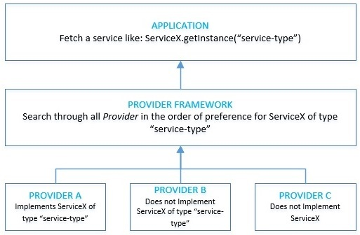

# Core Java Security

This module contains articles about core Java Security

## Java安全的基础知识

1. 概述

    在本教程中，我们将了解Java平台上的安全基础知识。我们还将重点介绍我们可以用来编写安全应用程序的内容。

    安全是一个广泛的话题，包括许多领域。其中一些是语言本身的一部分，如访问修改器和类加载器。此外，还有一些是作为服务提供的，其中包括数据加密、安全通信、认证和授权，仅举几例。

    因此，在本教程中对所有这些都进行有意义的深入了解是不现实的。然而，我们将尝试至少获得一个有意义的词汇。

2. 语言特性

    最重要的是，Java的安全始于语言特性的层面。这使我们能够编写安全代码，并从许多隐含的安全特性中获益。

    - 静态数据类型化。Java是一种静态类型的语言，它减少了运行时检测类型相关错误的可能性。
    - 访问修改器。Java允许我们使用不同的访问修饰符，如public和private来控制对字段、方法和类的访问。
    - 自动内存管理。Java有基于垃圾收集的内存管理，这使开发人员无需手动管理。
    - 字节码验证(Bytecode Verification)。Java是一种编译语言，这意味着它将代码转换为与平台无关的字节码，而运行时将验证它加载执行的每个字节码。

    这并不是Java所提供的安全功能的完整清单，但它足以给我们带来一些保证!

3. Java中的安全架构

    在我们开始探索具体领域之前，让我们花些时间来了解Java中安全的核心架构。

    Java中安全的核心原则是由可互操作和可扩展的Provider实现驱动的。一个特定的Provider实现可以实现部分或全部的安全服务。

    例如，一个Provider可能实现的一些典型服务是。

    - 加密算法（如DSA、RSA或SHA-256）。
    - 密钥生成、转换和管理设施（例如针对特定算法的密钥）。

    Java提供了许多内置的提供者。此外，一个应用程序也可以配置多个具有优先权的提供者。

    

    因此，Java中的提供者框架在所有提供者中按照对其设置的偏好顺序搜索服务的具体实现。

    此外，在这个架构中，总是可以实现具有可插拔安全功能的自定义提供者。

4. 密码学

    密码学是一般情况下和Java中安全功能的基石。这指的是在对手存在的情况下进行安全通信的工具和技术。

    1. Java密码学

        Java加密体系结构（[JCA](https://docs.oracle.com/javase/9/security/java-cryptography-architecture-jca-reference-guide.htm)）提供了一个框架来访问和实现Java中的加密功能，包括。

        - 数字签名(Digital signatures)
        - [消息摘要](https://www.baeldung.com/java-password-hashing)
        - [对称和非对称密码器](https://www.baeldung.com/java-cipher-class)
        - 消息验证码
        - 密钥生成器和密钥工厂

        最重要的是，Java为加密功能使用了[基于提供者的实现](https://docs.oracle.com/javase/9/security/howtoimplaprovider.htm)。

        此外，Java还包括常用加密算法的内置提供者，如RSA、DSA和AES等，仅举几例。我们可以使用这些算法来为静态、使用中或运动中的数据增加安全性。

    2. 实践中的密码学

        在应用程序中，一个非常常见的用例是存储用户密码。我们用它在以后的时间点上进行认证。现在，很明显，存储纯文本密码会损害安全性。

        因此，一个解决方案是以这样一种方式来扰乱密码，即这个过程是可重复的，但只是单向的。这个过程被称为加密散列函数，而SHA1就是这样一种流行的算法。

        那么，让我们看看如何在Java中做到这一点。

        ```java
        MessageDigest md = MessageDigest.getInstance("SHA-1");
        byte[] hashedPassword = md.digest("password".getBytes());
        ```

        在这里，MessageDigest是一个我们感兴趣的加密服务。我们使用getInstance()方法，从任何一个可用的安全提供者那里请求这个服务。

5. 公钥基础设施

    公钥基础设施 Public Key Infrastructure（PKI）指的是使用公钥加密在网络上实现信息安全交换的设置。这种设置依赖于参与通信的各方之间建立的信任。这种信任的基础是由一个被称为证书颁发机构（CA）的中立和可信的机构颁发的数字证书。

    1. Java中的PKI支持

        Java平台有一些API来[促进数字证书的创建、存储和验证](https://docs.oracle.com/javase/9/security/java-pki-programmers-guide.htm)。

        - [KeyStore](https://www.baeldung.com/java-keystore)：Java提供了KeyStore类，用于持久地存储加密密钥和可信的证书。在这里，KeyStore可以代表密钥存储和信任存储文件。这些文件有类似的内容，但在用途上有所不同。
        - CertStore：此外，Java还有CertStore类，它代表了一个可能不受信任的证书和撤销列表的公共存储库。我们需要检索证书和撤销列表，以便在其他用途中建立证书路径。

        Java有一个内置的名为 "cacerts" 的信任库，其中包含知名CA的证书。

    2. 用于PKI的Java工具

        Java有一些非常方便的工具来促进信任通信。

        - 有一个内置的工具叫 "keytool"，用来创建和管理钥匙库和信任库。
        - 还有一个工具 "jarsigner"，我们可以用它来签署和验证JAR文件。

    3. 在Java中使用证书

        让我们看看如何在Java中使用证书来建立一个使用SSL的安全连接。一个相互认证的SSL连接需要我们做两件事。

        出示证书(Present Certificate) - 我们需要向通信中的另一方出示有效的证书。为此，我们需要加载密钥存储文件，其中必须有我们的公钥。

        ```java
        KeyStore keyStore = KeyStore.getInstance(KeyStore.getDefaultType());
        char[] keyStorePassword = "changeit".toCharArray();
        try(InputStream keyStoreData = new FileInputStream("keystore.jks")){
            keyStore.load(keyStoreData, keyStorePassword);
        }
        ```

        验证证书(Verify Certificate) - 我们还需要验证通信中另一方提交的证书。为此，我们需要加载信任存储，在这里我们必须有以前信任的其他方的证书。

        ```java
        KeyStore trustStore = KeyStore.getInstance(KeyStore.getDefaultType());
        // Load the trust-store from filesystem as before
        ```

        我们很少需要以编程方式进行，通常在运行时将系统参数传递给Java。

        ```bash
        -Djavax.net.ssl.trustStore=truststore.jks 
        -Djavax.net.ssl.keyStore=keystore.jks
        ```

6. 认证 Authentication

    认证是根据额外的数据，如密码、令牌或目前可用的各种其他凭证，来验证用户或机器所呈现的身份的过程。

    1. Java中的认证

        Java APIs利用[可插拔的登录模块](https://docs.oracle.com/javase/9/security/java-authentication-and-authorization-service-jaas-loginmodule-developers-guide1.htm)，为应用程序提供不同的、通常是多重的认证机制。LoginContext提供了这种抽象，它反过来参考配置并加载适当的LoginModule。

        虽然多个供应商提供了他们的登录模块，但Java有一些默认的模块可供使用。

        - Krb5LoginModule，用于基于Kerberos的认证
        - JndiLoginModule，用于由LDAP存储支持的基于用户名和密码的认证
        - KeyStoreLoginModule，用于基于加密密钥的认证

    2. 登录实例

        最常见的认证机制之一是用户名和密码。让我们看看我们如何通过JndiLoginModule来实现这个目标。

        这个模块负责从用户那里获得用户名和密码，并根据JNDI中配置的目录服务对其进行验证。

        ```java
        LoginContext loginContext = new LoginContext("Sample", new SampleCallbackHandler());
        loginContext.login();
        ```

        这里，我们使用LoginContext的一个实例来执行登录。LoginContext接受登录配置中的一个条目的名称--在本例中，它是 "Sample"。此外，我们还必须提供一个CallbackHandler的实例，使用LoginModule与用户进行交互，获取用户名和密码等细节。

        让我们看一下我们的登录配置。

        ```xml
        Sample {
        com.sun.security.auth.module.JndiLoginModule required;
        };
        ```

        很简单，它表明我们使用JndiLoginModule作为强制LoginModule。

7. 安全通信

    网络上的通信很容易受到许多攻击媒介的影响。例如，有人可能会侵入网络，在我们的数据包传输过程中读取它们。多年来，业界已经建立了许多协议来保证这种通信的安全。

    1. Java对安全通信的支持

        Java提供了一些[API来保证网络通信的加密](https://docs.oracle.com/javase/9/security/java-secure-socket-extension-jsse-reference-guide.htm)、消息完整性以及客户和服务器认证。

        - SSL/TLS：SSL和它的后继者TLS通过数据加密和公钥基础设施为不被信任的网络通信提供安全保障。Java通过 "java.security.ssl" 包中定义的SSLSocket提供对SSL/TLS的支持。
        - SASL：简单认证和安全层（SASL）是客户端和服务器之间认证的标准。Java支持SASL，作为 "java.security.sasl" 包的一部分。
        - GGS-API/Kerberos：通用安全服务API（GSS-API）通过各种安全机制（如Kerberos v5）提供对安全服务的统一访问。Java支持GSS-API，作为 "java.security.jgss"包的一部分。

    2. 行动中的SSL通信

        现在让我们看看如何[使用SSLSocket](https://www.baeldung.com/java-ssl)在Java中与其他各方打开一个安全连接。

        ```java
        SocketFactory factory = SSLSocketFactory.getDefault();
        try (Socket connection = factory.createSocket(host, port)) {
            BufferedReader input = new BufferedReader(
            new InputStreamReader(connection.getInputStream()));
            return input.readLine();
        }
        ```

        在这里，我们正在使用SSLSocketFactory来创建SSLSocket。作为其中的一部分，我们可以设置一些可选的参数，如密码套件和使用的协议。

        为了使其正常工作，我们必须创建并设置我们的密钥存储和信任存储，正如我们之前看到的那样。

8. 访问控制 Access Control

    访问控制是指保护敏感的资源，如文件系统或代码库，使其不被无端访问。这通常是通过限制对这些资源的访问来实现的。

    1. Java中的访问控制

        我们可以使用通过SecurityManager类介导的Policy和Permission类在[Java中实现访问控制](https://docs.oracle.com/en/java/javase/11/security/java-authentication-and-authorization-service-jaas-reference-guide.html)。SecurityManager是 "java.lang" 包的一部分，负责在Java中执行访问控制检查。

        当类加载器在运行时加载一个类时，它会自动授予封装在Permission对象中的该类一些默认权限。除了这些默认权限，我们还可以通过安全策略授予类更多的杠杆作用。这些都是由类的策略表示的。

        在代码执行的过程中，如果运行时遇到对受保护资源的请求，SecurityManager会通过调用堆栈将请求的Permission与安装的Policy进行验证。因此，它要么授予权限，要么抛出SecurityException。

    2. Java的策略工具

        Java有一个默认的策略实现，从属性文件中读取授权数据。然而，这些策略文件中的策略条目必须采用特定的格式。

        Java提供了 "policytool"，这是一个图形化的工具，用于编排策略文件。

    3. 通过实例进行访问控制

        让我们看看如何在Java中限制对文件等资源的访问。

        ```java
        SecurityManager securityManager = System.getSecurityManager();
        if (securityManager != null) {
            securityManager.checkPermission(
            new FilePermission("/var/logs", "read"));
        }
        ```

        在这里，我们使用SecurityManager来验证我们对一个文件的读取请求，用FilePermission来包装。

        但是，SecurityManager把这个请求委托给了AccessController。AccessController在内部使用了已安装的策略来做出决定。

        让我们看一个策略文件的例子。

        ```xml
        grant {
        permission 
            java.security.FilePermission
            <<ALL FILES>>, "read";
        };
        ```

        我们基本上是授予每个人对所有文件的读取权限。但是，我们可以通过安全策略提供更细化的控制。

        值得注意的是，Java中可能没有默认安装SecurityManager。我们可以通过在启动Java时始终使用参数来确保这一点。

        `-Djava.security.manager -Djava.security.policy=/path/to/sample.policy`

9. XML Signature 签名

    XML签名在保护数据安全和提供数据完整性方面很有用。W3C为XML签名的管理提供了建议。我们可以使用XML签名来保护任何类型的数据，如二进制数据。

    1. Java中的XML签名

        Java API支持按照建议的准则[生成和验证XML签名](https://docs.oracle.com/javase/9/security/xml-digital-signature1.htm)。Java XML数字签名API被封装在 "java.xml.crypto "包中。

        签名本身只是一个XML文档。XML签名可以有三种类型。

        - Detached 分离式。这种类型的签名是在签名元素外部的数据上的。
        - Enveloping：这种类型的签名是在签名元素的内部数据上。
        - Enveloped：这种类型的签名是在包含签名元素本身的数据上。

        当然，Java支持创建和验证所有上述类型的XML签名。

    2. 创建一个XML签名

        现在，我们将卷起袖子，为我们的数据生成一个XML签名。例如，我们可能要在网络上发送一个XML文档。因此，我们希望我们的收件人能够验证其完整性。

        因此，让我们看看如何在Java中实现这一目标。

        ```java
        XMLSignatureFactory xmlSignatureFactory = XMLSignatureFactory.getInstance("DOM");
        DocumentBuilderFactory documentBuilderFactory = DocumentBuilderFactory.newInstance();
        documentBuilderFactory.setNamespaceAware(true);
        
        Document document = documentBuilderFactory
        .newDocumentBuilder().parse(new FileInputStream("data.xml"));
        
        DOMSignContext domSignContext = new DOMSignContext(
        keyEntry.getPrivateKey(), document.getDocumentElement());
        
        XMLSignature xmlSignature = xmlSignatureFactory.newXMLSignature(signedInfo, keyInfo);
        xmlSignature.sign(domSignContext);
        ```

        为了澄清，我们正在为我们存在于文件 "data.xml" 中的数据生成一个XML签名。同时，关于这段代码有几件事需要注意。

        - 首先，XMLSignatureFactory是用于生成XML签名的工厂类。
        - XMLSigntaure需要一个SignedInfo对象，它在该对象上计算签名。
        - XMLSigntaure还需要KeyInfo，它封装了签名密钥和证书。
        - 最后，XMLSignature使用封装为DOMSignContext的私钥来签署文档。

        结果，XML文档现在将包含Signature元素，它可以被用来验证其完整性。

10. 超越核心Java的安全性

    正如我们现在所看到的，Java平台提供了很多必要的功能来编写安全的应用程序。然而，有时候，这些都是相当低级的，并不直接适用于，例如，网络上的标准安全机制。

    例如，在我们的系统中工作时，我们一般不希望必须阅读完整的OAuth RFC并自己实现它。我们往往需要更快、更高层次的方式来实现安全。这就是应用框架出现的地方--这些框架帮助我们用更少的模板代码实现我们的目标。

    在Java平台上，这通常意味着Spring Security。该框架是Spring生态系统的一部分，但它实际上可以在纯Spring应用之外使用。

    简单地说，它有助于以一种简单的、声明性的、高层次的方式实现认证、授权和其他安全功能。

    当然，Spring Security在一[系列的教程](https://www.baeldung.com/security-spring)中，以及在Learn Spring Security课程中以指导的方式，广泛地涵盖了Spring Security。

11. 结论

    简而言之，在本教程中，我们了解了Java中安全的高级架构。此外，我们还了解了Java如何为我们提供一些标准加密服务的实现。

    我们还看到了一些常见的模式，我们可以应用这些模式在认证和访问控制等领域实现可扩展和可插拔的安全。

    总而言之，这只是为我们提供了一个偷窥Java安全特性的机会。因此，本教程中讨论的每一个领域都值得进一步探索。但希望我们应该有足够的洞察力来开始这个方向的工作。

## Java SASL简介

1. 概述

    在本教程中，我们将了解简单认证和安全层（[SASL](https://tools.ietf.org/html/rfc4422)）的基础知识。我们将了解Java如何支持采用SASL来保护通信安全。

    在这个过程中，我们将使用简单的客户端和服务器通信，用SASL来保护它。

2. 什么是SASL？

    SASL是互联网协议中认证和数据安全的一个框架。它的目的是使互联网协议与特定的认证机制脱钩。随着我们的深入，我们会更好地理解这个定义的一部分。

    通信中对安全的需求是隐含的。让我们试着在客户端和服务器通信的背景下理解这一点。通常，客户端和服务器通过网络交换数据。当务之急是双方能够相互信任并安全地发送数据。

    1. SASL的作用是什么？

        在一个应用程序中，我们可能使用SMTP来发送电子邮件，使用LDAP来访问目录服务。但这些协议都可能支持另一种认证机制，如Digest-MD5或Kerberos。

        如果有一种方法可以让协议更明确地交换认证机制呢？这正是SASL出现的地方。支持SASL的协议可以无一例外地支持任何一种SASL机制。

        因此，应用程序可以协商一个合适的机制并采用该机制进行认证和安全通信。

    2. SASL是如何工作的？

        现在，我们已经看到SASL在整个安全计划中的位置，让我们了解它是如何工作的。

        SASL是一个挑战-回应(challenge-response)框架。在这里，服务器向客户发出挑战，而客户则根据挑战发送响应。挑战和响应是任意长度的字节数组，因此，可以携带任何机制特定的数据。

        

        这种交换可以持续多次迭代，最后在服务器不再发出挑战时结束。

        此外，客户端和服务器可以在认证后协商一个安全层。然后，所有后续通信都可以利用这个安全层。然而，请注意，有些机制可能只支持认证。

        在此必须理解，SASL只提供了一个交换挑战和响应数据的框架。它没有提到任何关于数据本身或如何交换的问题。这些细节留给采用SASL的应用程序来处理。

3. Java中的SASL支持

    Java中有一些API，支持用SASL开发客户端和服务器端应用程序。该API不依赖于实际机制本身。使用Java SASL API的应用程序可以根据所需的安全功能选择一种机制。

    1. Java SASL API

        作为 "javax.security.sasl" 包的一部分，需要注意的关键接口是SaslServer和SaslClient。

        SaslServer代表SASL的服务器端机制。

        让我们看看如何实例化一个SaslServer。

        ```java
        SaslServer ss = Sasl.createSaslServer(
        mechanism, 
        protocol, 
        serverName, 
        props, 
        callbackHandler);
        ```

        我们正在使用工厂类Sasl来实例化SaslServer。方法createSaslServer接受几个参数。

        - mechanism - IANA(Internet Assigned Numbers Authority)注册的SASL支持机制的名称
        - protocol - 正在进行认证的协议的名称
        - serverName - 服务器的完全合格的主机名
        - props - 一组用于配置认证交换的属性
        - callbackHandler - 所选机制用于获得进一步信息的回调处理程序。

        在上述内容中，只有前两个是强制性的，其余的都是可忽略的。

        SaslClient表示SASL的客户端机制。让我们看看如何实例化一个SaslClient。

        ```java
        SaslClient sc = Sasl.createSaslClient(
        mechanisms, 
        authorizationId, 
        protocol, 
        serverName, 
        props,
        callbackHandler);
        ```

        这里，我们再次使用工厂类Sasl来实例化我们的SaslClient。createSaslClient所接受的参数列表与之前的基本相同。

        然而，也有一些细微的差别。

        - mechanisms - 在这里，这是一个可供尝试的机制列表。
        - authorizationId - 这是一个依赖于协议的标识，用于授权。

        其余的参数在含义上和它们的可选性上都差不多。

    2. Java SASL安全提供者

        在Java SASL API的下面是提供安全功能的实际机制。这些机制的实现是由在Java密码学架构（[JCA](https://docs.oracle.com/javase/9/security/java-cryptography-architecture-jca-reference-guide.htm)）中注册的安全提供者提供的。

        可以有多个安全提供者在JCA注册。每一个都可以支持一个或多个SASL机制。

        Java将SunSASL作为一个安全提供者，默认情况下，它被注册为JCA提供者。然而，这可以被删除或与任何其他可用的提供者重新排序。

        此外，我们总是可以提供一个自定义的安全提供者。这将要求我们实现SaslClient和SaslServer接口。在这样做的过程中，我们也可以实现我们的自定义安全机制!

4. 通过一个例子看SASL

    现在我们已经看到了如何创建一个SaslServer和一个SaslClient，是时候了解如何使用它们了。我们将开发客户端和服务器组件。这些组件将反复交换挑战和响应以实现认证。我们将在这里的简单例子中使用DIGEST-MD5机制。

    1. 客户端和服务器回调处理程序

        正如我们之前看到的，我们需要为SaslServer和SaslClient提供CallbackHandler的实现。现在，CallbackHandler是一个简单的接口，定义了一个方法--handle。这个方法接受一个数组的Callback。

        在这里，Callback为安全机制提供了一种从调用应用程序收集认证数据的方式。例如，一个安全机制可能需要一个用户名和密码。有相当多的Callback实现，如NameCallback和PasswordCallback可供使用。

        让我们看看我们如何为服务器定义一个CallbackHandler，首先。

        sasl/ServerCallbackHandler.java

        现在，让我们看看我们客户端的Callbackhandler。

        sasl/ClientCallbackHandler.java

        澄清一下，我们在回调数组中循环，只处理特定的回调。我们必须处理的是特定的机制，在这里是DIGEST-MD5。

    2. SASL认证

        所以，我们已经写好了我们的客户端和服务器端CallbackHandler。我们还为DIGEST-MD5机制实例化了SaslClient和SaslServer。

        现在是时候看看它们的运行情况了。

        参见：sasl/SaslUnitTest.givenHandlers_whenStarted_thenAutenticationWorks()

        让我们试着理解这里发生了什么。

        - 首先，我们的客户端从服务器获得默认的挑战书
        - 然后，客户端评估该挑战并准备一个响应
        - 这种挑战--响应的交换又持续了一个周期
        - 在这个过程中，客户端和服务器利用回调处理程序来收集机制所需的任何其他数据。
        - 我们的认证到此结束，但在现实中，它可以重复多个周期。

        一个典型的挑战和响应字节数组的交换是通过网络进行的。但是，在这里为了简单起见，我们假设是本地通信。

    3. SASL安全通信

        正如我们前面所讨论的，SASL是一个能够支持安全通信的框架，不仅仅是认证。然而，这只有在底层机制支持的情况下才有可能。

        首先，让我们先检查一下我们是否已经能够协商出一个安全的通信。

        ```java
        String qop = (String) saslClient.getNegotiatedProperty(Sasl.QOP);
        assertEquals("auth-conf", qop);
        ```

        在这里，QOP代表保护的质量。这是客户端和服务器在认证过程中协商的事情。一个 "auth-int" 的值表示认证和完整性。而 "auth-conf" 的值则表示认证、完整性和保密性。

        一旦我们有了安全层，我们就可以利用它来保护我们的通信。

        让我们来看看我们如何确保客户端的出站通信。

        ```java
        byte[] outgoing = "Baeldung".getBytes();
        byte[] secureOutgoing = saslClient.wrap(outgoing, 0, outgoing.length);
        // 通过网络将secureOutgoing发送给服务器
        ```

        而且，类似地，服务器可以处理传入的通信。

        ```java
        // 通过网络接收来自客户端的secureIncoming
        byte[] incoming = saslServer.unwrap(secureIncoming, 0, netIn.length);
        assertEquals("Baeldung", new String(incoming, StandardCharsets.UTF_8));
        ```

5. 真实世界中的SASL

    所以，我们现在对SASL是什么以及如何在Java中使用它有了一定的了解。但是，通常情况下，这并不是我们最终要使用SASL的目的，至少在我们的日常生活中是这样。

    正如我们前面看到的，SASL主要是为LDAP和SMTP等协议服务的。虽然，越来越多的应用程序开始使用SASL--例如，Kafka。那么，我们如何使用SASL来验证这些服务？

    假设我们已经为Kafka Broker配置了SASL，并选择了PLAIN作为机制。PLAIN只是意味着它使用纯文本的用户名和密码的组合进行认证。

    现在让我们看看如何配置一个Java客户端来使用SASL/PLAIN对Kafka Broker进行认证。

    我们首先提供一个简单的JAAS配置，"kafka_jaas.conf"。

    ```java
    KafkaClient {
    org.apache.kafka.common.security.plain.PlainLoginModule required
    username="username"
    password="password";
    };
    ```

    我们在启动JVM时利用了这个JAAS配置。

    `-Djava.security.auth.login.config=kafka_jaas.conf`

    最后，我们必须添加一些属性来传递给我们的生产者和消费者实例。

    ```java
    security.protocol=SASL_SSL
    sasl.mechanism=PLAIN
    ```

    这就是它的全部内容了。不过这只是[Kafka客户端配置](https://www.baeldung.com/kafka-connectors-guide)的一小部分。除了PLAIN之外，Kafka还支持GSSAPI/Kerberos的认证。

6. SASL的比较

    尽管SASL在提供一种机制中立的客户端和服务器通信的认证和安全方面相当有效。然而，SASL并不是这方面的唯一解决方案。

    Java本身也提供了其他机制来实现这一目标。我们将简要地讨论它们，并了解它们与SASL的对比情况。

    - Java Secure Socket Extension（[JSSE](https://docs.oracle.com/javase/9/security/java-secure-socket-extension-jsse-reference-guide.htm)）。JSSE是Java中的一组包，为Java实现安全套接字层（SSL）。它提供了数据加密、客户和服务器认证以及消息完整性。与SASL不同，JSSE依赖于公钥基础设施（PKI）来工作。因此，SASL比JSSE更灵活、更轻便。
    - Java GSS API（[JGSS](https://docs.oracle.com/javase/9/security/java-generic-security-services-java-gss-api1.htm)）。JGGS是通用安全服务应用编程接口（GSS-API）的Java语言绑定。GSS-API是一个IETF标准，用于应用程序访问安全服务。在Java中，在GSS-API下，Kerberos是唯一支持的机制。Kerberos同样需要一个Kerberised的基础设施来工作。与SASL相比，这里的选择是有限的，而且是重量级的。

    总的来说，SASL是一个非常轻量级的框架，并通过可插拔机制提供各种安全功能。采用SASL的应用程序在实现正确的安全功能集方面有很多选择，这取决于需求。

7. 结语

    总而言之，在本教程中，我们了解了SASL框架的基础知识，它提供了认证和安全通信。我们还讨论了Java中用于实现SASL客户端和服务器端的API。

    我们看到了如何通过JCA提供者使用安全机制。最后，我们还讨论了SASL在不同协议和应用程序中的使用。

## Java GSS API指南

1. 概述

    在本教程中，我们将了解通用安全服务(Generic Security Service)API（[GSS API](https://www.ietf.org/rfc/rfc2743.txt)）以及如何在Java中实现它。我们将看到如何使用Java中的GSS API来保证网络通信的安全。

    在这个过程中，我们将创建简单的客户端和服务器组件，用GSS API保护它们。

2. 什么是GSS API？

    那么，什么是真正的通用安全服务API？GSS API为应用程序提供了一个通用框架，以可插拔的方式使用不同的安全机制，如Kerberos、NTLM和SPNEGO。因此，它可以帮助应用程序直接从安全机制中解脱出来。

    为了说明问题，这里的安全包括认证、数据完整性和保密性。

    1. 为什么我们需要GSS API？

        像Kerberos、NTLM和Digest-MD5这样的安全机制在能力和实现上都有很大的不同。通常情况下，支持这些机制之一的应用程序会发现切换到另一个机制是非常令人生畏的。

        这时，像GSS API这样的通用框架为应用程序提供了一个抽象概念。因此，使用GSS API的应用程序可以协商一个合适的安全机制并使用该机制进行通信。所有这些都不需要实际实现任何机制的细节。

    2. GSS API是如何工作的？

        GSS API是一个基于令牌的机制。它通过对等体之间的安全令牌交换来工作。这种交换通常发生在网络上，但GSS API对这些细节是不可知的。

        这些令牌是由GSS API的具体实现者生成和处理的。这些令牌的语法和语义是特定于对等体之间协商的安全机制。

        

        GSS API的中心主题是围绕安全上下文展开的。我们可以通过交换令牌在对等体之间建立这种环境。我们可能需要在对等体之间多次交换令牌来建立上下文。

        一旦在两端成功建立，我们可以使用安全上下文来安全地交换数据。这可能包括数据完整性检查和数据加密，这取决于基础安全机制。

3. Java中的GSS API支持

    Java支持GSS API，作为 "org.ietf.jgss" 包的一部分。这个包的名字可能看起来很特别。这是因为GSS API的Java绑定被定义在[IETF的规范](https://www.ietf.org/rfc/rfc2853.txt)中。规范本身是独立于安全机制的。

    Java GSS的流行安全机制之一是Kerberos v5。

    1. Java GSS API

        让我们试着了解一下构建Java GSS的一些核心API。

        - GSSContext封装了GSS API的安全上下文，并提供该上下文下可用的服务
        - GSSCredential封装了建立安全上下文所需的实体的GSS API凭证。
        - GSSName封装了GSS API主体实体，为底层机制使用的不同命名空间提供了一个抽象。

        除了上述接口外，还有一些其他重要的类需要注意。

        - GSSManager是其他重要GSS API类的工厂类，如GSSName、GSSCredential和GSSContext。
        - Oid表示通用对象标识符（OIDs），它是GSS API中用于识别机制和名称格式的分层标识符。
        - MessageProp封装属性，以表明GSSContext在数据交换的保护质量（QoP）和保密性等方面的情况。
        - ChannelBinding封装了可选的通道绑定信息，用于加强提供对等实体认证的质量。

    2. Java GSS安全提供者

        虽然Java GSS定义了在Java中实现GSS API的核心框架，但它并没有提供一个实现。Java对包括Java GSS在内的安全服务采用了基于提供者的可插拔实现。

        可以有一个或多个这样的安全提供者在Java Cryptography Architecture（JCA）注册。每个安全提供者可以实现一个或多个安全服务，如Java GSSAPI和下面的安全机制。

        JDK中有一个默认的GSS提供者。然而，还有其他特定供应商的GSS提供者，具有不同的安全机制，我们可以使用。IBM Java GSS就是这样一个提供者。我们必须向JCA注册这样的安全提供者，以便能够使用它们。

        此外，如果需要的话，我们可以实现我们自己的安全提供者，并可能采用自定义的安全机制。然而，这在实践中几乎是不需要的。

4. 通过一个例子看GSS API

    现在，我们将通过一个例子来看看Java GSS的运行情况。我们将创建一个简单的客户端和服务器应用程序。在GSS中，客户端通常被称为发起者，服务器被称为接受者。我们将使用Java GSS和下面的Kerberos v5进行认证。

    1. 客户端和服务器的GSS上下文

        首先，我们必须在应用程序的服务器和客户端建立一个GSSContext。

        首先让我们看看如何在客户端做到这一点。

        参见：com.baeldung.jgss/JgssIntegrationTest.java

        ```java
        GSSManager manager = GSSManager.getInstance();
        String serverPrinciple = "HTTP/localhost@EXAMPLE.COM";
        GSSName serverName = manager.createName(serverPrinciple, null);
        Oid krb5Oid = new Oid("1.2.840.113554.1.2.2");
        GSSContext clientContext = manager.createContext(
        serverName, krb5Oid, (GSSCredential)null, GSSContext.DEFAULT_LIFETIME);
        clientContext.requestMutualAuth(true);
        clientContext.requestConf(true);
        clientContext.requestInteg(true);
        ```

        这里发生了相当多的事情，让我们把它们分解一下。

        - 我们首先创建一个GSSManager的实例
        - 然后我们使用这个实例来创建GSSContext，并传递给它。
        - 代表服务器主体的 GSSName，注意这里的 Kerberos 特定主体名称
        - 要使用的机制的 Oid，这里是 Kerberos v5
        - 发起人的证书，这里是空的，意味着将使用默认的证书
        - 已建立的上下文的有效期
        - 最后，我们为相互认证、保密性和数据完整性的上下文做准备。

        同样的，我们也要定义服务器端的上下文。

        ```java
        GSSManager manager = GSSManager.getInstance();
        GSSContext serverContext = manager.createContext((GSSCredential) null);
        ```

        我们可以看到，这比客户端的上下文要简单得多。这里唯一的区别是，我们需要接受者的凭证，我们使用了null。和以前一样，null意味着将使用默认的凭证。

    2. GSS API认证

        尽管我们已经创建了服务器和客户端的GSSContext，但请注意在这个阶段它们还没有被建立。

        为了建立这些上下文，我们需要交换特定于安全机制的令牌，即Kerberos v5。

        ```java
        // On the client-side
        clientToken = clientContext.initSecContext(new byte[0], 0, 0);
        sendToServer(clientToken); // This is supposed to be send over the network
        // On the server-side
        serverToken = serverContext.acceptSecContext(clientToken, 0, clientToken.length);
        sendToClient(serverToken); // This is supposed to be send over the network
        // Back on the client side
        clientContext.initSecContext(serverToken, 0, serverToken.length);
        ```

        这最终使上下文在两端都建立起来。

        ```java
        assertTrue(serverContext.isEstablished());
        assertTrue(clientContext.isEstablished());
        ```

    3. GSS API安全通信

        现在，我们在两端都建立了上下文，我们可以开始发送具有完整性和保密性的数据。

        ```java
        // On the client-side
        byte[] messageBytes = "Baeldung".getBytes();
        MessageProp clientProp = new MessageProp(0, true);
        byte[] clientToken = clientContext.wrap(messageBytes, 0, messageBytes.length, clientProp);
        sendToServer(clientToken); // This is supposed to be send over the network
            
        // On the server-side 
        MessageProp serverProp = new MessageProp(0, false);
        byte[] bytes = serverContext.unwrap(clientToken, 0, clientToken.length, serverProp);
        String string = new String(bytes);
        assertEquals("Baeldung", string);
        ```

        这里发生了几件事，让我们分析一下。

        - MessageProp被客户端用来设置wrap方法并生成token
        - 包裹方法还添加了数据的加密MIC，MIC被捆绑为令牌的一部分
        - 该令牌被发送到服务器（可能通过网络调用）。
        - 服务器再次利用MessageProp来设置解包方法并获得数据。
        - 同时，解包方法对收到的数据进行MIC验证，确保数据的完整性。

        因此，客户端和服务器能够以完整性和保密性交换数据。

    4. 例子中的Kerberos设置

        现在，像Kerberos这样的GSS机制通常被期望从一个现有的Subject中获取凭证。这里的Subject类是JAAS的一个抽象概念，代表一个人或一个服务等实体。这通常是在基于JAAS的认证过程中填充的。

        然而，在我们的例子中，我们将不直接使用基于JAAS的认证。我们将让Kerberos直接获得凭证，在我们的例子中使用一个keytab文件。有一个JVM系统参数可以实现这一点。

        `-Djavax.security.auth.useSubjectCredsOnly=false`

        然而，Sun Microsystem提供的默认Kerberos实现是依靠JAAS来提供认证。

        这听起来可能与我们刚才讨论的内容相反。请注意，我们可以在我们的应用程序中明确地使用JAAS，它将填充主题。或者让底层机制直接进行认证，无论如何它都会使用JAAS。因此，我们需要向底层机制提供一个JAAS配置文件。

        ```xml
        com.sun.security.jgss.initiate  {
            com.sun.security.auth.module.Krb5LoginModule required
            useKeyTab=true
            keyTab=example.keytab
            principal="client/localhost"
            storeKey=true;
        };
        com.sun.security.jgss.accept  {
            com.sun.security.auth.module.Krb5LoginModule required
            useKeyTab=true
            keyTab=example.keytab
            storeKey=true
            principal="HTTP/localhost";
        };
        ```

        这个配置很简单，我们把Kerberos定义为发起者和接受者的必要登录模块。此外，我们还配置了使用keytab文件中各自的原则。我们可以把这个JAAS配置作为一个系统参数传递给JVM。

        `-Djava.security.auth.login.config=login.conf`

        这里，假设我们可以访问一个 Kerberos KDC。在 KDC 中，我们设置了所需的 principals 并获得了要使用的 keytab 文件，比方说 "example.keytab"。

        此外， 我们还需要指向正确 KDC 的 Kerberos 配置文件。

        ```conf
        [libdefaults]
        default_realm = EXAMPLE.COM
        udp_preference_limit = 1
        [realms]
        EXAMPLE.COM = {
            kdc = localhost:52135
        }
        ```

        这个简单的配置定义了一个运行在52135端口的KDC，默认境界为`EXAMPLE.COM`。我们可以把它作为一个系统参数传递给 JVM。

        `-Djava.security.krb5.conf=krb5.conf`

    5. 运行实例

        要运行这个例子，我们必须利用上一节中讨论的 Kerberos 工具。

        - [ ] ？上一节中讨论的 Kerberos 工具

        此外，我们还需要传递所需的 JVM 参数。

        ```bash
        java -Djava.security.krb5.conf=krb5.conf \
        -Djavax.security.auth.useSubjectCredsOnly=false \
        -Djava.security.auth.login.config=login.conf \
        com.baeldung.jgss.JgssUnitTest
        ```

        这足以让Kerberos用keytab中的凭证进行认证，并让GSS建立上下文。

        - [ ] ？Run JgssIntegrationTest Error：

        ```log
        java.lang.Exception: No tests found matching [{ExactMatcher:fDisplayName=givenCredential_whenStarted_thenAutenticationWorks], {ExactMatcher:fDisplayName=givenCredential_whenStarted_thenAutenticationWorks(com.baeldung.jgss.JgssIntegrationTest)], {LeadingIdentifierMatcher:fClassName=com.baeldung.jgss.JgssIntegrationTest,fLeadingIdentifier=givenCredential_whenStarted_thenAutenticationWorks]] from org.junit.internal.requests.ClassRequest@6f539caf
        ```

5. 现实世界中的GSS API

    虽然GSS API承诺通过可插拔机制解决一系列安全问题，但有几个用例已经被更广泛地采用。

    - 它被广泛用于SASL中作为一种安全机制，特别是在Kerberos是底层机制的选择。Kerberos是一种广泛使用的认证机制，特别是在企业网络中。利用Kerberised基础设施来验证一个新的应用程序确实非常有用。因此，GSS API很好地弥补了这一空白。
    - 它还可以与SPNEGO结合使用，在事先不知道安全机制的情况下进行协商。在这方面，SPNEGO在某种意义上是GSS API的一个伪机制。这在所有的现代浏览器中都得到了广泛的支持，使得它们能够利用基于Kerberos的认证。

6. GSS API的比较

    GSS API在以可插拔的方式向应用程序提供安全服务方面相当有效。然而，它并不是在Java中实现这一目标的唯一选择。

    让我们了解一下Java还能提供什么，以及它们与GSS API的比较。

    - Java安全套接字扩展(Java Secure Socket Extension)（[JSSE](https://docs.oracle.com/javase/9/security/java-secure-socket-extension-jsse-reference-guide.htm)）。JSSE是Java中的一组包，为Java实现安全套接字层（SSL）。它提供了数据加密、客户和服务器认证以及消息完整性。与GSS API不同，JSSE依赖于公钥基础设施（PKI）来工作。因此，GSS API比JSSE更灵活、更轻便。
    - Java简单认证和安全层(Java Simple Authentication and Security Layer)（[SASL](https://docs.oracle.com/javase/9/security/introduction-java-sasl-api.htm)）。SASL是一个用于互联网协议的认证和数据安全的框架，将它们与特定的认证机制相分离。这在范围上与GSS API相似。然而，Java GSS通过可用的安全提供者对底层安全机制的支持有限。

    总的来说，GSS API在以与机制无关的方式提供安全服务方面相当强大。然而，对Java中更多安全机制的支持将使其进一步被采用。

7. 结语

    总而言之，在本教程中，我们了解了GSS API作为一个安全框架的基础知识。我们浏览了GSS的Java API，了解了如何利用它们。在这个过程中，我们创建了简单的客户端和服务器组件，进行相互认证并安全地交换数据。

    此外，我们还看到了GSS API的实际应用以及Java中的替代方案。

## Java SecurityManager的介绍

在本教程中，我们将了解Java的内置安全基础设施，它默认是禁用的。具体来说，我们将研究其主要组件、扩展点和配置。

1. 行动中的SecurityManager

    这可能是一个惊喜，但默认的SecurityManager设置不允许许多标准操作。

    ```java
    System.setSecurityManager(new SecurityManager());
    new URL("http://www.google.com").openConnection().connect();
    ```

    在这里，我们以编程方式启用默认设置的安全监管，并试图连接到google.com。

    然后我们得到了以下异常。

    ```java
    java.security.AccessControlException: access denied ("java.net.SocketPermission"
    "www.google.com:80" "connect,resolve")
    ```

    在标准库中还有许多其他的用例--例如，读取系统属性、读取环境变量、打开文件、反射和改变locale，仅此而已。

2. 用例

    这种安全基础设施从Java 1.0开始就已经存在了。那时候，小程序(applets)--嵌入到浏览器中的Java应用--是非常普遍的。自然，有必要限制它们对系统资源的访问。

    如今，applets已经过时了。然而，当出现第三方代码在受保护的环境中执行的情况时，安全执行仍然是一个实际的概念。

    例如，考虑到我们有一个Tomcat实例，第三方客户可以在那里托管他们的Web应用程序。我们不想让他们执行System.exit()这样的操作，因为那会影响到其他的应用程序，甚至可能影响到整个环境。

3. 设计

    1. 安全管理器

        内置安全基础设施的主要组件之一是[java.lang SecurityManager](https://docs.oracle.com/en/java/javase/11/docs/api/java.base/java/lang/SecurityManager.html)。它有几个checkXxx方法，比如checkConnect，它在上面的测试中授权我们尝试连接到Google。所有这些都委托给checkPermission(java.security.Permission)方法。

    2. 权限 Permission

        java.security.Permission实例代表了授权请求。标准JDK类为所有潜在的危险操作（如读/写文件、打开套接字等）创建它们，并将它们交给SecurityManager进行适当的授权。

    3. 配置

        我们以一种特殊的策略格式定义权限。这些权限采取授予条目的形式(grant entries)。

        ```xml
        grant codeBase "file:${{java.ext.dirs}}/*" {
            permission java.security.AllPermission;
        };
        ```

        上面的codeBase规则是可选的。我们可以在这里完全不指定任何字段，或者使用signedBy（与keystore中的相应证书集成）或principal（通过javax.security.auth.Subject附加到当前线程的java.security.Principal）。我们可以使用这些规则的任何组合。

        默认情况下，JVM会加载位于`<java.home>/lib/security/java.policy`中的公共系统策略文件。如果我们在`<user.home>/.java.policy`中定义了任何用户本地策略，JVM会将其附加到系统策略中。

        也可以通过命令行指定策略文件：`-Djava.security.policy=/my/policy-file`。这样我们就可以将策略附加到先前加载的系统和用户策略中。

        有一种特殊的语法用于替换所有系统和用户策略（如果有的话）--双等号：`-Djava.security.policy==/my/policy-file`

4. 例子

    让我们来定义一个自定义权限。

    securitymanager/CustomPermission.java

    和一个应该被保护的共享服务。

    securitymanager/Service.java

    如果我们试图在启用安全管理器的情况下运行它，就会抛出一个异常。

    ```log
    java.security.AccessControlException: access denied
    ("com.baeldung.security.manager.CustomPermission" "my-operation")
        at java.security.AccessControlContext.checkPermission(AccessControlContext.java:472)
        at java.security.AccessController.checkPermission(AccessController.java:884)
        at java.lang.SecurityManager.checkPermission(SecurityManager.java:549)
        at com.baeldung.security.manager.Service.operation(Service.java:10)
    ```

    我们可以用以下内容创建我们的`<user.home>/.java.policy`文件，并尝试重新运行该应用程序。

    ```xml
    grant codeBase "file:<our-code-source>" {
        permission com.baeldung.security.manager.CustomPermission "my-operation";
    };
    ```

    现在工作得很好。

## Relevant Articles

- [x] [The Basics of Java Security](https://www.baeldung.com/java-security-overview)
- [ ] [Guide to the Cipher Class](http://www.baeldung.com/java-cipher-class)
- [Introduction to SSL in Java](http://www.baeldung.com/java-ssl)
- [Java KeyStore API](http://www.baeldung.com/java-keystore)
- [Encrypting and Decrypting Files in Java](http://www.baeldung.com/java-cipher-input-output-stream)
- [SSL Handshake Failures](https://www.baeldung.com/java-ssl-handshake-failures)
- [Enabling TLS v1.2 in Java 7](https://www.baeldung.com/java-7-tls-v12)
- [The Java SecureRandom Class](https://www.baeldung.com/java-secure-random)
- [x] [An Introduction to Java SASL](https://www.baeldung.com/java-sasl)
- [x] [A Guide to Java GSS API](https://www.baeldung.com/java-gss)
- [x] [Intro to the Java SecurityManager](https://www.baeldung.com/java-security-manager)
- More articles: [[next -->]](../core-java-security-2/README-zh.md)

## Code

像往常一样，我们可以在[GitHub](https://github.com/eugenp/tutorials/tree/master/core-java-modules/core-java-security)上找到这些代码。
