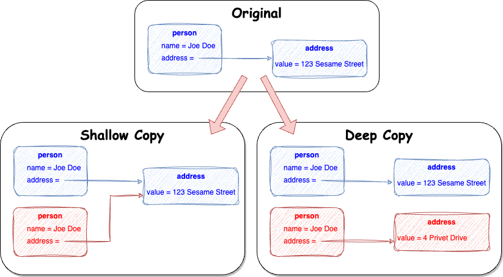

# Creating a deep vs shallow copy of an object in Java

## 1. Overview

When copying or cloning objects in Java it is important to understand the difference between a shallow copy and a deep copy:

* a **shallow copy** of an object copies into another object all the primitive attributes but not other attributes that are objects, instead it keeps a reference to the original attribute objects.
* a **deep copy** of an object copies not only the primitive attributes but also copies all the other objects that are referenced by the original instance.

The image below exemplifies the difference:


## 2. Code Example

As an example let’s consider 2 classes: `Person` and `Address`. These are simple objects with its own primitive values and `Person` has an attribute of `Address`.

### 2.1 Shallow Copy

To implement a shallow copy we can use the `Cloneable` interface. This allows the use of the clone() method and creates a shallow copy of the object.

```java
public class Person implements Cloneable, Serializable {
    private String name;
    private Address address;

    @Override
    public Person clone() throws CloneNotSupportedException {
        return (Person) super.clone();
    }

    // Getters and Setters
}
```

Note that we can use this method to actually implement a deep copy, by implementing the copy of other attribute objects manually. We can now create a copy:

```java
    public static Person shallowCopy(Person person) {
        if (person != null) {
            try {
                return person.clone();
            } catch (Exception e) {
                System.out.println("Problem cloning Person: " + e.getMessage());
            }
        }
        return null;
    }
```

### 2.2 Deep Copy

There are multiple ways to implement a deep copy:

* One way is to extend the `clone()` method and make sure the whole graph of objects are also copied – this approach is more verbose depending on the complexity of the objects.
* Another option is to serialize the object and deserialize it, forcing the creation of an entire copy of all the objects referenced, in this approach all the objects need to implement the `Serializable` interface.
* Using third-party libraries

#### Using Custom Serialization/Deserialization

```java
public class Person implements Serializable {
    private String name;
    private Address address;
 
    // Getters and Setters
}

public class Address implements Serializable {
    private String value;
 
    // Getters and Setters
}
```

Using this approach we can Serialize and Deserialize the objects:
```java
    public static Person deepCopy(Person person) {
        if (person != null) {
            try {
                // Serialize the original object into a byte array
                ByteArrayOutputStream byteArrayOutputStream = new ByteArrayOutputStream();
                ObjectOutputStream objectOutputStream = new ObjectOutputStream(byteArrayOutputStream);
                objectOutputStream.writeObject(person);

                // Deserialize the byte array to create a deep copy
                ByteArrayInputStream byteArrayInputStream = new ByteArrayInputStream(byteArrayOutputStream.toByteArray());
                ObjectInputStream objectInputStream = new ObjectInputStream(byteArrayInputStream);
                return (Person) objectInputStream.readObject();
            } catch (Exception e) {
                System.out.println("Problem cloning Person: " + e.getMessage());
            }
        }
        return null;
    }
```

#### Using Third-Party Libraries

Third party libraries can be used to create a deep copy using serialization/deserialization of objects, for example:

```java
import org.apache.commons.lang3.SerializationUtils;

// Cloning using SerializationUtils
Person copy = SerializationUtils.clone(person);
```

# 3. Conclusion
It is important to understand the different ways of copying objects and apply the approach to best fits the use case. A shallow copy could be used purposely to keep only one reference of an underlying object (for example, if we had City as an attribute of Person, keeping one single reference of City might be the desired behavior), but not understanding its behavior can cause problems.

What other methods do you know?
