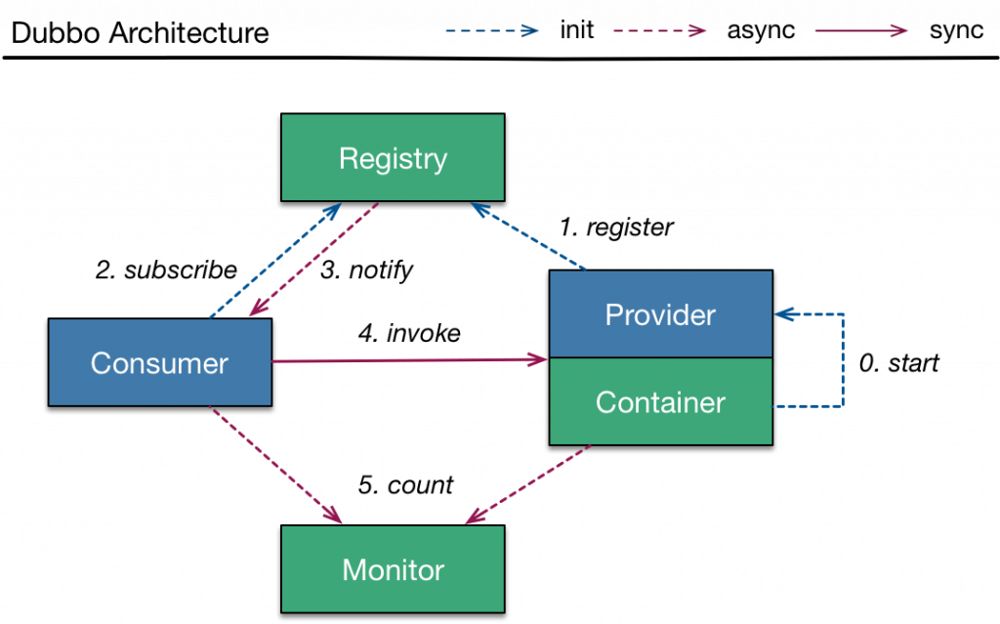

# Dubbo

1. 简介

    [Dubbo](http://dubbo.io/)是阿里巴巴的一个开源的RPC和微服务框架。

    在其他方面，它有助于加强服务治理，并使传统的单体(monolith)应用能够顺利地重构为可扩展的分布式架构。

    在这篇文章中，我们将对Dubbo及其最重要的功能进行介绍。

2. 架构

    Dubbo区分了几个角色。

    - 提供者--服务被暴露的地方；提供者将向注册中心注册其服务
    - 容器--服务被启动、加载和运行的地方
    - 消费者--调用远程服务的人；消费者将在注册表中订阅所需的服务
    - 注册处--服务将被注册和发现的地方
    - 监控--记录服务的统计数据，例如，在给定的时间间隔内调用服务的频率。

    

    提供者、消费者和注册中心之间的连接是持久的，因此只要服务提供者出现故障，注册中心就可以检测到故障并通知消费者。

    注册处和监视器是可选的。消费者可以直接连接到服务提供者，但整个系统的稳定性会受到影响。

3. Maven Dependency

    在我们深入研究之前，让我们在pom.xml中添加以下依赖性。

    ```xml
    <dependency>
        <groupId>com.alibaba</groupId>
        <artifactId>dubbo</artifactId>
        <version>2.5.7</version>
    </dependency>
    ```

    最新的版本可以在[这里](https://search.maven.org/classic/#search%7Cgav%7C1%7Cg%3A%22com.alibaba%22%20AND%20a%3A%22dubbo%22)找到。

4. 引导

    现在让我们来试试Dubbo的基本功能。

    这是一个侵入性最小的框架，它的很多功能都依赖于外部配置或注释。

    官方建议我们使用XML配置文件，因为它依赖于一个Spring容器（目前是Spring 4.3.10）。

    我们将使用XML配置来演示它的大部分功能。

## Relevant articles

- [ ] [Introduction to Dubbo](https://www.baeldung.com/dubbo)
