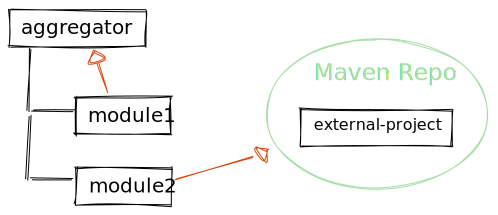

# parent pom resolution

## 理解Maven的 "相对路径 "标签对父级POM的影响

在本教程中，我们将学习Maven的父级POM解析。首先，我们将了解其默认行为。然后，我们将讨论定制它的可能性。

1. 默认的父POM解析

    如果我们想指定一个父POM，我们可以通过命名groupId、artifactId和version，即所谓的GAV坐标来实现。Maven不会先通过在仓库中搜索来解析父POM。我们可以在Maven模型文档中找到细节，并总结出该行为。

    如果父文件夹中存在一个pom.xml文件，并且该文件有匹配的GAV坐标，那么它就被归类为项目的父POM。
    如果没有，Maven就会恢复到资源库中。
    在管理多模块项目时，将一个Maven项目放入另一个项目是最佳做法。例如，我们有一个聚合器项目，其GAV坐标如下。

    aggregator/pom.xml

    然后我们可以把模块放到子文件夹中，并把聚合器作为父类引用。

    module1引用aggregator

    见module1/pom.xml中的`<parent>GAV</parent>`部分。

    不需要将聚合器POM安装到存储库中。甚至不需要在聚合器POM中声明模块1。但我们必须注意，这只适用于项目的本地签出（例如在构建项目时）。如果该项目是作为Maven资源库的依赖关系解决的，那么父POM也应该在资源库中可用。

    我们必须确保聚合器的POM有匹配的GAV坐标。否则，我们会得到一个构建错误。

    ```log
    [ERROR]     Non-resolvable parent POM for com.baeldung.maven-parent-pom-resolution:module1:1.0.0-SNAPSHOT:
    Could not find artifact com.baeldung.maven-parent-pom-resolution:aggregator:pom:1.0-SNAPSHOT
    and 'parent.relativePath' points at wrong local POM @ line 7, column 13
    ```

2. 自定义父POM的位置

    如果父POM不在父文件夹中，我们需要使用relativePath标签来引用其位置。例如，如果我们有第二个模块，应该从模块1继承设置，而不是从聚合器继承，我们必须命名兄弟姐妹文件夹。

    module2->module1->aggregator

    module2/pom.xml中的`<parent><relativePath></relativePath></parent>`部分。

    当然，我们应该只使用每个环境中都有的相对路径（大多是同一Git仓库内的路径），以确保我们构建的可移植性。

3. 禁用本地文件解析

    为了跳过本地文件搜索，直接搜索Maven仓库中的父POM，我们需要明确地将relativePath设为空值。

    ```xml
    <parent>
        <groupId>com.baeldung</groupId>
        <artifactId>external-project</artifactId>
        <version>1.0.0-SNAPSHOT</version>
        <relativePath/>
    </parent>
    ```

    

    每当我们从[Spring Boot](https://robintegg.com/2019/01/20/why-does-spring-initializr-set-the-parent-pom-relativepath-to-empty.html)等外部项目继承时，这应该是一种最佳做法。

4. 集成开发环境

    有趣的是，IntelliJ IDEA（当前版本：2021.1.3）有一个Maven插件，在父级POM解析方面与外部Maven运行系统不同。与[Maven的POM模式](https://maven.apache.org/xsd/maven-4.0.0.xsd)不同，它是这样解释relativePath标签的。

    > […] Maven looks for the parent pom first in the reactor of currently building projects […]

    这意味着，对于IDE内部的解析，只要父项目被注册为IntelliJ Maven项目，父POM的位置并不重要。这对简单开发项目而不明确构建项目可能有帮助（如果它们不在同一个Git仓库的范围内）。但如果我们试图用外部Maven运行时来构建项目，就会失败。

5. 总结

    在这篇文章中，我们了解到Maven不会首先通过搜索Maven仓库来解决父POM。而是在本地搜索，在继承外部项目时，我们必须明确停用这一行为。此外，IDE可能会额外解析到工作区的项目，这可能会导致我们在使用外部Maven运行时出现错误。

## 如何禁用父POM中定义的Maven插件

1. 概述

    Maven允许我们使用继承的概念来构建项目。当父级POM定义了一个插件，所有的子模块都会继承它。

    但如果我们不想从父级POM中继承一个插件，又不能修改父级POM，该怎么办？

    在本教程中，我们将探讨禁用Maven插件的几种不同方法，特别是父POM中定义的[Maven Enforcer](https://maven.apache.org/enforcer/maven-enforcer-plugin/)插件。

2. 何时禁用父POM中定义的插件？

    在进一步讨论之前，我们先想想为什么需要这样做。

    比起配置，Maven更倾向于约定俗成。我们需要记住，虽然禁用一个插件对我们来说可能是最快的解决方案，但对项目来说可能不是最好的解决方案。

    当Maven项目的原作者没有预见到我们的情况，而我们又没有办法自己修改父模块时，就可能需要在父POM中禁用一个插件。

    比方说，原作者假设某个特定文件应该一直存在。然而，我们的模块拥有这个文件是没有意义的。例如，父级POM可能强制要求每个模块都有一个许可文件，而我们没有这个文件。与其添加一个空文件，可能会造成混乱，我们不如禁用规则的执行。

    让我们在Maven项目中添加一个实现了maven-enforcer-plugin的父模块，来设置这种情况。

    ```xml
    <plugin>
        <groupId>org.apache.maven.plugins</groupId>
        <artifactId>maven-enforcer-plugin</artifactId>
        <version>3.0.0</version>
    </plugin>
    ```

    接下来，让我们为该插件添加一个执行，以执行一条规则，即每个模块的src目录下必须有一个名为file-that-must-exist.txt的文件。

    见 disable-plugin-examples/pom.xml:`<executions>`

    如果file-that-must-exist.txt不存在，那么构建将失败。

    由于子模块从它们的父模块继承插件，所有的子模块都必须遵守这一规则。

    让我们看一下我们可以在子模块的POM中禁用这一规则的几种方法。

3. 我们如何禁用一个在父级POM中定义的插件？

    首先，我们假设重组Maven项目或改变父POM都不是可接受的解决方案。如果我们能修改父模块，那么我们可以通过在父POM中实现[pluginManagement](http://baeldung.com/maven-plugin-management)部分来解决这个问题。

    我们可能无法修改父模块，因为我们并不拥有该项目，所以我们无权在我们的模块之外进行修改。这可能是由于时间限制--重组一个项目需要时间，所以只是在子模块中禁用一个插件更方便。

    此外，我们将假设该插件确实需要被禁用。很多插件在运行时不会有任何问题，即使是在它们不打算使用的模块上。

    例如，让我们假设我们有一个复制Java文件的插件。如果我们有一个没有Java文件的子项目，那么这个插件很可能就不会复制任何文件。它这样做不会引起问题。在这种情况下，让该插件继续运行是比较简单和常规的。

    让我们假设在考虑了上述情况后，我们肯定需要用我们的模块禁用该插件。

    我们可以这样做的一个方法是配置跳过参数。

    1. 配置跳过参数

        许多插件都有一个跳过参数。我们可以使用跳过参数来禁用该插件。

        如果我们看一下maven-enforcer-plugin的文档，就会发现它有一个跳过参数，我们可以实现。

        对跳过参数的支持应该是我们首先要检查的，因为这是最简单的解决方案，也是最常规的。

        让我们添加一个空的子模块，只包含POM。如果我们使用mvn clean install命令来构建该模块，我们会看到构建失败。这是因为file-that-must-exist.txt在我们的模块中不存在，这是由于从我们的父模块中继承规则而需要的。

        让我们在子模块的POM中添加以下几行来启用跳过参数。

        disable-plugin-examples/skip-parameter/pom.xml: `<skip>`
        现在，如果我们运行该项目，我们看到构建成功了。

        然而，不是所有的插件都会有一个跳过参数。所以，如果我们使用的插件没有这个参数，我们可以怎么做呢？

    2. 删除阶段参数

        一个Maven目标只有在与构建阶段绑定时才会运行。

        在我们的上级POM中，我们配置了 enforce 目标，使其以 enforce-file-exists id 运行。

        由于我们没有为 enforce-file-exists 指定一个阶段参数，它将使用 enforce 目标的默认值。从[文档](https://maven.apache.org/enforcer/maven-enforcer-plugin/enforce-mojo.html)中我们可以看到，默认值是验证构建阶段。

        我们可以通过为阶段参数指定一个替代值，在另一个构建阶段执行该目标。

        利用这一点，我们可以将阶段参数设置为一个不存在的值。这意味着该构建阶段将永远不会被执行。因此，目标不会被执行，有效地禁用了该插件。

        disable-plugin-examples/skip-parameter/pom.xml: `<phase>`

        为了让以后看我们代码的人清楚，我们想把phase设置成一个明确的名字，比如 "none "或 "null"。

        然而，也许最清楚的方法是完全清除阶段参数。

        ```xml
        <execution>
            <id>enforce-file-exists</id>
            <phase/>
        </execution>
        ```

        由于现在执行空的阶段是空的，目标不会被绑定到运行的构建阶段。这就有效地禁用了该插件。

        我们可以看到，当我们运行构建时，对于我们的子模块来说， enforce-file-exists根本就没有运行。

4. 总结

    在这篇文章中，我们讨论了为什么我们会选择禁用一个定义在父POM中的插件。我们看到，禁用插件并不总是最好的办法，因为Maven更倾向于约定俗成的配置。

    然后，我们看了一个简单的例子，我们禁用了父POM声明的maven-enforcer-plugin。

    首先，我们演示了如果插件有跳过参数，我们可以配置该插件的跳过参数。我们发现这是最常规的方法。

    最后，我们了解到，清除该插件的相位参数将有效地禁用它。

## Relevant Articles

- [x] [Understanding Maven’s “relativePath” Tag for a Parent POM](https://www.baeldung.com/maven-relativepath)
- [x] [How to Disable a Maven Plugin Defined in a Parent POM](https://www.baeldung.com/maven-disable-parent-pom-plugin)
