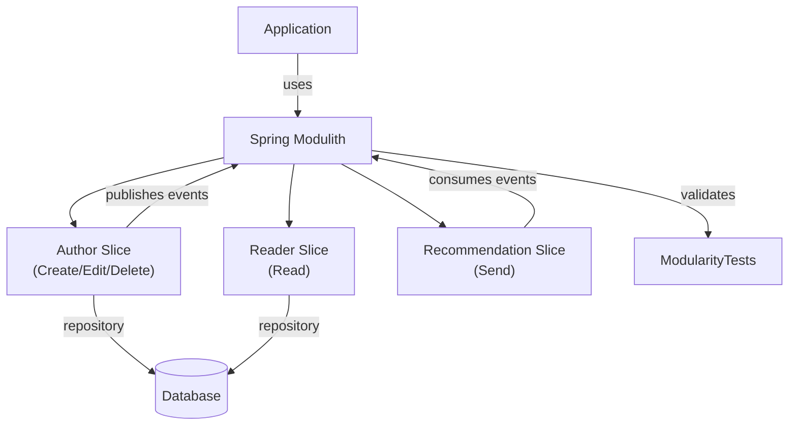

## Summary

Introduced Spring Modulith framework integration to enforce modular boundaries and improve architectural clarity in the vertical slice architecture. Added a pre-commit hook that automatically generates commit documentation, and integrated Spring Modulith dependencies to enable runtime module structure validation and event-driven communication between slices.

## Modified Components

- `.githooks/pre-commit` — automated documentation generation hook
- `pom.xml` — Spring Modulith BOM and starter dependencies added
- `Application.java` — application initialization with Modulith support
- `AuthorRepository.java` — updated for module integration
- `CreateArticleUseCase.java`, `DeleteArticleUseCase.java`, `EditArticleUseCase.java` — refactored to align with modular structure
- `ReadArticleUseCase.java`, `ReaderController.java` — reader slice updates
- `SendArticleRecommendationUseCase.java` — event-driven recommendation module
- `ModularityTests.java` — new module structure validation tests

## Component Diagram

