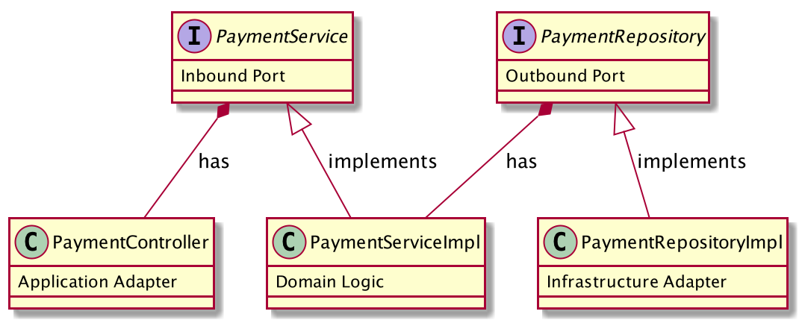

# hexagonal-architecture-example
Repo contains a sample project to demonstrate concepts of hexagonal architecture

There are 3 main components in hexagonal architecture:

### Domain

Exposes following **ports** for inbound and outbound interactions in form of interfaces

[PaymentService](./src/main/java/com/baeldung/hexagonal/domain/port/PaymentService.java)

[PaymentRepository](./src/main/java/com/baeldung/hexagonal/domain/port/PaymentRepository.java) 

### Application 

_inbound **adapter**_

[PaymentController](./src/main/java/com/baeldung/hexagonal/application/adapter/PaymentController.java)
 

### Infrastructure 

_outbound **adapter**_

[PaymentRepositoryImpl](./src/main/java/com/baeldung/hexagonal/infrastructure/adapter/PaymentRepositoryImpl.java)

## class diagram

