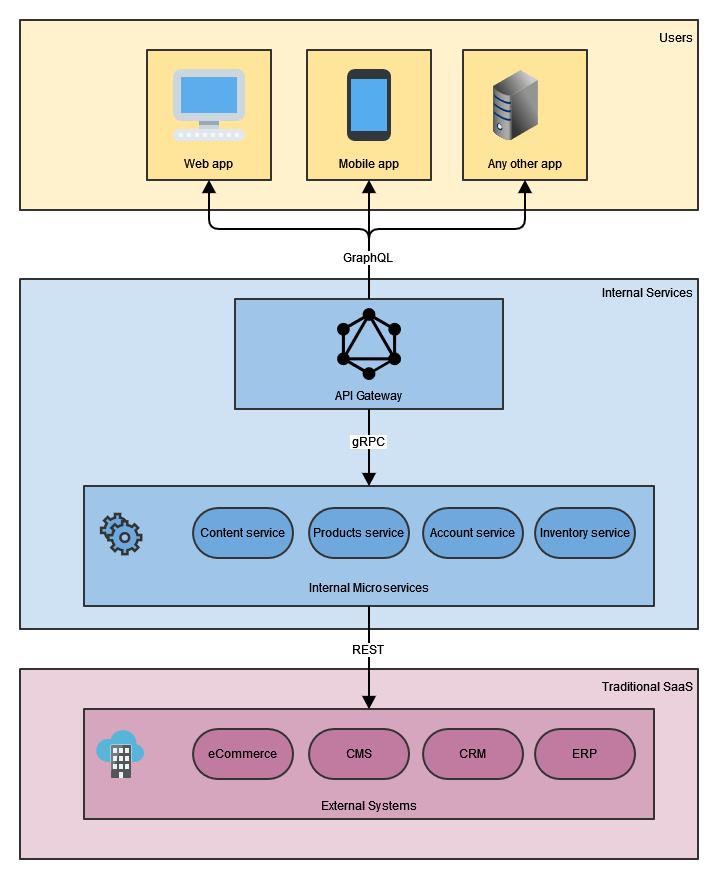

# Spring Boot Graphql

This module contains articles about Spring Boot Graphql

## Relevant Articles

- [x] [Getting Started with GraphQL and Spring Boot](https://www.baeldung.com/spring-graphql)
- [x] [Expose GraphQL Field with Different Name](https://www.baeldung.com/graphql-field-name)
- [x] [Error Handling in GraphQL With Spring Boot](https://www.baeldung.com/spring-graphql-error-handling)
- [x] [How to Test GraphQL Using Postman](https://www.baeldung.com/graphql-postman)
- [x] [GraphQL vs REST](https://www.baeldung.com/graphql-vs-rest)
- [x] [REST vs. GraphQL vs. gRPC – Which API to Choose?](https://www.baeldung.com/rest-vs-graphql-vs-grpc)

## 开始使用GraphQL和Spring Boot

1. 简介

    [GraphQL](http://graphql.org/)是Facebook提出的一个相对较新的概念，被称为Web API的REST的替代品。

    在本教程中，我们将学习如何使用Spring Boot设置GraphQL服务器，以便将其添加到现有的应用程序或在新的应用程序中使用。

2. 什么是GraphQL？

    传统的REST API是以服务器管理资源的概念工作的。我们可以按照各种HTTP动词，以一些标准的方式操作这些资源。只要我们的API符合资源的概念，这就非常好，但当我们需要偏离(deviate)它时，很快就会崩溃。

    当客户端同时需要来自多个资源的数据时，这也会受到影响，例如请求一个博客文章和评论。通常情况下，解决这个问题的方法是让客户端发出多个请求，或者让服务器提供可能并不总是需要的额外数据，从而导致更大的响应规模。

    GraphQL为这两个问题提供了一个解决方案。它允许客户端准确地指定它所需要的数据，包括在一次请求中导航子资源，并允许在一次请求中进行多次查询。

    它还以更多的RPC方式工作，使用命名的查询和突变，而不是一套标准的强制性动作。这样做的目的是把控制权放在它所属的地方，由API开发者指定什么是可能的，由API消费者指定什么是需要的。

    例如，一个博客可能允许以下的查询。

    ```GraphQL
    query {
        recentPosts(count: 10, offset: 0) {
            id
            title
            category
            author {
                id
                name
                thumbnail
            }
        }
    }
    ```

    这个查询将:

    - 请求获得最近的十个帖子
    - 对每一篇文章，要求提供ID、标题和类别
    - 对于每个帖子，请求作者，返回ID、名字和缩略图

    在传统的REST API中，这要么需要11个请求，一个请求帖子，10个请求作者，要么需要在帖子的细节中包括作者的细节。

    1. GraphQL模式

        GraphQL服务器暴露了一个描述API的模式。这个模式由类型定义组成。每个类型都有一个或多个字段，每个字段接受零个或多个参数并返回一个特定的类型。

        图(graph)是由这些字段相互嵌套的方式得出的。注意，图不需要是无环的，循环是完全可以接受的，但它是有方向的。客户端可以从一个字段到它的子字段，但它不能自动回到父字段，除非模式明确定义了这一点。

        一个博客的GraphQL模式的例子可能包含以下定义，描述一个帖子，帖子的作者，以及一个根查询，以获得博客上最近的帖子。

        ```GraphQL
        type Post {
            id: ID!
            title: String!
            text: String!
            category: String
            author: Author!
        }

        type Author {
            id: ID!
            name: String!
            thumbnail: String
            posts: [Post]!
        }

        # The Root Query for the application
        type Query {
            recentPosts(count: Int, offset: Int): [Post]!
        }

        # The Root Mutation for the application
        type Mutation {
            createPost(title: String!, text: String!, category: String, authorId: String!) : Post!
        }
        ```

        一些名字后面的"!"表示它是一个不可归零的类型。任何没有这个的类型在服务器的响应中都可能是空的。GraphQL服务正确地处理了这些，允许我们安全地请求可空类型的子字段。

        GraphQL服务还使用一组标准的字段来公开模式，允许任何客户端提前查询模式定义。

        这允许客户端自动检测模式的变化，并允许客户端动态地适应模式的工作方式。一个非常有用的例子是GraphiQL工具，它允许我们与任何GraphQL API交互。

3. 介绍GraphQL Spring Boot Starter

    [Spring Boot GraphQL Starter](https://spring.io/projects/spring-graphql)为在很短的时间内运行GraphQL服务器提供了一个绝佳的方法。利用自动配置和基于注解的编程方法，我们只需编写服务所需的代码。

    1. 设置服务

        我们所需要的是正确的依赖关系，这样才能工作。

        ```xml
        <dependency>
            <groupId>org.springframework.boot</groupId>
            <artifactId>spring-boot-starter-graphql</artifactId>
        </dependency>
        <dependency>
            <groupId>org.springframework.boot</groupId>
            <artifactId>spring-boot-starter-web</artifactId>
        </dependency>
        ```

        因为GraphQL是不依赖于传输的，所以我们在配置中包含了web starter。这将使用Spring MVC在默认的/graphql端点上通过HTTP暴露GraphQL API。其他启动器可用于其他底层实现，如Spring Webflux。

        如果有必要，我们也可以在application.properties文件中定制这个端点。

    2. 编写模式

        GraphQL Boot启动器通过处理GraphQL模式文件来建立正确的结构，然后将特殊的Bean连接到这个结构。Spring Boot GraphQL启动器会自动找到这些模式文件。

        我们需要将这些".graphqls"或".gqls"模式文件保存在 src/main/resources/graphql/** 位置下，Spring Boot会自动拾取它们。像往常一样，我们可以用spring.graphql.schema.lots定制位置，用spring.graphql.schema.file-extensions配置属性定制文件扩展名。

        一个要求是，必须有一个根查询和最多一个根突变。与模式的其他部分不同，我们不能将其分割到不同的文件中。这是GraphQL模式定义的一个限制，而不是Java实现的限制。

    3. 根查询解析器

        根查询需要有特别注释的方法来处理这个根查询中的各种字段。与模式定义不同，没有限制根查询字段只能有一个Spring Bean。

        我们需要用@QueryMapping注解来注解处理方法，并将这些方法放在我们应用程序中的标准@Controller组件内。这就将注释的类注册为我们GraphQL应用程序中的数据获取组件。

        ```java
        @Controller
        public class PostController {

            private PostDao postDao;

            @QueryMapping
            public List<Post> recentPosts(@Argument int count, @Argument int offset) {
                return postDao.getRecentPosts(count, offset);
            }
        }
        ```

        上面定义了 recentPosts 方法，我们将用它来处理对前面定义的模式中 recentPosts 字段的任何 GraphQL 查询。此外，该方法必须有与模式中的相应参数相对应的@Argument注释的参数。

        它还可以选择其他与GraphQL相关的参数，如GraphQLContext、DataFetchingEnvironment等，用于访问底层上下文和环境。

        该方法还必须为GraphQL方案中的类型返回正确的返回类型，正如我们即将看到的。我们可以使用任何简单的类型，如String、Int、List等，与之等价的Java类型，系统只是自动映射它们。

    4. 使用Bean来表示类型

        GraphQL服务器中的每个复杂类型都由一个Java Bean来表示，无论是从根查询还是从结构中的其他地方加载。相同的Java类必须始终代表相同的GraphQL类型，但类的名称不是必须的。

        Java Bean内的字段将根据字段的名称直接映射到GraphQL响应中的字段。

        ```java
        public class Post {
            private String id;
            private String title;
            private String category;
            private String authorId;
        }
        ```

        Java Bean上没有映射到GraphQL模式的任何字段或方法将被忽略，但不会导致问题。这对字段解析器的工作很重要。

        例如，在这里，字段authorId并不对应于我们先前定义的模式中的任何内容，但它将可用于下一步。

    5. 复杂值的字段解析器

        有时，一个字段的值的加载是不简单的。这可能涉及到数据库查询、复杂的计算，或者其他任何事情。@SchemaMapping注解将处理方法映射到模式中具有相同名称的字段，并将其用作该字段的DataFetcher。

        ```java
        @SchemaMapping
        public Author author(Post post) {
            return authorDao.getAuthor(post.getAuthorId());
        }
        ```

        重要的是，如果客户端没有请求一个字段，那么GraphQL服务器就不会做工作来检索它。这意味着，如果客户端检索了一个post，但没有询问author字段，上面的author()方法就不会被执行，DAO调用也不会进行。

        另外，我们也可以在注释中指定父类型名称和字段名称。

        ```java
        @SchemaMapping(typeName="Post", field="author")
        public Author getAuthor(Post post) {
            return authorDao.getAuthor(post.getAuthorId());
        }
        ```

        这里，注解属性被用来声明这是模式中作者字段的处理程序。

    6. 可归零的值

        GraphQL模式有一个概念，即有些类型是可空的，有些则不是。

        我们在Java代码中通过直接使用null值来处理这个问题。相反，我们可以直接使用Java 8中的新的Optional类型来处理可归零的类型，系统会对这些值做正确的处理。

        这非常有用，因为这意味着我们的Java代码从方法定义上与GraphQL模式更明显的相同。

    7. 变异

        到目前为止，我们所做的一切是关于从服务器上检索数据的。GraphQL也有能力通过突变来更新存储在服务器上的数据。

        从代码的角度来看，查询没有理由不改变服务器上的数据。我们可以很容易地写出接受参数的查询解析器，保存新数据，并返回这些变化。这样做会给API客户端带来令人惊讶的副作用，被认为是不好的做法。

        相反，应该使用突变来通知客户端，这将导致正在存储的数据发生变化。

        与查询类似，突变是在控制器中通过用@MutationMapping注释处理方法来定义的。突变字段的返回值与查询字段的返回值的处理方式完全相同，允许嵌套的值也被检索。

        ```java
        @MutationMapping
        public Post createPost(@Argument String title, @Argument String text,
        @Argument String category, @Argument String authorId) {

            Post post = new Post();
            post.setId(UUID.randomUUID().toString());
            post.setTitle(title);
            post.setText(text);
            post.setCategory(category);
            post.setAuthorId(authorId);

            postDao.savePost(post);

            return post;
        }
        ```

4. GraphiQL

    GraphQL也有一个配套的工具，叫做[GraphiQL](https://github.com/graphql/graphiql)。这个UI工具可以与任何GraphQL服务器通信，并帮助消费和开发GraphQL API。它的可下载版本作为Electron应用程序存在，可以从[这里](https://github.com/skevy/graphiql-app)检索到。

    Spring GraphQL带有一个默认的GraphQL页面，在/graphiql端点上暴露。该端点默认是禁用的，但可以通过启用spring.graphql.graphiql.enabled属性来打开它。这提供了一个非常有用的浏览器内工具来编写和测试查询，特别是在开发和测试期间。

5. 总结

    GraphQL是一项非常令人兴奋的新技术，有可能彻底改变我们开发Web API的方式。

    Spring Boot GraphQL Starter使得将这项技术添加到任何新的或现有的Spring Boot应用程序中变得异常简单。

## 用不同的名字暴露GraphQL字段

1. 概述

    GraphQL已被广泛用作网络服务中的一种通信模式。GraphQL的基本前提是在客户端应用程序中灵活使用。

    在本教程中，我们将研究灵活性的另一个方面。我们还将探讨如何用不同的名称来暴露GraphQL字段。

2. GraphQL模式

    让我们举个例子，一个[博客](https://www.baeldung.com/spring-graphql)有不同作者的帖子。GraphQL模式看起来是这样的。

    ```GraphQL
    query {
        recentPosts(count: 1, offset: 0){
            id
            title
            text
            category
            author {
                id
                name
                thumbnail
            }
        }
    }

    type Post {
        id: ID!
        title: String!
        text: String!
        category: String
        authorId: Author!
    }

    type Author {
        id: ID!
        name: String!
        thumbnail: String
        posts: [Post]!
    }
    ```

    这里我们可以获取最近的帖子。每一个帖子都将伴随着它的作者。查询的结果如下。

    ```json
    {
        "data": {
            "recentPosts": [
                {
                    "id": "Post00",
                    "title": "Post 0:0",
                    "text": "Post 0 + by author 0",
                    "category": null,
                    "author": {
                        "id": "Author0",
                        "name": "Author 0",
                        "thumbnail": "http://example.com/authors/0"
                    }
                }
            ]
        }
    }
    ```

3. 用不同的名字暴露GraphQL字段

    一个客户端应用程序可能需要使用字段first_author。现在，它正在使用作者。为了适应这一要求，我们有两个解决方案。

    - 改变GraphQL服务器中模式的定义
    - 利用GraphQL中的[别名](https://graphql.org/learn/queries/#aliases)概念
    让我们逐一看一下这两种方法。

    1. 改变模式

        让我们来更新帖子的模式定义。

        ```GraphQL
        type Post {
            id: ID!
            title: String!
            text: String!
            category: String
            first_author: Author!
        }
        ```

        作者不是一个微不足道的字段。它是一个复杂的字段。我们还需要更新处理方法来适应这一变化。

        PostController中用@SchemaMapping标记的author(Post post)方法，需要更新为getFirst_author(Post post)。另外，还需要在@SchemaMapping中添加字段属性，以反映新的字段名。

        下面是查询的内容。

        ```GraphQL
        query{
            recentPosts(count: 1,offset: 0){
                id
                title
                text
                category
                first_author{
                    id
                    name
                    thumbnail
                }
            }
        }
        ```

        上述查询的结果如下：

        ```json
        {
            "data": {
                "recentPosts": [
                    {
                        "id": "Post00",
                        "title": "Post 0:0",
                        "text": "Post 0 + by author 0",
                        "category": null,
                        "first_author": {
                            "id": "Author0",
                            "name": "Author 0",
                            "thumbnail": "http://example.com/authors/0"
                        }
                    }
                ]
            }
        }
        ```

        这个解决方案有两个主要问题。

        - 它引入了对模式和服务器端实现的改变
        - 它迫使其他客户端应用程序遵循这个更新的模式定义。
        这些问题与GraphQL提供的灵活性功能相矛盾。

    2. GraphQL别名

        在GraphQL中，别名让我们把一个字段的结果重命名为我们想要的任何东西，而不需要改变模式定义。要在查询中引入一个别名，别名和冒号（:）必须在GraphQL字段之前。

        下面是查询的演示。

        ```GraphQL
        query {
            recentPosts(count: 1, offset: 0) {
                id
                title
                text
                category
                first_author: author {
                    id
                    name
                    thumbnail
                }
            }
        }
        ```

        上述查询的结果如下：

        ```json
        {
            "data": {
                "recentPosts": [
                    {
                        "id": "Post00",
                        "title": "Post 0:0",
                        "text": "Post 0 + by author 0",
                        "category": null,
                        "first_author": {
                            "id": "Author0",
                            "name": "Author 0",
                            "thumbnail": "http://example.com/authors/0"
                        }
                    }
                ]
            }
        }
        ```

        让我们注意到，查询本身是在请求第一个帖子。另一个客户端应用程序可能会要求得到first_post而不是recentPosts。这时，Aliases又会来帮忙了。

        ```GraphQL
        query {
            first_post: recentPosts(count: 1, offset: 0) {
                id
                title
                text
                category
                author {
                    id
                    name
                    thumbnail
                }
            }
        }
        ```

        上述查询的结果如下。

        ```json
        {
            "data": {
                "first_post": [
                    {
                        "id": "Post00",
                        "title": "Post 0:0",
                        "text": "Post 0 + by author 0",
                        "category": null,
                        "author": {
                            "id": "Author0",
                            "name": "Author 0",
                            "thumbnail": "http://example.com/authors/0"
                        }
                    }
                ]
            }
        }
        ```

        这两个例子清楚地表明了使用GraphQL是多么灵活。每一个客户端的应用程序都可以根据需求来更新自己。同时，服务器端的模式定义和实现保持不变。

4. 总结

    在这篇文章中，我们研究了用不同的名字暴露graphQL字段的两种方法。我们用例子介绍了Aliases的概念，并解释了它是如何正确的方法。

## 用Spring Boot处理GraphQL中的错误

1. 概述

    在本教程中，我们将学习 GraphQL 中的错误处理选项。我们将研究GraphQL规范中关于错误响应的内容。因此，我们将使用Spring Boot开发一个GraphQL错误处理的例子。

2. 根据GraphQL规范的响应

    根据GraphQL规范，收到的每个请求都必须返回一个格式良好的响应。这个格式良好的响应包括数据map或来自各自成功或不成功的请求操作的错误。此外，一个响应可能包含部分成功的结果数据和字段错误。

    响应map的关键组成部分是错误、数据和扩展。

    响应中的错误部分描述了在请求的操作过程中的任何失败。如果没有发生错误，响应中就不能出现错误部分。在下一节，我们将研究规范中描述的不同种类的错误。

    数据部分描述了成功执行请求操作的结果。如果操作是一个查询，这个部分是一个查询根操作类型的对象。另一方面，如果操作是一个突变，这个组件是突变根操作类型的一个对象。

    如果由于信息缺失、验证错误或语法错误，请求的操作在执行前就已经失败了，那么数据组件就不能出现在响应中。而如果在操作执行过程中操作失败，并出现不成功的结果，那么数据组件必须为空。

    响应map可以包含一个额外的组件，称为扩展，它是一个map对象。该组件方便实现者在响应中提供他们认为合适的其他自定义内容。因此，对其内容格式没有额外的限制。

    如果数据组件没有出现在响应中，那么错误组件必须出现，并且必须至少包含一个错误。此外，它应该指出失败的原因。

    下面是一个GraphQL错误的例子:

    ```GraphQL
    mutation {
    addVehicle(vin: "NDXT155NDFTV59834", year: 2021, make: "Toyota", model: "Camry", trim: "XLE",
                location: {zipcode: "75024", city: "Dallas", state: "TX"}) {
        vin
        year
        make
        model
        trim
    }
    }
    ```

    违反唯一约束时的错误响应将看起来像。

    ```json
    {
    "data": null,
    "errors": [
        {
        "errorType": "DataFetchingException",
        "locations": [
            {
            "line": 2,
            "column": 5,
            "sourceName": null
            }
        ],
        "message": "Failed to add vehicle. Vehicle with vin NDXT155NDFTV59834 already present.",
        "path": [
            "addVehicle"
        ],
        "extensions": {
            "vin": "NDXT155NDFTV59834"
        }
        }
    ]
    }
    ```

3. 根据GraphQL规范的错误响应组件

    响应中的错误部分是一个非空的错误列表，每个错误都是一个map。

    1. 请求错误

        顾名思义，如果请求本身有任何问题，请求错误可能在操作执行之前发生。它可能是由于请求数据解析失败，请求文档验证，不支持的操作，或者无效的请求值。

        当请求错误发生时，这表明执行还没有开始，这意味着响应中的数据部分一定不会出现在响应中。换句话说，响应中只包含错误部分。

        让我们看一个演示无效输入语法情况的例子。

        ```GraphQL
        query {
        searchByVin(vin: "error) {
            vin
            year
            make
            model
            trim
        }
        }
        ```

        下面是一个语法错误的请求错误响应，在本例中是缺少一个引号：

        ```json
        {
        "data": null,
        "errors": [
            {
            "message": "Invalid Syntax",
            "locations": [
                {
                "line": 5,
                "column": 8,
                "sourceName": null
                }
            ],
            "errorType": "InvalidSyntax",
            "path": null,
            "extensions": null
            }
        ]
        }
        ```

    2. 字段错误

        字段错误，顾名思义，可能是由于未能将值强制变成预期的类型，或者在特定字段的值解析过程中出现内部错误。这意味着字段错误是在执行要求的操作过程中发生的。

        在发生字段错误的情况下，继续执行请求的操作并返回部分结果，这意味着响应的数据部分必须与错误部分的所有字段错误一起出现。

        让我们看看另一个例子。

        ```GraphQL
        query {
        searchAll {
            vin
            year
            make
            model
            trim
        }
        }
        ```

        这一次，我们包含了车辆装饰字段，根据我们的GraphQL模式，它应该是不可为空的。

        然而，其中一个车辆的信息有一个空的修饰值，所以我们只得到了部分数据--修饰值不为空的车辆--以及错误。

        ```json
        {
        "data": {
            "searchAll": [
            null,
            {
                "vin": "JTKKU4B41C1023346",
                "year": 2012,
                "make": "Toyota",
                "model": "Scion",
                "trim": "Xd"
            },
            {
                "vin": "1G1JC1444PZ215071",
                "year": 2000,
                "make": "Chevrolet",
                "model": "CAVALIER VL",
                "trim": "RS"
            }
            ]
        },
        "errors": [
            {
            "message": "Cannot return null for non-nullable type: 'String' within parent 'Vehicle' (/searchAll[0]/trim)",
            "path": [
                "searchAll",
                0,
                "trim"
            ],
            "errorType": "DataFetchingException",
            "locations": null,
            "extensions": null
            }
            ]
        }
        ```

    3. 错误响应格式

        正如我们前面看到的，响应中的错误是一个或多个错误的集合。而且，每个错误都必须包含一个描述失败原因的消息键，以便客户端开发人员可以进行必要的修正以避免错误。

        每个错误还可能包含一个叫做location的键，这是一个位置列表，指向请求的GraphQL文档中与错误相关的一行。每个位置是一个带有键的地图：行和列，分别提供相关元素的行号和起始列号。

        另一个可能是错误的一部分的键被称为路径。它提供了从根元素追踪到响应中出现错误的特定元素的值的列表。路径值可以是一个字符串，代表字段名，如果字段值是一个列表，则是错误元素的索引。如果错误与一个有别名的字段有关，那么路径中的值应该是别名。

    4. 处理字段错误

        无论字段错误是发生在可归零还是不可归零的字段上，我们都应该像字段返回空值一样处理它，并且该错误必须被添加到错误列表中。

        在可置空字段的情况下，该字段在响应中的值将是空的，但错误必须包含这个字段的错误，描述失败的原因和其他信息，正如在前面的章节中看到的。

        另一方面，父字段处理非空字段的错误。如果父字段是不可空的，那么错误处理就会被传播，直到我们到达一个可空的父字段或根元素。

        类似地，如果一个列表字段包含一个不可置空的类型，并且一个或多个列表元素返回null，整个列表解析为null。此外，如果包含列表字段的父字段是不可置空的，那么错误处理会被传播，直到我们到达一个可置空的父字段或根元素。

        出于任何原因，如果在解析过程中对同一字段提出了多个错误，那么对于该字段，我们必须只将一个字段的错误加入错误中。

4. Spring Boot GraphQL库

    我们的Spring Boot应用实例使用spring-boot-starter-graphql模块，它带来了所需的GraphQL依赖。

    我们还使用spring-graphql-test模块进行相关测试。

    ```xml
    <dependency>
        <groupId>org.springframework.boot</groupId>
        <artifactId>spring-boot-starter-graphql</artifactId>
    </dependency>
    <dependency>
        <groupId>org.springframework.graphql</groupId>
        <artifactId>spring-graphql-test</artifactId>
        <scope>test</scope>
    </dependency>
    ```

5. Spring Boot GraphQL错误处理

    在本节中，我们将主要介绍Spring Boot应用程序本身的GraphQL错误处理。我们将不涉及GraphQL Java和GraphQL Spring Boot应用的开发。

    在我们的Spring Boot应用实例中，我们将根据位置或VIN（车辆识别码）对车辆进行变异或查询。我们将看到使用这个例子实现错误处理的不同方法。

    在以下各小节中，我们将看到Spring Boot模块如何处理异常或错误。

    1. 带有标准异常的GraphQL响应

        一般来说，在REST应用程序中，我们通过扩展RuntimeException或Throwable来创建一个自定义的运行时异常类。

        ```java
        public class InvalidInputException extends RuntimeException {
            public InvalidInputException(String message) {
                super(message);
            }
        }
        ```

        通过这种方法，我们可以看到GraphQL引擎返回以下响应。

        ```json
        {
        "errors": [
            {
            "message": "INTERNAL_ERROR for 2c69042a-e7e6-c0c7-03cf-6026b1bbe559",
            "locations": [
                {
                "line": 2,
                "column": 5
                }
            ],
            "path": [
                "searchByLocation"
            ],
            "extensions": {
                "classification": "INTERNAL_ERROR"
            }
            }
        ],
        "data": null
        }
        ```

        在上面的错误响应中，我们可以看到它并没有包含任何错误的细节。

        默认情况下，请求处理过程中的任何异常都由 ExceptionResolversExceptionHandler 类处理，该类实现了GraphQL API的 DataFetcherExceptionHandler 接口。它允许应用程序注册一个或多个 DataFetcherExceptionResolver 组件。

        这些解析器被依次调用，直到其中一个能够处理该异常并将其解析为GraphQLError。如果没有解析器能够处理该异常，那么该异常将被归类为INTERNAL_ERROR。如上图所示，它还包含执行ID和通用错误信息。

    2. 带有处理过的异常的GraphQL响应

        现在让我们看看，如果我们实现了我们的自定义异常处理，响应会是什么样子。

        首先，我们有另一个自定义异常。

        ```java
        public class VehicleNotFoundException extends RuntimeException {
            public VehicleNotFoundException(String message) {
                super(message);
            }
        }
        ```

        DataFetcherExceptionResolver提供了一个异步合约。然而，在大多数情况下，扩展DataFetcherExceptionResolverAdapter并重载它的resolveToSingleError或resolveToMultipleErrors方法之一就足够了，这些方法可以同步地解决异常。

        现在，让我们来实现这个组件，我们可以返回一个NOT_FOUND分类和异常信息，而不是一般的错误。

        ```java
        @Component
        public class CustomExceptionResolver extends DataFetcherExceptionResolverAdapter {

            @Override
            protected GraphQLError resolveToSingleError(Throwable ex, DataFetchingEnvironment env) {
                if (ex instanceof VehicleNotFoundException) {
                    return GraphqlErrorBuilder.newError()
                    .errorType(ErrorType.NOT_FOUND)
                    .message(ex.getMessage())
                    .path(env.getExecutionStepInfo().getPath())
                    .location(env.getField().getSourceLocation())
                    .build();
                } else {
                    return null;
                }
            }
        }
        ```

        在这里，我们创建了一个GraphQLError，带有适当的分类和其他错误细节，以便在JSON响应的错误部分创建一个更有用的响应。

        ```json
        {
        "errors": [
            {
            "message": "Vehicle with vin: 123 not found.",
            "locations": [
                {
                "line": 2,
                "column": 5
                }
            ],
            "path": [
                "searchByVin"
            ],
            "extensions": {
                "classification": "NOT_FOUND"
            }
            }
        ],
        "data": {
            "searchByVin": null
        }
        }
        ```

        这个错误处理机制的一个重要细节是，未解决的异常会被记录在ERROR级别，同时记录与发送到客户端的错误相关的executionId。任何已解决的异常，如上所示，在日志中被记录在DEBUG级别。

6. 总结

    在本教程中，我们学习了不同类型的GraphQL错误。我们还研究了如何根据规范格式化GraphQL错误。后来我们在Spring Boot应用程序中实现了错误处理。

## 如何使用Postman测试GraphQL

1. 概述

    在这个简短的教程中，我们将展示如何使用Postman测试GraphQL端点。

2. 模式概述和方法

    我们将使用在GraphQL教程中创建的端点。作为提醒，该模式包含描述帖子和作者的定义。

    ```GraphQL
    type Post {
        id: ID!
        title: String!
        text: String!
        category: String
        author: Author!
    }
    
    type Author {
        id: ID!
        name: String!
        thumbnail: String
        posts: [Post]!
    }
    ```

    另外，我们还有显示帖子和编写新帖子的方法。

    ```GraphQL
    type Query {
        recentPosts(count: Int, offset: Int): [Post]!
    }
    
    type Mutation {
        createPost(title: String!, text: String!, category: String) : Post!
    }
    ```

    当使用突变来保存数据时，所需的字段会用感叹号来标记。还要注意的是，在我们的Mutation中，返回的类型是Post，但在Query中，我们会得到一个Post对象的列表。

    上述模式可以在Postman API部分加载--只需添加具有GraphQL类型的新API，然后按生成集合。

    配置入口 APIs-Define

    一旦我们加载了我们的模式，我们就可以使用Postman对GraphQL的自动完成支持，轻松地编写样本查询。

3. Postman中的GraphQL请求

    首先，Postman允许我们以GraphQL格式发送主体--我们只需选择GraphQL选项。

    配置入口 request-Body-QUERY

    然后，我们可以写一个原生的GraphQL查询，比如在QUERY部分获取标题、类别和作者姓名。

    ```GraphQL
    query {
        recentPosts(count: 1, offset: 0) {
            title
            category
            author {
                name
            }
        }
    }
    ```

    结果是，我们会得到：

    ```json
    {
        "data": {
            "recentPosts": [
                {
                    "title": "Post",
                    "category": "test",
                    "author": {
                        "name": "Author 0"
                    }
                }
            ]
        }
    }
    ```

    也可以使用原始格式发送请求，但我们必须在头文件部分添加Content-Type: application/graphql。而且，在这种情况下，正文看起来是一样的。

    例如，我们可以更新标题、文本、类别，得到一个ID和标题作为响应。

    ```GraphQL
    mutation {
        createPost (
            title: "Post", 
            text: "test", 
            category: "test",
        ) {
            id
            title
        }
    }
    ```

    操作的类型--如查询和突变--可以在查询体中省略，只要我们使用速记的语法。在这种情况下，我们不能使用操作的名称和变量，但建议使用操作名称，以方便记录和调试。

4. 使用变量

    在变量部分，我们可以创建一个JSON格式的模式，为变量赋值。这就避免了在查询字符串中输入参数。

    配置入口 request-Body-QUERY

    因此，我们可以在QUERY部分修改 recentPosts主体，以动态地分配变量的值。

    ```GraphQL
    query recentPosts ($count: Int, $offset: Int) {
        recentPosts (count: $count, offset: $offset) {
            id
            title
            text
            category
        }
    }
    ```

    然后我们可以在GRAPHQL VARIABLES部分编辑我们希望的变量设置：

    配置入口 request-Body-GRAPHQL VARIABLES

    ```json
    {
    "count": 1,
    "offset": 0
    }
    ```

5. 总结

    我们可以使用Postman轻松地测试GraphQL，它还允许我们导入模式并生成查询。

## GraphQL与REST

1. 概述

    当创建网络服务来支持我们的应用程序时，我们可以选择使用[REST](https://www.baeldung.com/category/rest/)或GraphQL作为通信模式。虽然两者都最有可能通过HTTP使用JSON，但它们有不同的优点和缺点。

    在本教程中，我们将比较GraphQL与REST。我们将创建一个产品数据库的例子，并比较这两种解决方案在执行相同的客户端操作时有何不同。

2. 服务实例

    我们的示例服务将允许我们：

    - 创建一个处于草稿状态的产品
    - 更新产品的详细信息
    - 获取产品列表
    - 获取单个产品及其订单的详细信息
    让我们开始使用REST创建应用程序。

3. REST

    REST（Representational State Transfer）是分布式超媒体系统的一种[架构风格](https://www.ics.uci.edu/~fielding/pubs/dissertation/rest_arch_style.htm)。REST的主要数据元素被称为[资源](https://www.ics.uci.edu/~fielding/pubs/dissertation/rest_arch_style.htm#tab_5_1)。在这个例子中，资源是 "product"。

    1. 创建产品

        为了创建一个产品，我们将在我们的API上使用POST方法。

        ```shell
        curl --request POST 'http://localhost:8081/product' \
        --header 'Content-Type: application/json' \
        --data '{
            "name": "Watch",
            "description": "Special Swiss Watch",
            "status": "Draft",
            "currency": "USD",
            "price": null,
            "imageUrls": null,
            "videoUrls": null,
            "stock": null,
            "averageRating": null
        }'
        ```

        结果是，系统将创建一个新的产品。

    2. 更新产品

        在REST中，我们习惯性地使用PUT方法来更新产品。

        ```shell
        curl --request PUT 'http://localhost:8081/product/{product-id}' \
        --header 'Content-Type: application/json' \
        --data '{
            "name": "Watch",
            "description": "Special Swiss Watch",
            "status": "Draft",
            "currency": "USD",
            "price": 1200.0,
            "imageUrls": [
                "https://graphqlvsrest.com/imageurl/product-id"
            ],
            "videoUrls": [
                "https://graphqlvsrest.com/videourl/product-id"
            ],
            "stock": 10,
            "averageRating": 0.0
        }'
        ```

        结果，{product-id}对象上会有一个更新。

    3. 获取产品列表

        列出产品通常是一个GET操作，我们可以使用一个查询字符串来指定分页。

        `curl --request GET 'http://localhost:8081/product?size=10&page=0'`

        第一个响应对象是：

        ```json
        {
        "id": 1,
        "name": "T-Shirt",
        "description": "Special beach T-Shirt",
        "status": Published,
        "currency": "USD",
        "price": 30.0,
        "imageUrls": ["https://graphqlvsrest.com/imageurl/1"], 
        "videoUrls": ["https://graphqlvsrest.com/videourl/1"], 
        "stock": 10, 
        "averageRating": 3.5 
        }
        ```

    4. 获取带有订单的单个产品

        要获得一个产品和它的订单，我们通常可能期望通过之前的API获得一个产品列表，然后调用一个订单资源来找到相关的订单。

        `curl --request GET 'localhost:8081/order?product-id=1'`

        第一个响应对象是。

        ```json
        {
        "id": 1,
        "productId": 1,
        "customerId": "de68a771-2fcc-4e6b-a05d-e30a8dd0d756",
        "status": "Delivered",
        "address": "43-F 12th Street",
        "creationDate": "Mon Jan 17 01:00:18 GST 2022"
        }
        ```

        由于我们是通过产品ID来查询订单，因此将ID作为查询参数提供给GET操作是合理的。然而，我们应该注意到，我们需要为我们感兴趣的每个产品执行一次这个操作，在原始操作的基础上，获取所有产品。这与N+1选择问题有关。

4. GraphQL

    GraphQL是一种用于API的查询语言，它带有一个使用现有数据服务来完成这些查询的框架。

    GraphQL的构建模块是[查询和变异](https://graphql.org/learn/queries/)。查询负责获取数据，而突变则是用于创建和更新。

    查询和突变都定义了一个[模式](https://graphql.org/learn/schema/)。该模式定义了可能的客户端请求和响应。

    让我们使用GraphQL服务器重新实现我们的例子。

    1. 创建产品

        让我们使用一个名为saveProduct的突变。

        ```bash
        curl --request POST 'http://localhost:8081/graphql' \
        --header 'Content-Type: application/json' \
        --data \
        '{
        "query": "mutation {saveProduct (
            product: {
            name: \"Bed-Side Lamp\",
            price: 24.0,
            status: \"Draft\",
            currency: \"USD\"
            }){ id name currency price status}
        }"
        }'
        ```

        在这个saveProduct函数中，圆括号内的内容是输入类型模式。后面的大括号描述了将由服务器返回的字段。

        当我们运行突变时，我们应该期待一个带有所选字段的响应。

        ```json
        {
        "data": {
            "saveProduct": {
            "id": "12",
            "name": "Bed-Side Lamp",
            "currency": "USD",
            "price": 24.0,
            "status": "Draft"
            }
        }
        }
        ```

        这个请求与我们在REST版本中的POST请求非常相似，尽管我们现在可以对响应进行一些定制。

    2. 更新产品

        同样地，我们可以使用另一个名为updateProduct的突变来修改一个产品。

        ```shell
        curl --request POST 'http://localhost:8081/graphql' \
        --header 'Content-Type: application/json' \
        --data \
        '{"query": "mutation {updateProduct(
            id: 11
            product: {
            price: 14.0,
            status: \"Publish\"
            }){ id name currency price status }  
        }","variables":{}}'
        ```

        我们在响应中收到所选择的字段。

        ```json
        {
        "data": {
            "updateProduct": {
            "id": "12",
            "name": "Bed-Side Lamp",
            "currency": "USD",
            "price": 14.0,
            "status": "Published"
            }
        }
        }
        ```

        正如我们所看到的，GraphQL对响应的格式提供了灵活性。

    3. 获取产品列表

        为了从服务器上获取数据，我们将利用一个查询。

        ```shell
        curl --request POST 'http://localhost:8081/graphql' \
        --header 'Content-Type: application/json' \
        --data \
        '{
            "query": "query {products(size:10,page:0){id name status}}"
        }'
        ```

        在这里，我们也描述了我们想要看到的结果页面。

        ```json
        {
        "data": {
            "products": [
            {
                "id": "1",
                "name": "T-Shirt",
                "status": "Published"
            },
            ...
            ]
        }
        }
        ```

    4. 获取单一产品与订单

        通过GraphQL，我们可以要求GraphQL服务器将产品和订单连接起来。

        ```shell
        curl --request POST 'http://localhost:8081/graphql' \
        --header 'Content-Type: application/json' \
        --data \
        '{
            "query": "query {product(id:1){ id name orders{customerId address status creationDate}}}"
        }'
        ```

        在这个查询中，我们获取id等于1的产品和它的订单。这使我们能够在一个单一的操作中进行请求，让我们检查一下响应。

        ```json
        {
        "data": {
            "product": {
            "id": "1",
            "name": "T-Shirt",
            "orders": [
                {
                "customerId": "de68a771-2fcc-4e6b-a05d-e30a8dd0d756",
                "status": "Delivered",
                "address": "43-F 12th Street",
                "creationDate": "Mon Jan 17 01:00:18 GST 2022"
                }, 
                ...
            ]
            }
        }
        }
        ```

        正如我们在这里看到的，响应有产品的细节和它各自的订单。

        为了用REST实现这一点，我们需要发送几个请求--第一个请求是获取产品，第二个请求是获取相应的订单。

5. 比较

    这些例子显示了GraphQL的使用如何减少了客户端和服务器之间的流量，并允许客户端为响应提供一些格式化的规则。

    值得注意的是，这些API背后的数据源可能仍然需要执行相同的操作来修改或获取数据，但是客户端和服务器之间丰富的接口允许客户端使用GraphQL做更少的工作。

    让我们进一步比较这两种方法。

    1. 灵活和动态

        GraphQL允许灵活和动态的查询。

        - 客户端应用程序可以只请求所需的字段
        - 可以使用[别名](https://graphql.org/learn/queries/#aliases)来请求具有自定义键的字段
        - 客户端可以使用查询来管理结果顺序
        - 客户端可以更好地与API的任何变化脱钩，因为没有单一版本的响应对象结构需要遵循。

    2. 更加廉价的操作

        每个服务器请求都有一个往返时间和有效载荷大小的代价。

        在REST中，我们最终可能会发送多个请求来实现所需的功能。这些多次请求将是一个昂贵的操作。另外，响应的有效载荷可能有不必要的数据，而这些数据可能不是客户端应用程序所需要的。

        GraphQL倾向于避免昂贵的操作。我们通常可以使用GraphQL在一个请求中获取我们需要的所有数据。

    3. 什么时候使用REST？

        GraphQL不是REST的替代品。两者甚至可以在同一个应用程序中共存。根据使用情况，托管GraphQL端点所增加的复杂性可能是值得的。

        在以下情况下，我们可能更喜欢REST：

        - 我们的应用程序自然是资源驱动的，其中的操作是非常直接和完全与个别资源实体相关的
        - 需要网络缓存，因为GraphQL并不支持它。
        - 我们需要文件上传，因为GraphQL本身并不支持它。

6. 结论

    在这篇文章中，我们用一个实际例子比较了REST和GraphQL。

    我们看到了我们是如何按惯例使用每种方法的。

    然后，我们讨论了两种方法都没有明显的优势。我们的需求将是在它们之间做出选择的驱动力。偶尔，两者也可以共存。

## REST vs. GraphQL vs. gRPC - 选择哪个API？

1. 概述

    多年来，REST一直是设计网络API的事实上的工业标准架构风格。然而，GraphQL和gRPC最近出现了，以解决REST的一些限制。这些API方法中的每一种都有很大的好处，也有一些折衷的地方。

    在本教程中，我们将首先看一下每种API设计方法。然后，我们将在Spring Boot中使用这三种不同的方法构建一个简单的服务。接下来，我们将通过研究在决定采用哪种方法之前应该考虑的几个标准来比较它们。

    最后，由于没有一个放之四海而皆准的方法，我们将看到不同的方法如何在不同的应用层上混合使用。

2. REST

    Representational State Transfer（REST）是全世界最常用的API架构风格。它早在2000年由Roy Fielding定义。

    1. 架构风格

        REST不是一个框架或库，而是一种架构风格，描述了一种基于URL结构和HTTP协议的接口。它描述了一个无状态的、可缓存的、基于约定的客户端-服务器互动的架构。它使用URL来解决适当的资源，使用HTTP方法来表达要采取的行动。

        - GET用于获取现有资源或多个资源
        - POST用于创建一个新的资源
        - PUT用于更新一个资源或在其不存在时创建它
        - DELETE用于删除一个资源
        - PATCH用于部分更新一个现有的资源
        REST可以用各种编程语言实现，支持多种数据格式，如JSON和XML。

    2. 服务实例

        我们可以通过使用@RestController注解定义一个控制器类，在Spring中建立一个REST服务。接下来，我们通过@GetMapping注解定义一个与HTTP方法对应的函数，例如GET。最后，在注解参数中，我们提供了一个资源路径，该方法应该被触发。

        ```java
        @GetMapping("/rest/books")
        public List<Book> books() {
            return booksService.getBooks();
        }
        ```

        MockMvc为Spring中的REST服务的集成测试提供支持。它封装了所有的Web应用Bean，并使它们可用于测试。

        ```java
        this.mockMvc.perform(get("/rest/books"))
        .andDo(print())
        .andExpect(status().isOk())
        .andExpect(content().json(expectedJson));
        ```

        由于它们是基于HTTP的，REST服务可以在浏览器中或使用Postman或CURL等工具进行测试。

        `$ curl http://localhost:8082/rest/books`

    3. 优点和缺点

        REST最大的优势在于它是科技界最成熟的API架构风格。由于它的流行，许多开发者已经熟悉了REST，并发现它很容易操作。然而，由于它的灵活性，REST在开发者之间可以有不同的解释。

        鉴于每个资源通常位于一个独特的URL后面，它很容易监测和限制API的速率。REST还通过利用HTTP的优势使缓存变得简单。通过缓存HTTP响应，我们的客户端和服务器不需要不断地相互交流。

        REST很容易出现获取不足和获取过度的情况。例如，为了获取嵌套的实体，我们可能需要进行多次请求。另一方面，在REST API中，通常不可能只获取特定的一块实体数据。客户端总是会收到所请求的端点被配置为返回的所有数据。

3. GraphQL

    GraphQL是Facebook开发的一种开源的API查询语言。

    1. 架构风格

        GraphQL提供了一种用于开发API的查询语言，并有一个框架来完成这些查询。它不依赖HTTP方法来操作数据，大部分只使用POST。相比之下，GraphQL使用了查询、突变和订阅。

        - Queries 查询是用来向服务器请求数据的
        - Mutations 突变用于修改服务器上的数据
        - Subscriptions 订阅用于在数据变化时获得实时更新。
        GraphQL是客户驱动的，因为它使其客户能够准确地定义他们在特定的使用情况下需要的数据。然后在一次往返中从服务器上检索所请求的数据。

    2. 服务实例

        在GraphQL中，数据是用定义对象、其字段和类型的模式来表示的。因此，我们将首先为我们的示例服务定义一个GraphQL模式。

        ```graphql
        type Author {
            firstName: String!
            lastName: String!
        }

        type Book {
            title: String!
            year: Int!
            author: Author!
        }

        type Query {
            books: [Book]
        }
        ```

        通过使用@RestController类注解，我们可以在Spring中建立GraphQL服务，与REST服务类似。接下来，我们用[@QueryMapping](https://www.baeldung.com/spring-graphql)来注解我们的函数，将其标记为GraphQL数据获取组件。

        ```java
        @QueryMapping
        public List<Book> books() {
            return booksService.getBooks();
        }
        ```

        HttpGraphQlTester为Spring中的GraphQL服务的集成测试提供支持。它封装了所有的Web应用Bean，并使它们可用于测试。

        ```java
        this.graphQlTester.document(document)
        .execute()
        .path("books")
        .matchesJson(expectedJson);
        ```

        GraphQL服务可以用Postman或CURL等工具来测试。然而，他们需要在POST正文中指定一个查询。

        `$ curl -X POST -H "Content-Type: application/json" -d "{\"query\":\"query{books{title}}\"}" http://localhost:8082/graphql`

    3. 优点和缺点

        GraphQL对其客户非常灵活，因为它只允许获取和交付所要求的数据。由于没有不必要的数据被发送到网络上，GraphQL可以带来更好的性能。

        与REST的模糊性相比，它使用更严格的规范。此外，GraphQL为调试目的提供详细的错误描述，并自动生成关于API变化的文档。

        由于每个查询可以是不同的，GraphQL打破了中间代理缓存，使缓存的实现更加困难。另外，由于GraphQL查询有可能执行一个大型复杂的服务器端操作，所以查询往往受到复杂性的限制，以避免服务器过载。

4. gRPC

    RPC代表远程程序性调用，[gRPC](https://www.baeldung.com/grpc-introduction)是谷歌创建的高性能、开源的RPC框架。

    1. 架构风格

        gRPC框架是基于客户端-服务器模式的远程过程调用。客户端应用程序可以直接调用服务器应用程序的方法，就像它是一个本地对象一样。这是一种基于契约的严格方法，客户和服务器都需要访问同一个模式定义。

        在gRPC中，一个叫做协议缓冲区语言的DSL定义了请求和响应类型。协议缓冲区编译器然后生成服务器和客户端的代码工件。我们可以用自定义的业务逻辑扩展生成的服务器代码，并提供响应数据。

        该框架支持几种类型的客户-服务器交互：

        - 传统的请求-响应互动
        - 服务器流，其中来自客户端的一个请求可能产生多个响应
        - 客户端流，客户端的多个请求会产生一个响应

        客户端和服务器通过HTTP/2通信，使用紧凑的二进制格式，使gRPC消息的编码和解码非常有效。

    2. 服务实例

        与GraphQL类似，我们首先定义了一个模式，该模式定义了服务、请求和响应，包括其字段和类型。

        ```text
        message BooksRequest {}

        message AuthorProto {
            string firstName = 1;
            string lastName = 2;
        }

        message BookProto {
            string title = 1;
            AuthorProto author = 2;
            int32 year = 3;
        }

        message BooksResponse {
            repeated BookProto book = 1;
        }

        service BooksService {
            rpc books(BooksRequest) returns (BooksResponse);
        }
        ```

        然后，我们需要将我们的协议缓冲区文件传递给协议缓冲区编译器，以便生成所需代码。我们可以选择使用某个预编译的二进制文件手动执行这一操作，或者使用protobuf-maven-plugin使其成为构建过程的一部分。

        ```xml
        <plugin>
            <groupId>org.xolstice.maven.plugins</groupId>
            <artifactId>protobuf-maven-plugin</artifactId>
            <version>${protobuf-plugin.version}</version>
            <configuration>
                <protocArtifact>com.google.protobuf:protoc:${protobuf.version}:exe:${os.detected.classifier}</protocArtifact>
                <pluginId>grpc-java</pluginId>
                <pluginArtifact>io.grpc:protoc-gen-grpc-java:${grpc.version}:exe:${os.detected.classifier}</pluginArtifact>
            </configuration>
            <executions>
                <execution>
                    <goals>
                        <goal>compile</goal>
                        <goal>compile-custom</goal>
                    </goals>
                </execution>
            </executions>
        </plugin>
        ```

        现在，我们可以扩展生成的BooksServiceImplBase类，用@GrpcService注解来注解它，并重写books方法。

        ```java
        @Override
        public void books(BooksRequest request, StreamObserver<BooksResponse> responseObserver) {
            List<Book> books = booksService.getBooks();
            BooksResponse.Builder responseBuilder = BooksResponse.newBuilder();
            books.forEach(book -> responseBuilder.addBook(GrpcBooksMapper.mapBookToProto(book)));
            responseObserver.onNext(responseBuilder.build());
            responseObserver.onCompleted();
        }
        ```

        在Spring中对gRPC服务进行集成测试是可行的，但还没有像REST和GraphQL那样成熟。

        ```java
        BooksRequest request = BooksRequest.newBuilder().build();
        BooksResponse response = booksServiceGrpc.books(request);
        List<Book> books = response.getBookList().stream()
        .map(GrpcBooksMapper::mapProtoToBook)
        .collect(Collectors.toList());     
        JSONAssert.assertEquals(objectMapper.writeValueAsString(books), expectedJson, true);
        ```

        为了使这个集成测试工作，我们需要用以下内容来注解我们的测试类。

        - @SpringBootTest以配置客户端连接到所谓的gRPC "in process" 测试服务器
        - @SpringJUnitConfig来准备和提供应用bean。
        - @DirtiesContext以确保每次测试后服务器都能正确关闭
        Postman最近增加了对测试gRPC服务的支持。与CURL类似，一个名为[grpcurl](https://github.com/fullstorydev/grpcurl)的命令行工具使我们能够与gRPC服务器交互。

        `$ grpcurl --plaintext localhost:9090 com.baeldung.choiceapi.BooksService/books`

        这个工具使用JSON编码，使协议缓冲区的编码对测试来说更人性化。

    3. 优点和缺点

        gRPC最大的优势是性能，这是由紧凑的数据格式、快速的消息编码和解码以及HTTP/2的使用所带来的。另外，它的代码生成功能支持多种编程语言，可以帮助我们节省一些编写模板代码的时间。

        通过要求HTTP 2和TLS/SSL，gRPC提供了更好的安全默认值和对流媒体的内置支持。接口合同的语言无关性定义使得用不同编程语言编写的服务之间可以进行通信。

        然而，目前在开发者社区，gRPC远不如REST流行。它的数据格式对人类来说是不可读的，所以需要额外的工具来分析有效载荷并进行调试。另外，HTTP/2只在现代浏览器的最新版本中通过TLS支持。

5. 选择哪个API

    现在我们已经熟悉了这三种API设计方法，让我们看看在决定选择哪一种之前应该考虑的几个标准。

    1. 数据格式

        在请求和响应数据格式方面，REST是最灵活的方法。我们可以实现REST服务来支持一种或多种数据格式，如JSON和XML。

        另一方面，GraphQL定义了自己的查询语言，在请求数据时需要使用。GraphQL服务以JSON格式响应。尽管有可能将响应转换为其他格式，但这并不常见，而且可能会影响性能。

        gRPC框架使用协议缓冲区，这是一种自定义的二进制格式。它对人类来说是不可读的，但它也是使gRPC表现如此出色的主要原因之一。虽然有几种编程语言支持，但这种格式不能被定制。

    2. 数据获取

        GraphQL是最有效的从服务器上获取数据的API方法。因为它允许客户端选择要获取的数据，所以通常不会有额外的数据通过网络发送。

        REST和gRPC都不支持这种先进的客户端查询。因此，除非在服务器上开发和部署新的端点或过滤器，否则服务器可能会返回额外的数据。

    3. 浏览器支持

        所有现代浏览器都支持REST和GraphQL APIs。通常，JavaScript客户端代码被用来从浏览器向服务器API发送HTTP请求。

        浏览器对gRPC APIs的支持并没有开箱即用。然而，gRPC在网络上的扩展是可用的。它是基于HTTP 1.1的，但不提供所有的gRPC功能。与Java客户端类似，网络版gRPC要求浏览器客户端代码从协议缓冲区模式中生成一个gRPC客户端。

    4. 代码生成

        GraphQL需要在Spring这样的核心框架中添加额外的库。这些库为处理GraphQL模式、基于注解的编程和GraphQL请求的服务器处理增加了支持。从GraphQL模式生成代码是可能的，但不是必须的。任何与模式中定义的GraphQL类型相匹配的自定义POJO都可以被使用。

        gRPC框架还需要在核心框架中添加额外的库，以及一个强制性的代码生成步骤。协议缓冲区编译器会生成服务器和客户端的模板代码，然后我们可以对其进行扩展。如果我们使用自定义的POJO，它们将需要被映射到自动生成的协议缓冲区类型中。

        REST是一种架构风格，可以使用任何编程语言和各种HTTP库来实现。它不使用预定义的模式，也不需要生成任何代码。也就是说，利用Swagger或[OpenAPI](https://www.baeldung.com/java-openapi-generator-server)，如果我们愿意，可以定义模式并生成代码。

    5. 响应时间

        由于其优化的二进制格式，与REST和GraphQL相比，gRPC的响应时间明显加快。此外，在这三种方法中都可以使用负载均衡，将客户端的请求均匀地分布在多个服务器上。

        然而，此外，gRPC默认使用HTTP 2.0，这使得gRPC的延迟低于REST和GraphQL APIs。利用HTTP 2.0，几个客户端可以同时发送多个请求，而不需要建立新的TCP连接。大多数性能测试报告显示，gRPC的速度大约是REST的5到甚至10倍。

    6. 缓存

        用REST对请求和响应进行缓存是简单而成熟的，因为它允许在HTTP层面对数据进行缓存。每个GET请求都暴露了应用资源，这些资源很容易被浏览器、代理服务器或CDN所缓存。

        由于GraphQL默认使用POST方法，而且每个查询都可能是不同的，这使得缓存的实现更加困难。当客户端和服务器在地理上相距甚远时，情况更是如此。这个问题的一个可能的解决方法是通过GET进行查询，并使用预先计算并存储在服务器上的持久化查询。一些GraphQL中间件服务也提供缓存。

        目前，gRPC中默认不支持缓存请求和响应。然而，可以实现一个自定义的中间件层，它将缓存响应。

    7. 预期的用法

        REST很适合领域，可以很容易地描述为一组资源，而不是行动。利用HTTP方法可以对这些资源进行标准的CRUD操作。通过对HTTP语义的依赖，它对调用者来说是很直观的，使它很适合面向公众的界面。REST的良好缓存支持使其适合于具有稳定使用模式和地理分布的用户的API。

        GraphQL很适合于多个客户需要不同数据集的公共API。因此，GraphQL客户可以通过标准化的查询语言指定他们想要的确切数据。它也是一个很好的选择，适用于从多个来源聚合数据，然后将其提供给多个客户端的API。

        在开发微服务之间频繁互动的内部API时，gRPC框架是很合适的。它通常用于从低级代理（如不同的物联网设备）收集数据。然而，其有限的浏览器支持使其难以用于面向客户的网络应用。

6. 混合和匹配

    这三种API架构风格中的每一种都有其好处。然而，没有一个放之四海而皆准的方法，我们选择哪种方法将取决于我们的用例。

    我们不必每次都做出单一的选择。我们也可以在我们的解决方案架构中混合和匹配不同的风格。

    

    在上面的架构示例图中，我们展示了不同的API风格如何在不同的应用层中应用。

7. 总结

    在这篇文章中，我们探讨了设计网络API的三种流行架构风格。REST、GraphQL和gRPC。我们研究了每种不同风格的用例，并描述了其优点和权衡。

    我们探讨了如何在Spring Boot中使用这三种不同的方法来构建一个简单的服务。此外，我们还通过研究在决定一种方法之前应该考虑的几个标准来比较它们。最后，由于没有放之四海而皆准的方法，我们看到了如何在不同的应用层中混合和匹配不同的方法。

## Code

一如既往，代码片段可以在[GitHub](https://github.com/eugenp/tutorials/tree/master/spring-boot-modules/spring-boot-graphql)上找到。

### GraphQL sample queries

Query

```shell script
curl \
--request POST 'localhost:8080/graphql' \
--header 'Content-Type: application/json' \
--data-raw '{"query":"query {\n    recentPosts(count: 2, offset: 0) {\n        id\n        title\n        author {\n            id\n            posts {\n                id\n            }\n        }\n    }\n}"}'
```

Mutation

```shell script
curl \
--request POST 'localhost:8080/graphql' \
--header 'Content-Type: application/json' \
--data-raw '{"query":"mutation {\n    createPost(title: \"New Title\", authorId: \"Author2\", text: \"New Text\") {\n id\n       category\n        author {\n            id\n            name\n        }\n    }\n}"}'
```
