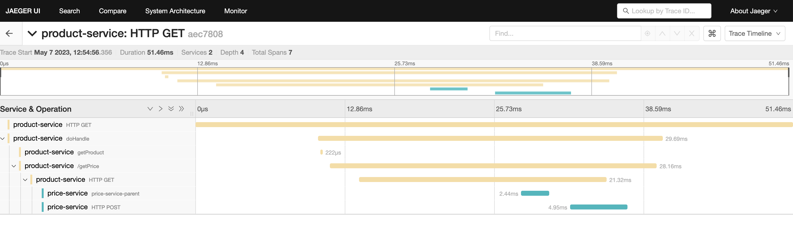
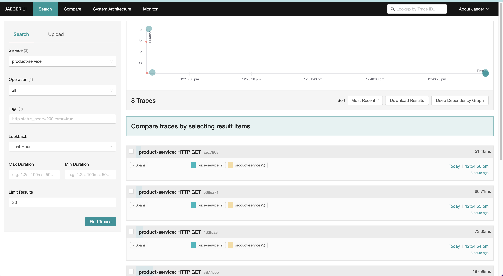
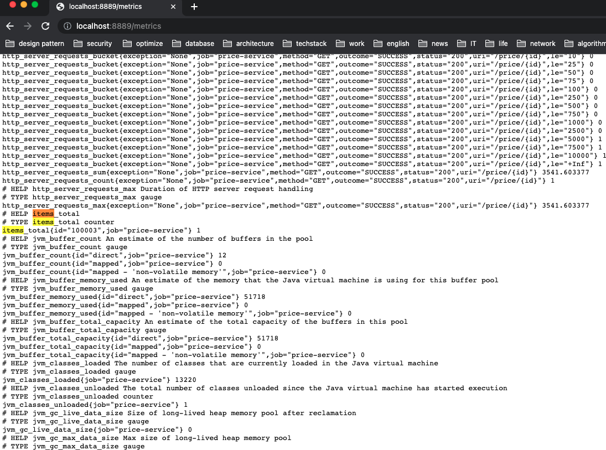
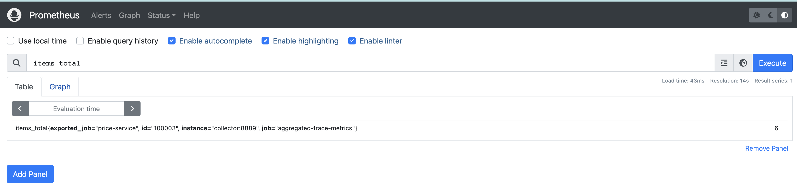
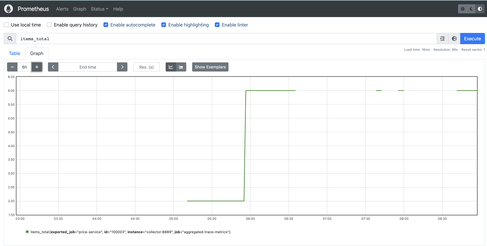
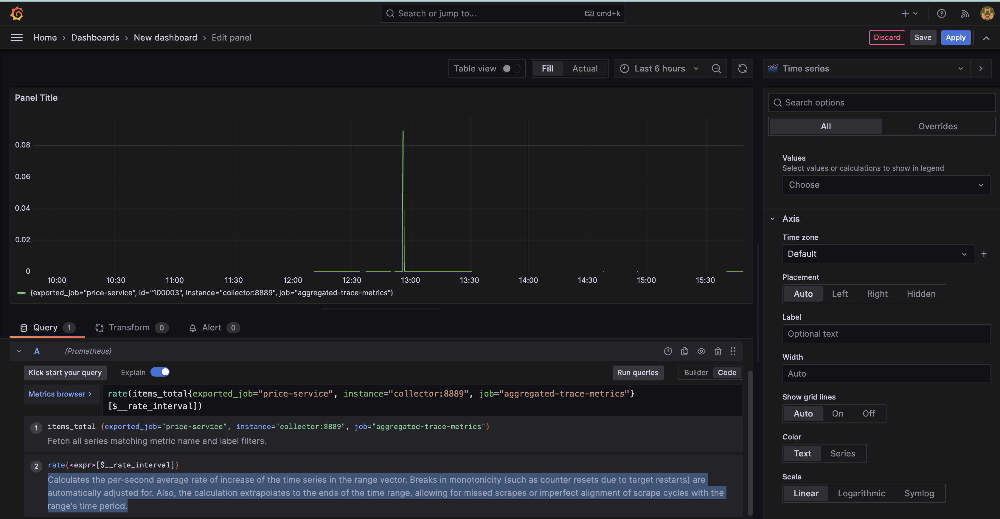

## Relevant Articles
- [OpenTelemetry Setup in Spring Boot Application](https://www.baeldung.com/spring-boot-opentelemetry-setup)

## Product-Service
* curl --location --request GET 'http://localhost:8080/product/100003'
* Prometheus Exporter: http://localhost:8889/metrics

## Jaeger
```
http://localhost:16686/
```



## Prometheus
```
http://localhost:9090/
```




## Grafana
```
http://localhost:3000/
```

