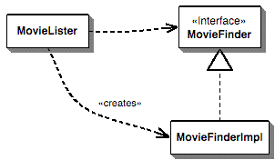
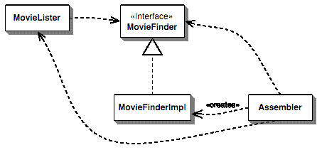
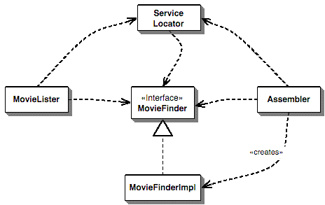

# 控制容器的反转和依赖注入模式

<https://insights.thoughtworks.cn/injection/>

摘要：Java社群近来掀起了一阵轻量级容器的热潮，这些容器能够帮助开发者将来自不同项目的组件组装成为一个内聚的应用程序。在它们的背后有着同一个模式，这个模式决定了这些容器进行组件装配的方式。人们用一个大而化之的名字来称呼这个模式："控制反转"（Inversion ofControl，IoC）。在本文中，我将深入探索这个模式的工作原理，给它一个更能描述其特点的名字——"依赖注入"（Dependency Injection），并将其与"服务定位器"（Service Locator）模式作一个比较。不过，这两者之间的差异并不太重要，更重要的是：应该将组件的配置与使用分离开——两个模式的目标都是这个。

在企业级Java的世界里存在一个有趣的现象：有很多人投入很多精力来研究主流 J2EE 技术的替代品——自然，这大多发生在open source社群。在很大程度上，这可以看作是开发者对主流J2EE技术的笨重和复杂作出的回应，但其中的确有很多极富创意的想法，的确提供了一些可供选择的方案。J2EE开发者常遇到的一个问题就是如何组装不同的程序元素：如果web控制器体系结构和数据库接口是由不同的团队所开发的，彼此几乎一无所知，你应该如何让它们配合工作？很多框架尝试过解决这个问题，有几个框架索性朝这个方向发展，提供了更通用的"组装各层组件"的方案。这样的框架通常被称为"轻量级容器"，PicoContainer和Spring都在此列中。

在这些容器背后，一些有趣的设计原则发挥着作用。这些原则已经超越了特定容器的范畴，甚至已经超越了Java平台的范畴。在本文中，我就要初步揭示这些原则。我使用的范例是Java代码，

## 组件和服务

装配程序元素，这样的话题立即将我拖进了一个棘手的术语问题：如何区分"服务"（service）和"组件"（component）？你可以毫不费力地找出关于这两个词定义的长篇大论，各种彼此矛盾的定义会让你感受到我所处的窘境。有鉴于此，对于这两个遭到了严重滥用的词汇，我将首先说明它们在本文中的用法。

所谓"组件"是指这样一个软件单元：它将被作者无法控制的其他应用程序使用，但后者不能对组件进行修改。也就是说，使用一个组件的应用程序不能修改组件的源代码，但可以通过作者预留的某种途径对其进行扩展，以改变组件的行为。

服务和组件有某种相似之处：它们都将被外部的应用程序使用。在我看来，两者之间最大的差异在于：组件是在本地使用的（例如JAR文件、程序集、DLL、或者源码导入）；而服务是要通过同步或异步的远程接口来远程使用的（例如web service、消息系统、RPC，或者socket）。

在本文中，我将主要使用"服务"这个词，但文中的大多数逻辑也同样适用于本地组件。实际上，为了方便地访问远程服务，你往往需要某种本地组件框架。不过，"组件或者服务"这样一个词组实在太麻烦了，而且"服务"这个词当下也很流行，所以本文将用"服务"指代这两者。

## 一个简单的例子

为了更好地说明问题，我要引入一个例子。和我以前用的所有例子一样，这是一个超级简单的例子：它非常小，小得有点不够真实，但足以帮助你看清其中的道理，而不至于陷入真实例子的泥潭中无法自拔。

在这个例子中，我编写了一个组件，用于提供一份电影清单，清单上列出的影片都是由一位特定的导演执导的。实现这个伟大的功能只需要一个方法：

```java
class MovieLister...

    public Movie[] moviesDirectedBy(String arg)
    {
        List allMovies = finder.findAll();
        for (Iterator it = allMovies.iterator(); it.hasNext();)
        {
            Movie movie = (Movie) it.next();
            if (!movie.getDirector().equals(arg))
            {
                it.remove();
            }

        }
        return (Movie[]) allMovies.toArray(new Movie[allMovies.size()]);
}
```

你可以看到，这个功能的实现极其简单：moviesDirectedBy方法首先请求finder（影片搜寻者）对象返回后者所知道的所有影片，然后遍历finder对象返回的清单，并返回其中由特定的某个导演执导的影片。非常简单，不过不必担心，这只是整个例子的脚手架罢了。我们真正想要考察的是finder对象，或者说，如何将MovieLister对象与特定的finder对象连接起来。为什么我们对这个问题特别感兴趣？因为我希望上面这个漂亮的moviesDirectedBy方法完全不依赖于影片的实际存储方式。所以，这个方法只能引用一个finder对象，而finder对象则必须知道如何对findAll方法作出回应。为了帮助读者更清楚地理解，我给finder定义了一个接口：

```java
public interface MovieFinder
{
    List findAll();
}
```

现在，两个对象之间没有什么耦合关系。但是，当我要实际寻找影片时，就必须涉及到MovieFinder的某个具体子类。在这里，我把涉及具体子类的代码放在MovieLister类的构造函数中。

```java
class MovieLister...
    private MovieFinder finder;
    public MovieLister()
    {
        finder = new ColonDelimitedMovieFinder("movies1.txt");
    }
```

这个实现类的名字就说明：我将要从一个逗号分隔的文本文件中获得影片列表。你不必操心具体的实现细节，只要设想这样一个实现类就可以了。如果这个类只由我自己使用，一切都没问题。但是，如果我的朋友叹服于这个精彩的功能，也想使用我的程序，那又会怎么样呢？如果他们也把影片清单保存在一个逗号分隔的文本文件中，并且也把这个文件命名为"movie1.txt"，那么一切还是没问题。如果他们只是给这个文件改改名，我也可以从一个配置文件获得文件名，这也很容易。但是，如果他们用完全不同的方式——例如SQL 数据库、XML 文件、web service，或者另一种格式的文本文件——来存储影片清单呢？在这种情况下，我们需要用另一个类来获取数据。由于已经定义了MovieFinder接口，我可以不用修改moviesDirectedBy方法。但是，我仍然需要通过某种途径获得合适的MovieFinder实现类的实例。



图1：在MovieLister 类中直接创建MovieFinder 实例时的依赖关系

图1展现了这种情况下的依赖关系：MovieLister类既依赖于MovieFinder接口，也依赖于具体的实现类。我们当然希望MovieLister类只依赖于接口，但我们要如何获得一个MovieFinder子类的实例呢？

在[Patterns of Enterprise Application Architecture](https://martinfowler.com/books/eaa.html)一书中，我们把这种情况称为插件（[plugin](https://martinfowler.com/eaaCatalog/plugin.html)）：MovieFinder的实现类不是在编译期连入程序之中的，因为我并不知道我的朋友会使用哪个实现类。我们希望MovieLister类能够与MovieFinder的任何实现类配合工作，并且允许在运行期插入具体的实现类，插入动作完全脱离我（原作者）的控制。这里的问题就是：如何设计这个连接过程，使MovieLister类在不知道实现类细节的前提下与其实例协同工作。

将这个例子推而广之，在一个真实的系统中，我们可能有数十个服务和组件。在任何时候，我们总可以对使用组件的情形加以抽象，通过接口与具体的组件交流（如果组件并没有设计一个接口，也可以通过适配器与之交流）。但是，如果我们希望以不同的方式部署这个系统，就需要用插件机制来处理服务之间的交互过程，这样我们才可能在不同的部署方案中使用不同的实现。所以，现在的核心问题就是：如何将这些插件组合成一个应用程序？这正是新生的轻量级容器所面临的主要问题，而它们解决这个问题的手段无一例外地是控制反转（[Inversion of Control](https://martinfowler.com/bliki/InversionOfControl.html)）模式。

## 控制反转

几位轻量级容器的作者曾骄傲地对我说：这些容器非常有用，因为它们实现了控制反转。这样的说辞让我深感迷惑：控制反转是框架所共有的特征，如果仅仅因为使用了控制反转就认为这些轻量级容器与众不同，就好象在说我的轿车是与众不同的，因为它有四个轮子。

问题的关键在于：它们反转了哪方面的控制？我第一次接触到的控制反转针对的是用户界面的主控权。早期的用户界面是完全由应用程序来控制的，你预先设计一系列命令，例如输入姓名、输入地址等，应用程序逐条输出提示信息，并取回用户的响应。而在图形用户界面环境下，UI框架将负责执行一个主循环，你的应用程序只需为屏幕的各个区域提供事件处理函数即可。在这里，程序的主控权发生了反转：从应用程序移到了框架。对于这些新生的容器，它们反转的是如何定位插件的具体实现。在前面那个简单的例子中，MovieLister类负责定位MovieFinder的具体实现——它直接实例化后者的一个子类。这样一来，MovieFinder也就不成其为一个插件了，因为它并不是在运行期插入应用程序中的。而这些轻量级容器则使用了更为灵活的办法，只要插件遵循一定的规则，一个独立的组装模块就能够将插件的具体实现注射到应用程序中。因此，我想我们需要给这个模式起一个更能说明其特点的名字——"控制反转"这个名字太泛了，常常让人有些迷惑。与多位IoC 爱好者讨论之后，我们决定将这个模式叫做"依赖注入"（Dependency Injection）。

下面，我将开始介绍Dependency Injection模式的几种不同形式。不过，在此之前，我要首先指出：要消除应用程序对插件实现的依赖，依赖注入并不是唯一的选择，你也可以用ServiceLocator模式获得同样的效果。介绍完Dependency Injection模式之后，我也会谈到ServiceLocator 模式。

## 依赖注入的几种形式

Dependency Injection模式的基本思想是：用一个单独的对象（装配器）来获得MovieFinder的一个合适的实现，并将其实例赋给MovieLister类的一个字段。这样一来，我们就得到了图2所示的依赖图：


图2：引入依赖注入器之后的依赖关系

依赖注入的形式主要有三种，我分别将它们叫做构造函数注入（Constructor Injection）、设值方法注入（Setter Injection）和接口注入（Interface Injection）。如果读过最近关于IoC的一些讨论材料，你不难看出：这三种注入形式分别就是type 1 IoC（接口注入）、type 2 IoC（设值方法注入）和type 3 IoC（构造函数注入）。我发现数字编号往往比较难记，所以我使用了这里的命名方式。

### 使用PicoContainer 进行构造函数注入

首先，我要向读者展示如何用一个名为PicoContainer的轻量级容器完成依赖注入。之所以从这里开始，主要是因为我在ThoughtWorks公司的几个同事在 [PicoContainer](http://picocontainer.com/) 的开发社群中非常活跃——没错，也可以说是某种偏袒吧。

PicoContainer通过构造函数来判断如何将MovieFinder实例注入MovieLister 类。因此，MovieLister类必须声明一个构造函数，并在其中包含所有需要注入的元素：

```java
class MovieLister...
    public MovieLister(MovieFinder finder)
    {
        this.finder = finder;
    }
```

MovieFinder实例本身也将由PicoContainer来管理，因此文本文件的名字也可以由容器注入：

```java
class ColonMovieFinder...
    public ColonMovieFinder(String filename)
    {
        this.filename = filename;
    }
```

随后，需要告诉PicoContainer：各个接口分别与哪个实现类关联、将哪个字符串注入MovieFinder组件。

```java
    private MutablePicoContainer configureContainer()
    {
        MutablePicoContainer pico = new DefaultPicoContainer();
        Parameter[] finderParams = {newConstantParameter("movies1.txt")};
        pico.registerComponentImplementation(MovieFinder.class,ColonMovieFinder.class, finderParams);
        pico.registerComponentImplementation(MovieLister.class);
        return pico;
    }
```

这段配置代码通常位于另一个类。对于我们这个例子，使用我的 MovieLister 类的朋友需要在自己的设置类中编写合适的配置代码。当然，还可以将这些配置信息放在一个单独的配置文件中，这也是一种常见的做法。你可以编写一个类来读取配置文件，然后对容器进行合适的设置。尽管PicoContainer本身并不包含这项功能，但另一个与它关系紧密的项目NanoContainer提供了一些包装，允许开发者使用XML配置文件保存配置信息。NanoContainer能够解析XML文件，并对底下的PicoContainer进行配置。这个项目的哲学观念就是：将配置文件的格式与底下的配置机制分离开。

使用这个容器，你写出的代码大概会是这样：

```java
    public void testWithPico()
    {
        MutablePicoContainer pico = configureContainer();
        MovieLister lister = (MovieLister)pico.getComponentInstance(MovieLister.class);
        Movie[] movies = lister.moviesDirectedBy("Sergio Leone");
        assertEquals("Once Upon a Time in the West",movies[0].getTitle());
    }
```

尽管在这里我使用了构造函数注入，实际上PicoContainer也支持设值方法注入，不过该项目的开发者更推荐使用构造函数注入。

### 使用 Spring 进行设值方法注入

Spring 框架是一个用途广泛的企业级Java开发框架，其中包括了针对事务、持久化框架、web应用开发和JDBC等常用功能的抽象。和PicoContainer一样，它也同时支持构造函数注入和设值方法注入，但该项目的开发者更推荐使用设值方法注入——恰好适合这个例子。为了让MovieLister类接受注入，我需要为它定义一个设值方法，该方法接受类型为MovieFinder的参数：

```java
class MovieLister...
    private MovieFinder finder;
    public void setFinder(MovieFinder finder)
    {
        this.finder = finder;
    }
```

类似地，在MovieFinder的实现类中，我也定义了一个设值方法，接受类型为 String 的参数：

```java
class ColonMovieFinder...
    public void setFilename(String filename)
    {
        this.filename = filename;
    }
```

第三步是设定配置文件。Spring 支持多种配置方式，你可以通过XML 文件进行配置，也可以直接在代码中配置。不过，XML 文件是比较理想的配置方式。

```xml
<beans>
    <bean id="MovieLister" class="spring.MovieLister">
        <property name="finder">
            <ref local="MovieFinder"/>
        </property>
    </bean>
    <bean id="MovieFinder" class="spring.ColonMovieFinder">
        <property name="filename">
            <value>movies1.txt</value>
        </property>
    </bean>
</beans>
```

于是，测试代码大概就像下面这样：

```java
    public void testWithSpring() throws Exception
    {
        ApplicationContext ctx = newFileSystemXmlApplicationContext("spring.xml");
        MovieLister lister = (MovieLister) ctx.getBean("MovieLister");
        Movie[] movies = lister.moviesDirectedBy("Sergio Leone");
        assertEquals("Once Upon a Time in the West",movies[0].getTitle());
    }
```

### 接口注入

除了前面两种注入技术，还可以在接口中定义需要注入的信息，并通过接口完成注入。[Avalon](http://avalon.apache.org/)框架就使用了类似的技术。在这里，我首先用简单的范例代码说明它的用法，后面还会有更深入的讨论。首先，我需要定义一个接口，组件的注入将通过这个接口进行。在本例中，这个接口的用途是将一个MovieFinder实例注入继承了该接口的对象。

```java
public interface InjectFinder
{
    void injectFinder(MovieFinder finder);
}
```

这个接口应该由提供MovieFinder接口的人一并提供。任何想要使用MovieFinder实例的类（例如MovieLister类）都必须实现这个接口。

```java
class MovieLister implements InjectFinder...
    public void injectFinder(MovieFinder finder)
    {
        this.finder = finder;
    }
```

然后，我使用类似的方法将文件名注入MovieFinder的实现类：

```java
public interface InjectFilename
{
    void injectFilename (String filename);
}

class ColonMovieFinder implements MovieFinder, InjectFilename...
    public void injectFilename(String filename)
    {
        this.filename = filename;
    }
```

现在，还需要用一些配置代码将所有的组件实现装配起来。简单起见，我直接在代码中完成配置，并将配置好的MovieLister对象保存在名为lister的字段中：

```java
class IfaceTester...
    private MovieLister lister;
    private void configureLister()
    {
        ColonMovieFinder finder = new ColonMovieFinder();
        finder.injectFilename("movies1.txt");
        lister = new MovieLister();
        lister.injectFinder(finder);
    }
```

测试代码则可以直接使用这个字段：

```java
class IfaceTester...
    public void testIface()
    {
        configureLister();
        Movie[] movies = lister.moviesDirectedBy("Sergio Leone");
        assertEquals("Once Upon a Time in the West",movies[0].getTitle());
    }
```

## 使用Service Locator

依赖注入的最大好处在于：它消除了MovieLister类对具体MovieFinder实现类的依赖。这样一来，我就可以把MovieLister类交给朋友，让他们根据自己的环境插入一个合适的MovieFinder实现即可。不过，Dependency Injection模式并不是打破这层依赖关系的唯一手段，另一种方法是使用[Service Locator](http://java.sun.com/blueprints/corej2eepatterns/Patterns/ServiceLocator.html)模式。

Service Locator模式背后的基本思想是：有一个对象（即服务定位器）知道如何获得一个应用程序所需的所有服务。也就是说，在我们的例子中，服务定位器应该有一个方法，用于获得一个MovieFinder实例。当然，这不过是把麻烦换了一个样子，我们仍然必须在MovieLister中获得服务定位器，最终得到的依赖关系如图3 所示：



图3：使用Service Locator 模式之后的依赖关系

在这里，我把ServiceLocator类实现为一个Singleton的注册表，于是MovieLister就可以在实例化时通过ServiceLocator获得一个MovieFinder实例。

```java
class MovieLister...
    MovieFinder finder = ServiceLocator.movieFinder();

class ServiceLocator...
    public static MovieFinder movieFinder()
    {
        return soleInstance.movieFinder;
    }
    private static ServiceLocator soleInstance;
    private MovieFinder movieFinder;
```

和注入的方式一样，我们也必须对服务定位器加以配置。在这里，我直接在代码中进行配置，但设计一种通过配置文件获得数据的机制也并非难事。

```java
class Tester...
    private void configure()
    {
        ServiceLocator.load(new ServiceLocator(
        newColonMovieFinder("movies1.txt")));
    }

class ServiceLocator...
    public static void load(ServiceLocator arg)
    {
        soleInstance = arg;
    }
    public ServiceLocator(MovieFinder movieFinder)
    {
    this.movieFinder = movieFinder;
    }
```

下面是测试代码：

```java
class Tester...
    public void testSimple()
    {
        configure();
        MovieLister lister = new MovieLister();
        Movie[] movies = lister.moviesDirectedBy("Sergio Leone");
        assertEquals("Once Upon a Time in the West",movies[0].getTitle());

    }
```

我时常听到这样的论调：这样的服务定位器不是什么好东西，因为你无法替换它返回的服务实现，从而导致无法对它们进行测试。当然，如果你的设计很糟糕，你的确会遇到这样的麻烦；但你也可以选择良好的设计。在这个例子中，ServiceLocator实例仅仅是一个简单的数据容器，只需要对它做一些简单的修改，就可以让它返回用于测试的服务实现。

对于更复杂的情况，我可以从ServiceLocator派生出多个子类，并将子类型的实例传递给注册表的类变量。另外，我可以修改ServiceLocator的静态方法，使其调用ServiceLocator实例的方法，而不是直接访问实例变量。我还可以使用特定于线程的存储机制，从而提供特定于线程的服务定位器。所有这一切改进都无须修改ServiceLocator的使用者。

一种改进的思路是：服务定位器仍然是一个注册表，但不是Singleton。Singleton的确是实现注册表的一种简单途径，但这只是一个实现时的决定，可以很轻松地改变它。

### 为定位器提供分离的接口

上面这种简单的实现方式有一个问题：MovieLister类将依赖于整个ServiceLocator类，但它需要使用的却只是后者所提供的一项服务。我们可以针对这项服务提供一个[单独的接口](https://martinfowler.com/bliki/RoleInterface.html)，减少MovieLister对ServiceLocator的依赖程度。这样一来，MovieLister就不必使用整个的ServiceLocator接口，只需声明它想要使用的那部分接口。

此时，MovieLister 类的提供者也应该一并提供一个定位器接口，使用者可以通过这个接口获得MovieFinder实例。

```java
public interface MovieFinderLocator
{
    public MovieFinder movieFinder();
```

真实的服务定位器需要实现上述接口，提供访问MovieFinder实例的能力：

```java
    MovieFinderLocator locator = ServiceLocator.locator();
    MovieFinder finder = locator.movieFinder();
    public static ServiceLocator locator()
    {
    return soleInstance;
    }
    public MovieFinder movieFinder()
    {
        return movieFinder;
    }
    private static ServiceLocator soleInstance;
    private MovieFinder movieFinder;
```

你应该已经注意到了：由于想要使用接口，我们不能再通过静态方法直接访问服务——我们必须首先通过ServiceLocator类获得定位器实例，然后使用定位器实例得到我们想要的服务。

### 动态服务定位器

上面是一个静态定位器的例子——对于你所需要的每项服务，ServiceLocator类都有对应的方法。这并不是实现服务定位器的唯一方式，你也可以创建一个动态服务定位器，你可以在其中注册需要的任何服务，并在运行期决定获得哪一项服务。

在本例中，ServiceLocator使用一个map来保存服务信息，而不再是将这些信息保存在字段中。此外，ServiceLocator还提供了一个通用的方法，用于获取和加载服务对象。

```java
class ServiceLocator...
    private static ServiceLocator soleInstance;
    public static void load(ServiceLocator arg)
    {
        soleInstance = arg;
    }
    private Map services = new HashMap();
    public static Object getService(String key)
    {
        return soleInstance.services.get(key);
    }
    public void loadService (String key, Object service)
    {
        services.put(key, service);
    }
```

同样需要对服务定位器进行配置，将服务对象与适当的关键字加载到定位器中：

```java
class Tester...
    private void configure()
    {
        ServiceLocator locator = new ServiceLocator();
        locator.loadService("MovieFinder", newColonMovieFinder("movies1.txt"));
        ServiceLocator.load(locator);
    }
```

我使用与服务对象类名称相同的字符串作为服务对象的关键字：

```java
class MovieLister...
    MovieFinder finder = (MovieFinder)
    ServiceLocator.getService("MovieFinder");
```

总体而言，我不喜欢这种方式。无疑，这样实现的服务定位器具有更强的灵活性，但它的使用方式不够直观明朗。我只有通过文本形式的关键字才能找到一个服务对象。相比之下，我更欣赏通过一个方法明确获得服务对象的方式，因为这让使用者能够从接口定义中清楚地知道如何获得某项服务。

### 用Avalon兼顾服务定位器和依赖注入

Dependency Injection和Service Locator两个模式并不是互斥的，你可以同时使用它们，Avalon框架就是这样的一个例子。Avalon使用了服务定位器，但如何获得定位器的信息则是通过注入的方式告知组件的。

对于前面一直使用的例子，Berin Loritsch发送给了我一个简单的Avalon实现版本：

```java
public class MyMovieLister implements MovieLister, Serviceable
{
    private MovieFinder finder;
    public void service( ServiceManager manager )throws ServiceException
    {
        finder = (MovieFinder)manager.lookup("finder");
    }
```

service方法就是接口注入的例子，它使容器可以将一个ServiceManager对象注入MyMovieLister对象。ServiceManager则是一个服务定位器。在这个例子中，MyMovieLister并不把ServiceManager对象保存在字段中，而是马上借助它找到MovieFinder 实例，并将后者保存起来。

## 决定使用哪个选项

到目前为止，我集中精力解释了我是如何看待这些模式及其变化的。现在开始讨论它们的优缺点，以帮助确定何时使用哪些。

### 服务定位器与依赖注入

Service Locator vs Dependency Injection

基本选择是服务定位器和依赖注入。第一点是，这两种实现都提供了朴素示例中缺少的基本解耦——在这两种情况下，应用程序代码都独立于服务接口的具体实现。这两种模式之间的重要区别在于如何将实现提供给应用程序类。对于服务定位器，应用程序类通过向定位器发送消息来明确请求它。注入没有明确的请求，服务出现在应用程序类中，因此控制反转。

控制反转是框架的一个常见特性，但这是有代价的。当您尝试调试时，它往往很难理解并导致问题。

关键区别在于，使用Service Locator，服务的每个用户都依赖于该定位器。定位器可以隐藏对其他实现的依赖关系，但您需要查看定位器。因此，定位器和注入器之间的决定取决于这种依赖关系是否存在问题。

使用依赖项注入可以帮助更容易地查看组件依赖项是什么。使用依赖项注入器，您可以只查看注入机制，例如构造函数，并查看依赖项。使用服务定位器，您必须搜索对定位器的调用的源代码。具有查找引用功能的现代IDE使这一点更容易，但它仍然不如查看构造函数或设置方法那么容易。

这在很大程度上取决于服务用户的性质。如果您正在使用使用服务的各种类构建应用程序，那么应用程序类与定位器之间的依赖关系并不是什么大问题。在我的例子中，给我的朋友一个Movie Lister，然后使用服务定位器就很好了。他们所需要做的就是通过一些配置代码或配置文件配置定位器以挂接正确的服务实现。在这种情况下，我认为注入器的倒置不会提供任何令人信服的东西。

如果列表器是我提供给其他人正在编写的应用程序的一个组件，那么就有区别了。在这种情况下，我不太了解我的客户将要使用的服务定位器的API。每个客户可能都有自己的不兼容服务定位器。我可以通过使用隔离接口来解决一些问题。每个客户都可以编写一个适配器，将我的接口与他们的定位器匹配，但无论如何，我仍然需要看到第一个定位器来查找我的特定接口。一旦适配器出现，直接连接定位器的简单性就开始下滑。

由于使用注入器时，组件与注入器之间没有依赖关系，因此一旦配置好，组件就无法从注入器获得进一步的服务。

人们给出的偏好依赖注入的一个常见原因是它使测试更容易。这里的要点是，要进行测试，您需要用stubs或模拟(mocks)轻松地替换真实的服务实现。然而，依赖注入和服务定位器之间确实没有区别：两者都非常容易被stubbing。我怀疑这一观察来自于人们没有努力确保他们的服务定位器可以很容易地被替换的项目。这就是持续测试的帮助之处，如果您不能轻松地将服务stubs用于测试，那么这意味着您的设计存在严重问题。

当然，测试问题会因侵入性很强的组件环境而加剧，例如Java的EJB框架。我的观点是，这些类型的框架应该尽量减少对应用程序代码的影响，尤其是不应该做会减慢编辑执行周期的事情。使用插件替代重量级组件对这个过程有很大帮助，这对于测试驱动开发等实践至关重要。

### 构造函数与Setter注入

对于服务组合，您必须始终有一些约定，以便将事物连接在一起。注入的优点主要是它需要非常简单的约定，至少对于构造函数和setter注入来说是这样的。您不必在组件中做任何奇怪的事情，注入器可以非常简单地配置所有内容。

接口注入更具侵入性，因为您必须编写大量接口才能把事情处理好。对于容器所需的一小组接口，例如在Avalon的方法中，这并不太糟糕。但是，组装组件和依赖项需要做很多工作，这就是为什么当前的轻量级容器需要setter和构造函数注入。

setter和构造函数注入之间的选择很有趣，因为它反映了面向对象编程的一个更普遍的问题——应该在构造函数中填充字段还是使用setter。

我对对象的长期默认设置是，尽可能在构造时创建有效的对象。这个建议可以追溯到Kent Beck的Smalltalk最佳实践模式：构造函数方法和构造函数参数方法。带参数的构造函数可以清楚地说明在明显位置创建有效对象的含义。如果有多种方法，请创建多个显示不同组合的构造函数。

构造函数初始化的另一个优点是，它允许您通过不提供setter来清楚地隐藏任何不可变的字段。我认为这很重要——如果某些事情不应该改变，那么缺乏一个setter就很好地传达了这一点。如果您使用setter进行初始化，那么这可能会成为一种痛苦。（事实上，在这些情况下，我宁愿避免通常的设置约定，我宁愿使用initFoo这样的方法，以强调它只应该在出生时执行。）

但在任何情况下都有例外。如果你有很多构造函数参数，事情可能看起来很混乱，特别是在没有关键字参数的语言中。的确，一个长构造函数通常表示应该拆分的对象过于繁忙，但有时也需要拆分。

如果有多种方法来构造有效对象，则很难通过构造函数来显示这一点，因为构造函数只能根据参数的数量和类型而变化。这是工厂方法发挥作用的时候，它们可以使用私有构造函数和setter的组合来实现它们的工作。用于组件组装的经典工厂方法的问题是，它们通常被视为静态方法，不能在接口上使用这些方法。您可以创建一个工厂类，然后它就变成了另一个服务实例。工厂服务通常是一种很好的策略，但您仍然需要使用此处的一种技术来实例化工厂。

如果有字符串等简单参数，构造函数也会受到影响。通过setter注入，您可以为每个setter指定一个名称，以指示字符串应该做什么。对于构造函数，你只是依赖于位置，这很难遵循。

如果您有多个构造函数和继承，那么事情可能会变得特别尴尬。为了初始化所有内容，您必须提供构造函数来转发到每个超类构造函数，同时还要添加自己的参数。

尽管有缺点，我还是倾向于从构造函数注入开始，但一旦我上面概述的问题开始成为问题，就要准备好切换到setter注入。

### 代码或配置文件

一个单独但经常混淆的问题是，是否使用API上的配置文件或代码连接服务。对于大多数可能部署在多个位置的应用程序，单独的配置文件通常最有意义。几乎所有时候这都是一个XML文件，这是有意义的。然而，在某些情况下，使用程序代码进行装配更容易。一种情况是，您有一个简单的应用程序，它没有很多部署变化。在这种情况下，代码比单独的XML文件更清晰。

相反的情况是程序集相当复杂，涉及条件步骤。一旦你开始接近编程语言，XML就开始崩溃，最好使用一种真正的语言，它有所有的语法来编写一个清晰的程序。然后编写一个执行程序集的生成器类。如果您有不同的构建器场景，您可以提供几个构建器类，并使用简单的配置文件在它们之间进行选择。

我经常认为人们过于渴望定义配置文件。通常，编程语言会生成一种简单而强大的配置机制。现代语言可以轻松编译小型汇编程序，这些汇编程序可以用于为大型系统组装插件。如果编译是一件痛苦的事情，那么脚本语言也可以很好地工作。

人们常说配置文件不应该使用编程语言，因为它们需要由非程序员编辑。但这种情况多久发生一次？人们真的希望非程序员改变复杂服务器端应用程序的事务隔离级别吗？非语言配置文件只有在简单的程度上才能很好地工作。如果它们变得复杂，那么是时候考虑使用合适的编程语言了。

目前，我们在Java世界中看到的一件事是配置文件的杂音，每个组件都有自己的配置文件，与其他组件的配置文件不同。如果您使用了十几个这样的组件，那么您可以很容易地得到十几个配置文件来保持同步。

我在这里的建议是，始终提供一种方法，通过编程接口轻松完成所有配置，然后将单独的配置文件视为可选功能。您可以轻松构建配置文件处理以使用编程接口。如果正在编写组件，则由用户决定是使用编程接口、配置文件格式，还是编写自己的自定义配置文件格式并将其绑定到编程接口。

### 将配置与使用分离

所有这一切的重要问题是确保服务的配置与其使用分离。事实上，这是一个基本的设计原则，它与接口与实现分离。当条件逻辑决定实例化哪个类时，我们可以在面向对象程序中看到这一点，然后通过多态性而不是通过重复的条件代码对该条件进行未来的求值。

如果这种分离在单个代码库中有用，那么当您使用诸如组件和服务之类的外部元素时，它尤其重要。第一个问题是您是否希望将实现类的选择推迟到特定部署。如果是这样，您需要使用插件的一些实现。一旦您使用插件，就必须将插件的组装与应用程序的其余部分分开，以便您可以轻松地为不同的部署替换不同的配置。你如何做到这一点是次要的。此配置机制可以配置服务定位器，也可以使用注入直接配置对象。

## 总结性想法

当前流行的轻量级容器都有一个共同的底层模式，即依赖注入器模式。依赖注入是服务定位器的一种有用的替代方法。在构建应用程序类时，这两个类大致相当，但我认为Service Locator由于其更直接的行为而有一点优势。然而，如果您正在构建要在多个应用程序中使用的类，那么依赖注入是一个更好的选择。

如果使用依赖注入，有许多样式可供选择。我建议您遵循构造函数注入，除非您遇到该方法的特定问题之一，在这种情况下，请切换到setter注入。如果您选择构建或获取容器，请寻找同时支持构造函数和setter注入的容器。

服务定位器和依赖注入之间的选择不如将服务配置与应用程序中的服务使用分离的原则重要。
