# Spring Reactive

## Reactor Core介绍

Reactor Core是一个Java 8库，实现了反应式编程模型。它建立在[Reactive Streams](http://www.reactive-streams.org)规范之上，是构建反应式应用的标准。

从非反应式Java开发的背景来看，走向反应式可能是一个相当陡峭的学习曲线。当把它与Java 8 Stream API进行比较时，这将变得更加具有挑战性，因为它们可能会被误认为是相同的高级抽象概念。

1. 反应式流规范

    在看Reactor之前，我们应该先看一下Reactive Streams Specification。这是Reactor实现的内容，它为该库奠定了基础。

    本质上，Reactive Streams是一个异步流处理的规范。

    **Essentially, Reactive Streams is a specification for asynchronous stream processing.**

    换句话说，就是一个大量事件被异步产生和消费的系统。想想看，每秒有成千上万的股票更新流进入一个金融应用程序，而它必须及时地对这些更新作出反应。

    这方面的主要目标之一是解决背压(backpressure)的问题。如果我们有一个生产者向消费者发出的事件比它处理的速度快，那么最终消费者将被事件淹没，耗尽系统资源。

    背压意味着我们的消费者应该能够告诉生产者要发送多少数据，以防止这种情况，这就是规范中所规定的。

2. Maven的依赖性

    在我们开始之前，让我们添加我们的Maven依赖项。

    ```xml
    <dependency>
        <groupId>io.projectreactor</groupId>
        <artifactId>reactor-core</artifactId>
        <version>3.4.16</version>
    </dependency>

    <dependency> 
        <groupId>ch.qos.logback</groupId> 
        <artifactId>logback-classic</artifactId> 
        <version>1.2.6</version> 
    </dependency>
    ```

    我们也要把[Logback](https://logback.qos.ch/)作为一个依赖项加入。这是因为我们将记录反应器的输出，以便更好地了解数据流。

3. 生成数据流

    为了使一个应用程序具有反应性，它必须能够做的第一件事就是产生一个数据流。

    这可能是像我们前面给出的股票更新的例子。没有这些数据，我们就没有任何东西可以反应，这就是为什么这是一个合理的第一步。

    Reactive Core给了我们两种数据类型，使我们能够做到这一点。

    1. Flux

        做到这一点的第一个方法是[Flux](https://projectreactor.io/docs/core/release/api/reactor/core/publisher/Flux.html)。它是一个可以发射0...n个元素的流。让我们试着创建一个简单的。

        `Flux<Integer> just = Flux.just(1, 2, 3, 4);`

        生产一个四元素的静态流。

    2. Mono

        第二种方法是使用[Mono](https://projectreactor.io/docs/core/release/api/reactor/core/publisher/Mono.html)，它是一个0...1元素的流。让我们试着实例化一个。

        `Mono<Integer> just = Mono.just(1);`

        这看起来和行为几乎与Flux完全一样，只是这一次我们被限制在不超过一个元素上。

    3. 为什么不只是Flux？

    在进一步实验之前，值得强调的是为什么我们有这两种数据类型。

    首先，需要注意的是，Flux 和 Mono 都是 Reactive Streams [Publisher](http://www.reactive-streams.org/reactive-streams-1.0.3-javadoc/org/reactivestreams/Publisher.html)接口的实现。这两个类都是符合规范的，我们可以用这个接口来代替它们。

    `Publisher<String> just = Mono.just("foo");`

    但实际上，知道这个基数(cardinality)是有用的。这是因为有一些操作只对两种类型中的一种有意义，而且它可以有更多的表现力（想象一下在资源库中的 findOne() ）。

4. 订阅一个流

    现在我们对如何产生一个数据流有了一个高层次的概述，我们需要订阅它，以使它能够发射元素。

    1. 收集元素
        让我们使用subscribe()方法来收集一个流中的所有元素。

        ReactorIntegrationTest.givenFlux_whenSubscribing_thenStream()

        在我们订阅之前，数据是不会开始流动的。

    2. 元素的流动

        有了日志记录，我们可以用它来可视化数据是如何在我们的流中流动的。

        ```log
        20:25:19.550 [main] INFO reactor.Flux.Array.1 - | onSubscribe([Synchronous Fuseable] FluxArray.ArraySubscription)
        20:25:19.553 [main] INFO reactor.Flux.Array.1 - | request(unbounded)
        20:25:19.553 [main] INFO reactor.Flux.Array.1 - | onNext(1)
        ......
        20:25:19.553 [main] INFO reactor.Flux.Array.1 - | onComplete()
        ```

        首先，一切都在主线程上运行。我们可以按顺序处理一切。

        现在让我们逐一浏览一下我们所记录的序列。

        1. onSubscribe() - 这是在我们订阅我们的流时调用的
        2. request(unbounded) - 当我们调用subscribe时，在幕后我们正在创建一个订阅。这个订阅从流中请求元素。在这种情况下，它默认为unbounded，意味着它请求每一个可用的元素。
        3. onNext() - 这是对每一个元素的调用。
        4. onComplete() - 这是最后一次调用，在收到最后一个元素之后。实际上还有一个onError()，如果有异常，它将被调用，但在这种情况下，没有异常。

        这是作为Reactive Streams规范一部分的[Subscriber](http://www.reactive-streams.org/reactive-streams-1.0.3-javadoc/org/reactivestreams/Subscriber.html)接口中规定的流程，实际上，这就是我们调用onSubscribe()时在幕后实例化的东西。这是一个有用的方法，但为了更好地理解发生了什么，让我们直接提供一个订阅者接口。

        ReactorIntegrationTest.givenFlux_Subscriber()

        我们可以看到，上述流程中的每个可能的阶段都映射到订阅者实现中的一个方法。恰好Flux为我们提供了一个辅助方法来减少这种繁琐的操作。

    3. 与Java 8 Streams的比较

        看起来我们还是有一些与Java 8 Stream同义的东西在做收集。

        ```java
        List<Integer> collected = Stream.of(1, 2, 3, 4)
        .collect(toList());
        ```

        但是我们没有采用。

        核心区别在于，Reactive是一个推送模型，而Java 8 Streams是一个拉动模型。在一个反应式的方法中，事件在进来时被推送给订阅者。

        接下来要注意的是，Streams的终端操作者只是终端，拉出所有的数据并返回一个结果。有了Reactive，我们可以有一个来自外部资源的无限流，with multiple subscribers attached and removed on an ad hoc basis。我们还可以做一些事情，比如合并流、节流和应用背压。

5. 背压

    我们应该考虑的下一件事是背压。在我们的例子中，订阅者告诉生产者要一次推送所有的元素。这最终可能会使订户不堪重负，消耗其所有的资源。

    背压(Backpressure)是指下游(downstream)可以告诉上游发送更少的数据，以防止它被淹没(overwhelmed)。

    我们可以修改我们的订阅者实现来应用背压。让我们通过使用require()告诉上游一次只发送两个元素。

    ReactorIntegrationTest.givenFlux_whenApplyingBackPressure_thenPushElementsInBatches()

    现在如果我们再次运行我们的代码，我们会看到require(2)被调用，接着是两个onNext()的调用，然后又是require(2)。

    ```log
    23:31:15.395 [main] INFO reactor.Flux.Array.1 - | onSubscribe([Synchronous Fuseable] FluxArray.ArraySubscription)
    23:31:15.397 [main] INFO reactor.Flux.Array.1 - | request(2)
    23:31:15.397 [main] INFO reactor.Flux.Array.1 - | onNext(1)
    23:31:15.398 [main] INFO reactor.Flux.Array.1 - | onNext(2)
    23:31:15.398 [main] INFO reactor.Flux.Array.1 - | request(2)
    23:31:15.398 [main] INFO reactor.Flux.Array.1 - | onNext(3)
    23:31:15.398 [main] INFO reactor.Flux.Array.1 - | onNext(4)
    23:31:15.398 [main] INFO reactor.Flux.Array.1 - | request(2)
    23:31:15.398 [main] INFO reactor.Flux.Array.1 - | onComplete()
    ```

    本质上，这是反应式拉动的背压。我们要求上游只推送一定数量的元素，而且是在我们准备好的时候。

    如果我们想象一下，我们被推送了来自Twitter的推文，那么将由上游来决定做什么。如果推文进来了，但没有来自下游的请求，那么上游可以放弃项目，把它们储存在缓冲区，或其他一些策略。

6. 对流的操作

    我们还可以对流中的数据进行操作，对我们认为合适的事件做出反应。

    1. 对流中的数据进行映射

        我们可以执行的一个简单操作是应用一个转换。在这种情况下，让我们把我们的流中的所有数字翻倍。

        ReactorIntegrationTest.givenFlux_whenSubscribing_thenStream()

        map()将在调用onNext()时被应用。

    2. 合并两个流

        可以通过将另一个流与这个流结合起来使事情变得更有趣。让我们通过使用zip()函数来尝试一下。

        ReactorIntegrationTest.givenFlux_whenZipping_thenCombine()

        在这里，我们正在创建另一个不断增量的Flux，并将其与我们的原始Flux一起流转。我们可以通过检查日志看到这些是如何一起工作的。

        ```log
        20:04:38.064 [main] INFO  reactor.Flux.Array.1 - | onSubscribe([Synchronous Fuseable] FluxArray.ArraySubscription)
        20:04:38.065 [main] INFO  reactor.Flux.Array.1 - | onNext(1)
        20:04:38.066 [main] INFO  reactor.Flux.Range.2 - | onSubscribe([Synchronous Fuseable] FluxRange.RangeSubscription)
        20:04:38.066 [main] INFO  reactor.Flux.Range.2 - | onNext(0)
        20:04:38.067 [main] INFO  reactor.Flux.Array.1 - | onNext(2)
        20:04:38.067 [main] INFO  reactor.Flux.Range.2 - | onNext(1)
        20:04:38.067 [main] INFO  reactor.Flux.Array.1 - | onNext(3)
        20:04:38.067 [main] INFO  reactor.Flux.Range.2 - | onNext(2)
        20:04:38.067 [main] INFO  reactor.Flux.Array.1 - | onNext(4)
        20:04:38.067 [main] INFO  reactor.Flux.Range.2 - | onNext(3)
        20:04:38.067 [main] INFO  reactor.Flux.Array.1 - | onComplete()
        20:04:38.067 [main] INFO  reactor.Flux.Array.1 - | cancel()
        20:04:38.067 [main] INFO  reactor.Flux.Range.2 - | cancel()
        ```

        注意我们现在每个 Flux 有一个订阅。onNext()的调用也是交替进行的，所以当我们应用zip()函数时，流中每个元素的索引都会匹配。

        > TODO：实际log onNext()未交替进行?

7. Hot Streams

    目前，我们主要关注cold streams。这些是静态的、固定长度的流，很容易处理。反应式的更现实的用例可能是无限发生的事情。

    例如，我们可以有一系列的鼠标移动，这些移动需要不断地做出反应，或者是一个Twitter提要。这些类型的流称为热流，因为它们总是在运行，并且可以在任何时间点订阅，而不需要数据的开头。

    1. 创建可ConnectableFlux

        创建热流的一种方法是将冷流转换为热流。让我们创建一个永久持续的Flux，将结果输出到控制台，控制台将模拟来自外部资源的无限数据流：

        ```java
        ConnectableFlux<Object> publish = Flux.create(fluxSink -> {
            while(true) {
                fluxSink.next(System.currentTimeMillis());
            }
        })
        .publish();
        ```

        通过调用publish()，我们得到了一个[ConnectableFlux](https://projectreactor.io/docs/core/release/api/reactor/core/publisher/ConnectableFlux.html)。这意味着调用subscribe()不会导致它开始发射，从而允许我们添加多个订阅：

        ```java
        publish.subscribe(System.out::println);        
        publish.subscribe(System.out::println);
        ```

        如果我们尝试运行这段代码，什么都不会发生。直到我们调用connect()，通量才会开始发射：

        `publish.connect();`

    2. Throttling

        如果我们运行代码，我们的控制台将被日志记录淹没。这是在模拟一种情况，即传递给消费者的数据太多。让我们尝试通过节流来解决这个问题：

        ```java
        ConnectableFlux<Object> publish = Flux.create(fluxSink -> {
            while (true) {
                fluxSink.next(System.currentTimeMillis());
            }
        })
                .log()
                .sample(Duration.ofSeconds(2))
                .publish();
        publish.connect();
        ```

        在这里，我们引入了间隔为两秒的sample()方法。现在，值只会每两秒发送给我们的订阅者，这意味着控制台将不再那么忙碌。

        当然，有多种策略可以减少下游发送的数据量，例如窗口和缓冲。

8. 并发性

    我们上面的所有示例目前都在主线程上运行。然而，如果需要，我们可以控制代码在哪个线程上运行。[Scheduler](https://projectreactor.io/docs/core/release/api/reactor/core/scheduler/Scheduler.html)接口提供了异步代码的抽象，为我们提供了许多实现。让我们尝试订阅其他线程到main：

    ReactorIntegrationTest.givenFlux_whenInParallel_thenSubscribeInDifferentThreads()

    并行调度程序将导致我们的订阅在不同的线程上运行，我们可以通过查看日志来证明这一点。Flux在另一个名为parallel-1的线程中运行。

9. 结论

    在本文中，我们对Reactive Core进行了高层次的端到端概述。我们已经解释了如何发布和订阅流、应用背压、对流进行操作以及异步处理数据。这有望为我们编写反应式应用程序奠定基础。

    本系列的后续文章将介绍更高级的并发和其他反应性概念。还有一篇文章介绍了[Reactor with Spring](https://www.baeldung.com/reactor-bus)。

## 在Java中调试反应型流

1. 概述

    一旦我们开始使用这些数据结构，调试反应式流可能是我们必须面对的主要挑战之一。

    考虑到反应流在过去几年中越来越受欢迎，了解如何有效地完成这项任务是一个好主意。

    让我们从设置一个使用反应式堆栈的项目开始，看看为什么这往往是麻烦的。

2. 有Bug的场景

    我们想模拟一个真实的场景，其中有几个异步进程正在运行，我们在代码中引入了一些缺陷，最终会触发异常。

    为了理解大局，我们将提到我们的应用程序将消费和处理简单的Foo对象的流，这些对象只包含一个id、一个格式化的name和一个数量字段。

    运行说明：
    - First Run ServerDebuggingApplication.java on 8081
    - Second Run ConsumerDebuggingApplication.java on 8082

    1. 分析日志输出

        现在，让我们来看看一个片段，以及当一个未处理的错误出现时它所产生的输出。

        FooService.processFoo()，未加入 doOnError 处理；

        FooService.processFooInAnotherScenario()；

        在运行我们的应用程序几秒钟后，我们会发现它不时地记录异常。

        仔细观察其中的一个错误，我们会发现与此类似的情况。

        ```log
        Caused by: java.lang.StringIndexOutOfBoundsException: String index out of range: 15
            at j.l.String.substring(String.java:1963)
            at com.baeldung.debugging.consumer.service.FooNameHelper
            .lambda$1(FooNameHelper.java:38)
            at r.c.p.FluxMap$MapSubscriber.onNext(FluxMap.java:100)
            ......
        ```

        根据根本原因，并注意到堆栈跟踪中提到的FooNameHelper类，我们可以想象，在某些场合，我们的Foo对象被处理时，其格式化的Name值比预期的要短。

        当然，这只是一个简化的案例，解决方案似乎相当明显。

        但让我们想象一下这是一个真实的案例，如果没有一些上下文信息，异常本身并不能帮助我们解决问题。

        异常是作为 processFoo 的一部分被触发的，还是 processFooInAnotherScenario 方法的一部分？

        在到达这个阶段之前，之前的其他步骤是否影响了格式化名称字段？

        日志条目并不能帮助我们弄清这些问题。

        更糟的是，有时异常甚至不是从我们的功能中抛出的。

        例如，设想我们依靠一个反应式存储库来持久化我们的Foo对象。如果这时出现了错误，我们可能连从哪里开始调试我们的代码都不知道。

        我们需要工具来有效地调试反应式流。

3. 使用调试会话

    要弄清我们的应用程序发生了什么，一个选择是使用我们最喜欢的IDE启动一个调试会话。

    我们必须设置几个条件断点，并分析数据流中每一步被执行时的数据流。

    事实上，这可能是一项繁琐的任务，特别是当我们有很多反应式进程在运行并共享资源时。

    此外，在很多情况下，由于安全原因，我们不能启动调试会话。

4. 用doOnErrorMethod或使用订阅参数来记录信息

    有时，我们可以添加有用的上下文信息，通过提供一个消费者作为订阅方法的第二个参数。

    ```java
    public void processFoo(Flux<Foo> flux) {
        // ...
        flux.subscribe(foo -> {
            logger.debug("Finished processing Foo with Id {}", foo.getId());
        }, error -> {
            logger.error(
            "The following error happened on processFoo method!",
            error);
        });
    }
    ```

    > 注意：值得一提的是，如果我们不需要在订阅方法上进行进一步的处理，我们可以在我们的发布者上链doOnError函数。

    现在我们将有一些关于错误可能来自何处的指导，尽管我们仍然没有关于产生异常的实际元素的很多信息。

5. 激活Reactor的全局调试配置

    [Reactor](https://projectreactor.io/)库提供了一个[Hooks](https://projectreactor.io/docs/core/release/reference/#hooks)类，让我们可以配置Flux和Mono操作符的行为。

    只需在 ConsumerDebuggingApplication.java 添加以下语句，我们的应用程序就会记录对发布者方法的调用，包住操作符的构造，并捕获堆栈跟踪。

    `Hooks.onOperatorDebug();`

    调试模式被激活后，我们的异常日志将包括一些有用的信息。

    ```log
    16:06:35.334 [parallel-1] ERROR c.b.d.consumer.service.FooService
    - The following error happened on processFoo method!
    java.lang.StringIndexOutOfBoundsException: String index out of range: 15
        at j.l.String.substring(String.java:1963)
        at c.d.b.c.s.FooNameHelper.lambda$1(FooNameHelper.java:38)
        ......
        at j.l.Thread.run(Thread.java:748)
        Suppressed: r.c.p.FluxOnAssembly$OnAssemblyException: 
    Assembly trace from producer [reactor.core.publisher.FluxMapFuseable] :
        reactor.core.publisher.Flux.map(Flux.java:5653)
        c.d.b.c.s.FooNameHelper.substringFooName(FooNameHelper.java:32)
        c.d.b.c.s.FooService.processFoo(FooService.java:24)
        c.d.b.c.c.ChronJobs.consumeInfiniteFlux(ChronJobs.java:46)
        o.s.s.s.ScheduledMethodRunnable.run(ScheduledMethodRunnable.java:84)
        ...... 
    Error has been observed by the following operator(s):
        |_    Flux.map ⇢ c.d.b.c.s.FooNameHelper
                .substringFooName(FooNameHelper.java:32)
        |_    Flux.map ⇢ c.d.b.c.s.FooReporter.reportResult(FooReporter.java:15)
    ```

    正如我们所看到的，第一部分相对保持不变，但下面的部分提供了以下信息。

    1. 发布者的汇编跟踪(assembly trace)--在这里我们可以确认，错误是在processFoo方法中首次产生的。

    2. 首次触发错误后观察到的操作者，以及他们被链入的用户类。

        注意：在这个例子中，主要是为了清楚地看到这一点，我们在不同的类上添加操作。

        我们可以在任何时候切换调试模式，但它不会影响已经实例化的Flux和Mono对象。

    3. 在不同的线程上执行操作符

        还有一个需要注意的方面是，即使有不同的线程在流上操作，汇编跟踪也会正常生成。

        让我们看一下下面的例子。

        ```java
        public void processFoo(Flux<Foo> flux) {
            flux.publishOn(Schedulers.newSingle("foo-thread"))
            // ...
                .publishOn(Schedulers.newSingle("bar-thread"))
                .map(FooReporter::reportResult)
                .subscribeOn(Schedulers.newSingle("starter-thread"))
                .subscribe();
        }
        ```

        现在，如果我们检查一下日志，就会发现在这种情况下，第一部分可能会有一些变化，但后两部分保持相当的不变。

        第一部分是线程堆栈跟踪，因此它只显示一个特定线程所进行的操作。

        正如我们所看到的，当我们调试应用程序时，这并不是最重要的部分，所以这种变化是可以接受的。

6. 激活单个进程的调试输出

    在每一个反应式进程中进行仪器检测和生成堆栈跟踪的成本很高。

    因此，我们应该只在关键情况下实施前一种方法。

    无论如何，Reactor提供了一种在单个关键进程上启用调试模式的方法，这对内存的消耗较少。

    我们指的是检查点操作符。

    ```java
    public void processFoo(Flux<Foo> flux) {
        
        // ...

        flux.checkpoint("Observed error on processFoo", true)
        .subscribe();
    }
    ```

    注意，以这种方式，装配跟踪(assembly trace)将在检查点阶段被记录下来。

    ```log
    Caused by: java.lang.StringIndexOutOfBoundsException: String index out of range: 15
    ...
    Assembly trace from producer [reactor.core.publisher.FluxMap],
    described as [Observed error on processFoo] :
        r.c.p.Flux.checkpoint(Flux.java:3096)
        c.b.d.c.s.FooService.processFoo(FooService.java:26)
        c.b.d.c.c.ChronJobs.consumeInfiniteFlux(ChronJobs.java:46)
        o.s.s.s.ScheduledMethodRunnable.run(ScheduledMethodRunnable.java:84)
        o.s.s.s.DelegatingErrorHandlingRunnable.run(DelegatingErrorHandlingRunnable.java:54)
        j.u.c.Executors$RunnableAdapter.call(Executors.java:511)
        j.u.c.FutureTask.runAndReset(FutureTask.java:308)
    Error has been observed by the following operator(s):
        |_    Flux.checkpoint ⇢ c.b.d.c.s.FooService.processFoo(FooService.java:26)
    ```

    我们应该在反应式链的末端实现检查点方法。

    否则，操作者将无法观察到下游发生的错误。

    另外，我们注意到库中提供了一个重载方法。我们可以避免。

    - 如果我们使用no-args选项，就可以为观察到的错误指定一个描述
    - 只提供自定义的描述，就可以生成一个完整的堆栈跟踪（这是最昂贵的操作）。
  
7. 记录一个元素的序列

    最后，Reactor发布者还提供了一个方法，在某些情况下可能会派上用场。

    通过在我们的反应式链中调用log方法，应用程序将记录流程中的每个元素以及它在该阶段的状态。

    让我们在我们的例子中试一下。

    ```java
    public void processFoo(Flux<Foo> flux) {
        flux.map(FooNameHelper::concatFooName)
        .map(FooNameHelper::substringFooName)
        .log();
        .map(FooReporter::reportResult)
        .doOnError(error -> {
            logger.error("The following error happened on processFoo method!", error);
        })
        .subscribe();
    }
    ```

    并检查日志。

    ```log
    IINFO  reactor.Flux.OnAssembly.1 - onSubscribe(FluxMap.MapSubscriber)
    INFO  reactor.Flux.OnAssembly.1 - request(unbounded)
    INFO  reactor.Flux.OnAssembly.1 - onNext(Foo(id=0, formattedName=theFo, quantity=8))
    INFO  reactor.Flux.OnAssembly.1 - onNext(Foo(id=1, formattedName=theFo, quantity=3))
    INFO  reactor.Flux.OnAssembly.1 - onNext(Foo(id=2, formattedName=theFo, quantity=5))
    INFO  reactor.Flux.OnAssembly.1 - onNext(Foo(id=3, formattedName=theFo, quantity=6))
    INFO  reactor.Flux.OnAssembly.1 - onNext(Foo(id=4, formattedName=theFo, quantity=6))
    INFO  reactor.Flux.OnAssembly.1 - cancel()
    ERROR c.b.d.consumer.service.FooService 
    - The following error happened on processFoo method!
    ERROR 30174 --- [ctor-http-nio-4] c.b.r.d.consumer.service.FooService      : The following error happened on processFoo method!
    ...
    ```

    我们可以很容易地看到每个Foo对象在这个阶段的状态，以及当异常发生时框架是如何取消流程的。

    当然，这种方法也是有代价的，我们要适度地使用它。

## Spring 5 WebFlux指南

1. 概述

    Spring 5包括Spring WebFlux，它为Web应用提供了反应式编程支持。

    在本教程中，我们将使用反应式Web组件RestController和WebClient创建一个小型反应式REST应用。

    我们还将研究如何使用Spring Security来保护我们的反应式端点。

    [Spring 5 WebClient](https://www.baeldung.com/spring-5-webclient)

    发现Spring 5的WebClient--一个新的反应式RestTemplate替代品。

    [在Spring WebFlux中处理错误](https://www.baeldung.com/spring-webflux-errors)

    看看在Spring Webflux中优雅地处理错误的不同方法。

    [Spring 5中的功能网络框架介绍](https://www.baeldung.com/spring-5-functional-web)

    关于Spring 5中新的功能Web框架的快速实用指南。

2. Spring WebFlux框架

    Spring WebFlux内部使用[Project Reactor](http://projectreactor.io/)及其发布器publisher实现，即[Flux](https://projectreactor.io/docs/core/release/api/reactor/core/publisher/Flux.html)和[Mono](https://projectreactor.io/docs/core/release/api/reactor/core/publisher/Mono.html)。

    新框架支持两种编程模型。

    - 基于注释的反应式组件 Annotation-based reactive components
    - 功能性路由和处理 Functional routing and handling

    我们将专注于基于注解的反应式组件，另见[功能式-路由和处理](https://www.baeldung.com/spring-5-functional-web)。

3. 依赖关系

    让我们从spring-boot-starter-webflux依赖项开始，该依赖项包含了所有其他需要的依赖项。

    - spring-boot和spring-boot-starter，用于基本的Spring Boot应用设置
    - spring-webflux框架
    - reactor-core，我们需要它来实现反应流，还有reactor-netty。

4. 反应式REST应用

    现在我们将使用Spring WebFlux构建一个非常简单的反应式REST EmployeeManagement应用程序。

    - 使用一个简单的领域模型--Employee，有一个id和一个name字段
    - 用RestController建立一个REST API，将Employee资源作为单一资源和集合发布
    - 用WebClient建立一个客户端来检索相同的资源
    - 使用WebFlux和Spring Security创建一个安全的反应式端点

5. 反应式RestController

    Spring WebFlux支持基于注解的配置，其方式与Spring Web MVC框架相同。

    首先，在服务器上，我们创建一个注解的控制器，发布Employee资源的反应式流。

    让我们来创建我们的EmployeeController注解。

    EmployeeRepository可以是任何支持非阻塞(non-blocking)反应流的数据存储库。

    1. 单一资源

        然后让我们在控制器中创建一个端点，发布一个单一的Employee资源。

        `EmployeeController.getEmployeeById`

        我们将一个Employee资源包裹在一个Mono中，因为我们最多只返回一个雇员。

    2. 采集资源

        我们还添加了一个端点，发布所有雇员的集合资源。

        `EmployeeController.getAllEmployees()`

        对于集合资源，我们使用Employee类型的Flux，因为那是0...n个元素的发布者。

6. 反应式网络客户端

    在Spring 5中引入的[WebClient](https://docs.spring.io/spring/docs/current/spring-framework-reference/web-reactive.html#webflux-client)是一个非阻塞式客户端，支持反应式流。

    我们可以使用WebClient来创建一个客户端，从EmployeeController提供的端点中获取数据。

    让创建一个简单的 webflux.annotation.EmployeeWebClient 。

    在这里，我们使用其工厂方法create创建了一个WebClient。它将指向localhost:8080，因此我们可以使用相对的URL来调用这个客户端实例。

    检索单个资源

    - 要从端点/employee/{id}检索一个单一的Mono类型的资源。

    检索一个集合资源

    - 从端点/employees检索一个Flux类型的集合资源。

    我们也有一篇关于设置和使用[WebClient](https://www.baeldung.com/spring-5-webclient)的详细文章。

7. Spring WebFlux安全

    我们可以使用Spring Security来保护我们的反应式端点。

    假设我们在EmployeeController中有一个新的端点。这个端点更新Employee的详细信息，并将更新后的Employee发送回来。

    由于这允许用户改变现有的雇员，我们希望限制这个端点只对ADMIN角色的用户开放。

    因此，让我们为EmployeeController.updateEmployee添加一个新方法。

    现在，为了限制对这个方法的访问，让我们创建SecurityConfig并定义一些基于路径的规则，只允许ADMIN用户访问。

    见 webflux.annotation.EmployeeWebSecurityConfig

    此配置将限制对端点/employees/update的访问。因此，只有拥有ADMIN角色的用户才能访问这个端点并更新现有的雇员。

    最后，注解@EnableWebFluxSecurity增加了Spring Security WebFlux的支持，并有一些默认配置。

最后运行 EmployeeControllerIntegrationTest.java 测试。

## Spring 5中的功能网络框架介绍

1. 简介

    Spring WebFlux是一个新的功能型Web框架，采用反应式原则构建。

    我们将在现有的Spring 5 WebFlux指南的基础上进行学习。在该指南中，我们使用基于注解的组件创建了一个简单的反应式REST应用。在这里，我们将使用功能框架来代替。

2. Maven依赖性

    定义的spring-boot-starter-webflux依赖关系一样。

3. 功能性网络框架

    功能性Web框架引入了一个新的编程模型，我们使用函数来路由和处理请求。

    相对于基于注解的模型，我们使用注解映射，这里我们将使用[HandlerFunction](https://docs.spring.io/spring-framework/docs/current/javadoc-api/org/springframework/web/reactive/function/server/HandlerFunction.html)和[RouterFunctions](https://docs.spring.io/spring-framework/docs/current/javadoc-api/org/springframework/web/reactive/function/server/RouterFunction.html)。

    同样地，和注解式控制器一样，功能端点方法也是建立在相同的反应式堆栈上。

    1. HandlerFunction

        HandlerFunction表示一个函数，它为路由到它们的请求生成响应。

        ```java
        @FunctionalInterface
        public interface HandlerFunction<T extends ServerResponse> {
            Mono<T> handle(ServerRequest request);
        }
        ```

        这个接口主要是一个`Function<Request, Response<T>>`，它的行为非常像一个Servlet。

        尽管与标准的Servlet#service(ServletRequest req, ServletResponse res)相比，HandlerFunction并不接受响应作为输入参数。

    2. RouterFunction

        RouterFunction是@RequestMapping注解的替代品。我们可以用它来将请求路由到处理函数。

        ```java
        @FunctionalInterface
        public interface RouterFunction<T extends ServerResponse> {
            Mono<HandlerFunction<T>> route(ServerRequest request);
            // ...
        }
        ```

        通常情况下，我们可以导入辅助函数[RouterFunctions.route()](https://docs.spring.io/spring-framework/docs/current/javadoc-api/org/springframework/web/reactive/function/server/RouterFunctions.html#route-org.springframework.web.reactive.function.server.RequestPredicate-org.springframework.web.reactive.function.server.HandlerFunction-)来创建路由，而不是编写一个完整的路由器函数。

        它允许我们通过应用一个RequestPredicate来路由请求。当谓词被匹配时，第二个参数，即处理函数，将被返回。

        ```java
        public static <T extends ServerResponse> RouterFunction<T> route(
            RequestPredicate predicate,
            HandlerFunction<T> handlerFunction)
        ```

        因为route()方法返回一个RouterFunction，我们可以用链子来建立强大而复杂的路由方案。

4. 使用功能型网络的反应型REST应用程序

    在之前的指南中，我们使用@RestController和WebClient创建了一个简单的EmployeeManagement REST应用程序。

    现在，让我们使用路由器和处理函数来实现同样的逻辑。

    首先，我们需要使用RouterFunction创建路由，以发布和消费我们反应式的雇员流。

    路由被注册为Spring Bean，可以在任何配置类中创建。

    4.1. 单一资源

    让我们使用RouterFunction创建我们的第一个路由，发布一个单一的雇员资源。

    EmployeeFunctionalConfig.getEmployeeByIdRoute()

    第一个参数是一个请求谓词。注意我们在这里使用的是静态导入的RequestPredicates.GET方法。第二个参数定义了一个处理函数，它将在谓词适用的情况下被使用。

    此方法将所有针对/employees/{id}的GET请求路由到EmployeeRepository#findEmployeeById(String id)方法。

    4.2. 集合资源

    接下来，为了发布一个集合资源，我们再添加一个路由。

    EmployeeFunctionalConfig.getAllEmployeesRoute()

    4.3. 单一资源更新

    最后，让我们添加一个用于更新Employee资源的路由。

    EmployeeFunctionalConfig.updateEmployeeRoute()

5. 组成路由

    我们还可以在一个单一的路由器函数中把路由组合在一起。

    让我们看看如何组合上面创建的路由。

    EmployeeFunctionalConfig.composedRoutes()

    在这里，我们使用了[RouterFunction.and()](https://docs.spring.io/spring-framework/docs/current/javadoc-api/org/springframework/web/reactive/function/server/RouterFunction.html#and-org.springframework.web.reactive.function.server.RouterFunction-)来组合我们的路由。

    最后，我们使用路由器和处理程序，实现了EmployeeManagement应用程序所需的完整的REST API。

    要运行该应用程序，我们可以使用单独的路由，也可以使用我们上面创建的单一的、组成的路由。

6. 测试路由

    我们可以使用WebTestClient来测试我们的路由。

    要做到这一点，我们首先需要使用bindToRouterFunction方法来绑定路由，然后建立测试客户端实例。

    让我们来测试我们的getEmployeeByIdRoute。

    EmployeeSpringFunctionalIntegrationTest.givenEmployeeId_whenGetEmployeeById_thenCorrectEmployee()

    和类似的getAllEmployeesRoute。

    我们还可以通过断言我们的Employee实例通过EmployeeRepository被更新来测试我们的updateEmployeeRoute。

    EmployeeSpringFunctionalIntegrationTest.whenUpdateEmployee_thenEmployeeUpdated()

    关于使用WebTestClient测试的更多细节，请参考我们的[WebClient和WebTestClient工作教程](https://www.baeldung.com/spring-5-webclient)。

7. 摘要

    在本教程中，我们介绍了Spring 5中新的功能型Web框架，并研究了其两个核心接口--RouterFunction和HandlerFunction。我们还学习了如何创建各种路由来处理请求和发送响应。

    此外，我们重新创建了在Spring 5 WebFlux指南中介绍的EmployeeManagement应用，并采用了功能型端点模型。

## Spring 5的WebClient

1. 概述

    在本教程中，我们将研究WebClient，它是Spring 5中引入的一个反应式Web客户端。

    我们还将研究WebTestClient，这是一个专门用于测试的WebClient。

    [Spring WebClient过滤器](https://www.baeldung.com/spring-webclient-filters)

    了解Spring WebFlux中的WebClient过滤器

    [带参数的Spring WebClient请求](https://www.baeldung.com/webflux-webclient-parameters)

    了解如何通过Spring Webflux的WebClient反应性地消费REST API端点。

2. 什么是WebClient？

    简单地说，WebClient是一个代表执行Web请求的主要入口点的接口。

    它是作为Spring Web Reactive模块的一部分创建的，并将在这些场景中取代经典的RestTemplate。此外，新的客户端是一个反应式的、非阻塞的解决方案，通过HTTP/1.1协议工作。

    值得注意的是，尽管它实际上是一个非阻塞式客户端，并且属于spring-webflux库，但该解决方案提供了对同步和异步操作的支持，使其也适用于在Servlet Stack上运行的应用程序。

    这可以通过阻断操作以获得结果来实现。当然，如果我们在Reactive Stack上工作，就不建议采用这种做法。

    最后，该接口有一个单一的实现，即DefaultWebClient类，我们将与之一起工作。

3. 依赖关系

    由于我们使用的是Spring Boot应用程序，所以我们只需要spring-boot-starter-webflux依赖项就可以获得Spring框架的Reactive Web支持。

    3.1. 用Maven构建

    让我们在pom.xml文件中添加以下依赖项。

    3.2. 用Gradle构建

    使用Gradle，我们需要在build.gradle文件中添加以下条目。

    `dependencies { compile 'org.springframework.boot:spring-boot-starter-webflux' }`

4. 与WebClient一起工作

    为了与客户端正常工作，我们需要知道如何。

    - 创建一个实例
    - 提出一个请求
    - 处理响应

    1. 创建一个WebClient实例

        有三个选项可以选择。第一种是用默认设置创建一个WebClient对象。

        `WebClient client = WebClient.create();`

        第二个选项是用给定的基本URI来启动一个WebClient实例。

        `WebClient client = WebClient.create("http://localhost:8080");`

        第三种选择（也是最先进的一种）是使用DefaultWebClientBuilder类来建立一个客户端，该类允许完全定制。

        ```java
        WebClient client = WebClient.builder()
        .baseUrl("http://localhost:8080")
        .defaultCookie("cookieKey", "cookieValue")
        .defaultHeader(HttpHeaders.CONTENT_TYPE, MediaType.APPLICATION_JSON_VALUE) 
        .defaultUriVariables(Collections.singletonMap("url", "http://localhost:8080"))
        .build();
        ```

    2. 创建一个带超时的WebClient实例

        很多时候，默认的30秒的HTTP超时对于我们的需求来说太慢了，为了定制这种行为，我们可以创建一个HttpClient实例，并配置我们的WebClient来使用它。

        我们可以。

        - 通过ChannelOption.CONNECT_TIMEOUT_MILLIS选项设置连接超时
        - 使用ReadTimeoutHandler和WriteTimeoutHandler分别设置读和写的超时。
        - 使用responseTimeout指令配置一个响应超时。

        正如我们所说，所有这些都必须在我们要配置的HttpClient实例中指定。

        ```java
        HttpClient httpClient = HttpClient.create()
        .option(ChannelOption.CONNECT_TIMEOUT_MILLIS, 5000)
        .responseTimeout(Duration.ofMillis(5000))
        .doOnConnected(conn -> 
            conn.addHandlerLast(new ReadTimeoutHandler(5000, TimeUnit.MILLISECONDS))
            .addHandlerLast(new WriteTimeoutHandler(5000, TimeUnit.MILLISECONDS)));

        WebClient client = WebClient.builder()
        .clientConnector(new ReactorClientHttpConnector(httpClient))
        .build();
        ```

        注意，虽然我们也可以在客户端请求上调用超时，但这是一个信号超时，而不是HTTP连接、读/写或响应超时；它是Mono/Flux发布器的超时。

    3. 准备一个请求 - 定义方法

        首先，我们需要通过调用method(HttpMethod方法)来指定一个请求的HTTP方法。

        `UriSpec<RequestBodySpec> uriSpec = client.method(HttpMethod.POST);`

        或者调用其快捷方法，如get、post和delete。

        `UriSpec<RequestBodySpec> uriSpec = client.post();`

        注意：虽然看起来我们重复使用了请求规范变量（WebClient.UriSpec, WebClient.RequestBodySpec, WebClient.RequestHeadersSpec, WebClient.ResponseSpec），但这只是为了简单地介绍不同的方法。这些指令不应该在不同的请求中重复使用，它们检索的是引用，因此后者的操作会修改我们在前面步骤中的定义。

    4. 准备一个请求 - 定义URL

        下一步是提供一个URL。再一次，我们有不同的方法来做这件事。

        我们可以把它作为一个字符串传递给 uri API。

        `RequestBodySpec bodySpec = uriSpec.uri("/resource");`

        使用一个UriBuilder函数。

        `RequestBodySpec bodySpec = uriSpec.uri(uriBuilder -> uriBuilder.pathSegment("/resource").build());`

        或者作为一个java.net.URL实例。

        `RequestBodySpec bodySpec = uriSpec.uri(URI.create("/resource"));`

        请记住，如果我们为WebClient定义了一个默认的基本URL，最后这个方法将覆盖这个值。

    5. 准备一个请求 - 定义主体

        然后我们可以设置一个请求主体、内容类型、长度、cookies或头信息（如果需要的话）。

        例如，如果我们想设置一个请求主体，有几种可用的方法。可能最常见和最直接的选择是使用bodyValue方法。

        `RequestHeadersSpec<?> headersSpec = bodySpec.bodyValue("data");`

        或者通过向body方法提出一个发布者（以及将被发布的元素的类型）。

        `RequestHeadersSpec<?> headersSpec = bodySpec.body(Mono.just(new Foo("name")), Foo.class);`

        另外，我们可以利用BodyInserters实用类。例如，让我们看看如何使用一个简单的对象来填写请求正文，就像我们使用bodyValue方法那样。

        `RequestHeadersSpec<?> headersSpec = bodySpec.body(BodyInserters.fromValue("data"));`

        同样地，如果我们使用一个Reactor实例，我们可以使用BodyInserters#fromPublisher方法。

        `RequestHeadersSpec headersSpec = bodySpec.body(BodyInserters.fromPublisher(Mono.just("data")),String.class);`

        这个类还提供了其他直观的功能，以涵盖更高级的场景。例如，在我们必须发送多部分请求的情况下。

        ```java
        LinkedMultiValueMap map = new LinkedMultiValueMap();
        map.add("key1", "value1");
        map.add("key2", "value2");
        RequestHeadersSpec<?> headersSpec = bodySpec.body(
        BodyInserters.fromMultipartData(map));
        ```

        所有这些方法都创建了一个BodyInserter实例，然后我们可以将其作为请求的主体。

        BodyInserter是一个接口，负责用给定的输出消息和插入过程中使用的上下文填充ReactiveHttpOutputMessage主体。

        Publisher是一个反应式组件，负责提供潜在的无限制数量的序列元素。它也是一个接口，最流行的实现是Mono和Flux。

    6. 准备一个请求--定义头文件

        在我们设置了主体之后，我们可以设置头文件、cookies和可接受的媒体类型。这些值将被添加到那些在实例化客户端时已经设置好的值中。

        此外，还有对最常用的头信息的额外支持，如 "If-None-Match"、"If-Modified-Since"、"Accept"和 "Accept-Charset"。

        下面是一个如何使用这些值的例子。

        ```java
        ResponseSpec responseSpec = headersSpec.header(
            HttpHeaders.CONTENT_TYPE, MediaType.APPLICATION_JSON_VALUE)
        .accept(MediaType.APPLICATION_JSON, MediaType.APPLICATION_XML)
        .acceptCharset(StandardCharsets.UTF_8)
        .ifNoneMatch("*")
        .ifModifiedSince(ZonedDateTime.now())
        .retrieve();
        ```

    7. 获得响应

        最后一个阶段是发送请求和接收响应。我们可以通过使用 exchangeToMono/exchangeToFlux 或 retrieve 方法来实现。

        exchangeToMono和exchangeToFlux方法允许访问ClientResponse以及它的状态和头信息。

        ```java
        Mono<String> response = headersSpec.exchangeToMono(response -> {
        if (response.statusCode().equals(HttpStatus.OK)) {
            return response.bodyToMono(String.class);
        } else if (response.statusCode().is4xxClientError()) {
            return Mono.just("Error response");
        } else {
            return response.createException()
                .flatMap(Mono::error);
        }
        });
        ```

        而retrieve方法是直接获取主体的最短路径。

        `Mono<String> response = headersSpec.retrieve().bodyToMono(String.class);`

        要注意ResponseSpec.bodyToMono方法，如果状态码是4xx（客户端错误）或5xx（服务器错误），它将抛出一个WebClientException。

5. 使用WebTestClient工作

    WebTestClient是测试WebFlux服务器端点的主要入口。它有一个与WebClient非常相似的API，它将大部分工作委托给内部的WebClient实例，主要侧重于提供一个测试环境。DefaultWebTestClient类是一个单一的接口实现。

    用于测试的客户端可以绑定到一个真正的服务器上，或者与特定的控制器或函数一起工作。

    1. 绑定到一个服务器

        为了用对运行中的服务器的实际请求完成端到端的集成测试，我们可以使用bindToServer方法。

        ```java
        WebTestClient testClient = WebTestClient
        .bindToServer()
        .baseUrl("http://localhost:8080")
        .build();
        ```

    2. 绑定到一个Router

        我们可以通过将一个特定的RouterFunction传递给bindToRouterFunction方法来测试它。

        ```java
        RouterFunction function = RouterFunctions.route(
        RequestPredicates.GET("/resource"),
        request -> ServerResponse.ok().build()
        );

        WebTestClient
        .bindToRouterFunction(function)
        .build().get().uri("/resource")
        .exchange()
        .expectStatus().isOk()
        .expectBody().isEmpty();
        ```

    3. 绑定到一个网络处理程序

        同样的行为可以通过bindToWebHandler方法实现，它需要一个WebHandler实例。

        ```java
        WebHandler handler = exchange -> Mono.empty();
        WebTestClient.bindToWebHandler(handler).build();
        ```

    4. 绑定到一个应用程序上下文

        当我们使用bindToApplicationContext方法时，一个更有趣的情况发生了。它需要一个ApplicationContext并分析控制器豆和@EnableWebFlux配置的上下文。

        如果我们注入一个ApplicationContext的实例，一个简单的代码片断可能看起来像这样。

        ```java
        @Autowired
        private ApplicationContext context;
        WebTestClient testClient = WebTestClient.bindToApplicationContext(context)
        .build();
        ```

    5. 绑定到一个控制器

        一个更短的方法是通过bindToController方法提供一个我们要测试的控制器数组。假设我们已经有了一个控制器类，并且把它注入到一个需要的类中，我们可以写。

        ```java
        @Autowired
        private Controller controller;
        WebTestClient testClient = WebTestClient.bindToController(controller).build();
        ```

    6. 发出请求

        在建立了一个WebTestClient对象之后，下面的所有操作都将与WebClient类似，直到交换方法（获得响应的一种方式），它提供了WebTestClient.ResponseSpec接口，以与有用的方法（如expectStatus、expectBody和expectHeader）一起工作。

        ```java
        WebTestClient
        .bindToServer()
            .baseUrl("http://localhost:8080")
            .build()
            .post()
            .uri("/resource")
        .exchange()
            .expectStatus().isCreated()
            .expectHeader().valueEquals("Content-Type", "application/json")
            .expectBody().jsonPath("field").isEqualTo("value");
        ```

6. 总结

    在这篇文章中，我们探讨了WebClient，一种新的增强型Spring机制，用于在客户端发出请求。

    我们还通过配置客户端、准备请求和处理响应，了解了它所提供的好处。

## Spring WebClient vs. RestTemplate

1. 概述

    在本教程中，我们将比较Spring的两种Web客户端实现--RestTemplate和新的Spring 5的反应式替代方案WebClient。

2. 阻塞式与非阻塞式客户端

    在Web应用程序中，对其他服务进行HTTP调用是一个常见的需求。因此，我们需要一个Web客户端工具。

    1. RestTemplate阻塞式客户端

        长期以来，Spring一直提供RestTemplate作为Web客户端的抽象。在引擎盖下，RestTemplate使用Java Servlet API，它是基于线程-每-请求模型的。

        这意味着线程会阻塞，直到网络客户端收到响应。阻塞代码的问题是由于每个线程都会消耗一定量的内存和CPU周期。

        让我们考虑有很多传入的请求，这些请求正在等待一些需要产生结果的缓慢服务。

        迟早有一天，等待结果的请求会堆积起来。因此，应用程序将创建许多线程，这将耗尽线程池或占用所有可用内存。由于频繁的CPU上下文（线程）切换，我们也会遇到性能下降的问题。

    2. WebClient非阻塞式客户端

        另一方面，WebClient使用Spring Reactive框架提供的异步、非阻塞解决方案。

        RestTemplate为每个事件（HTTP调用）使用调用者线程，而WebClient将为每个事件创建类似 "任务"的东西。在幕后，Reactive框架将对这些 "任务"进行排队，并在适当的响应可用时才执行。

        Reactive框架使用一个事件驱动的架构。它提供了通过[Reactive Streams API](https://www.baeldung.com/java-9-reactive-streams)组成异步逻辑的手段。因此，与同步/阻塞方法相比，反应式方法可以处理更多的逻辑，同时使用更少的线程和系统资源。

        WebClient是Spring WebFlux库的一部分。因此，我们也可以使用功能化、流畅的API与反应式类型（Mono和Flux）作为声明式的组合来编写客户端代码。

3. 比较实例

    为了证明这两种方法之间的差异，我们需要用许多并发的客户端请求来进行性能测试。

    在一定数量的并行客户端请求之后，我们会发现阻塞式方法的性能会明显下降。

    然而，反应式/非阻塞式方法应该提供恒定的性能，无论请求的数量如何。

    在这篇文章中，我们将实现两个REST端点，一个使用RestTemplate，另一个使用WebClient。它们的任务是调用另一个缓慢的REST网络服务，该服务返回一个推文列表。

    要开始，我们需要Spring Boot WebFlux启动器的依赖：`org.springframework.boo.spring-boot-starter-webflux`

    这里是我们的慢速服务REST端点。

    TweetsSlowServiceController.getAllTweets()

    1. 使用RestTemplate来调用慢速服务

        现在让我们实现另一个REST端点，它将通过Web客户端调用我们的慢速服务。

        首先，我们将使用RestTemplate。

        WebController.getTweetsBlocking()

        当我们调用这个端点时，由于RestTemplate的同步性，代码将阻塞，等待来自我们慢速服务的响应。这个方法中的其他代码只有在收到响应后才会被运行。

        运行 WebControllerIntegrationTest.whenEndpointWithBlockingClientIsCalled_thenThreeTweetsAreReceived() 将在日志中看到的内容。

        ```log
        Starting BLOCKING Controller!
        Tweet(text=RestTemplate rules, username=@user1)
        Tweet(text=WebClient is better, username=@user2)
        Tweet(text=OK, both are useful, username=@user1)
        Exiting BLOCKING Controller!
        ```

    2. 使用WebClient来调用一个慢速服务

        其次，让我们使用WebClient来调用慢速服务。

        WebController.getTweetsNonBlocking()

        在这种情况下，WebClient返回一个Flux发布器，方法的执行得到完成。一旦有了结果，发布者将开始向其订阅者发出推文。

        请注意，调用这个/tweets-non-blocking端点的客户端（在这种情况下，是一个web浏览器）也将被订阅到返回的Flux对象。

        运行 whenEndpointWithNonBlockingClientIsCalled_thenThreeTweetsAreReceived() 观察一下这次的日志。

        ```log
        Starting NON-BLOCKING Controller!
        Exiting NON-BLOCKING Controller!
        Tweet(text=RestTemplate rules, username=@user1)
        Tweet(text=WebClient is better, username=@user2)
        Tweet(text=OK, both are useful, username=@user1)
        ```

        请注意，这个端点方法在收到响应之前完成。

4. 总结

    在这篇文章中，我们探讨了在Spring中使用Web客户端的两种不同方式。

    RestTemplate使用Java Servlet API，因此是同步的和阻塞的。

    相反，WebClient是异步的，在等待响应回来时不会阻塞执行线程。只有当响应准备好时，才会产生通知。

    RestTemplate仍然会被使用。但在某些情况下，非阻塞式方法与阻塞式方法相比，使用的系统资源要少得多。所以，在这些情况下，WebClient是一个比较好的选择。

> FIXME: Run WebClientIntegrationTest observed an error
  Caused by: com.fasterxml.jackson.databind.exc.InvalidDefinitionException: No serializer found for class java.lang.Object and no properties discovered to create BeanSerializer (to avoid exception, disable SerializationFeature.FAIL_ON_EMPTY_BEANS)

## 带有参数的Spring WebClient请求

1. 概述

    很多框架和项目正在引入反应式编程和异步请求处理。因此，Spring 5引入了一个反应式WebClient实现，作为WebFlux框架的一部分。

    在本教程中，我们将学习如何用WebClient反应式消费REST API端点。

2. REST API端点

    首先，让我们定义一个具有以下GET端点的REST API样本。

    `/products` - 获取所有产品
    `/products/{id}` - 按ID获取产品
    `/products/{id}/attributes/{attributeId}` - 按ID获取产品属性
    `/products/?name={name}&deliveryDate={deliveryDate}&color={color}` - 查找产品
    `/products/?tag[]={tag1}&tag[]={tag2}` - 按标签获取产品
    `/products/?category={category1}&category={category2}` - 按类别获取产品

    这里我们定义了几个不同的URI。稍后，我们将弄清楚如何用WebClient建立和发送每种类型的URI。

    请注意，按标签和类别获取产品的URI包含了数组作为查询参数；但是，由于没有严格定义数组在URI中的表示方法，所以语法有所不同。这主要取决于服务器端的实现。因此，我们将涵盖这两种情况。

3. WebClient设置

    首先，我们需要创建一个WebClient的实例。在本文中，我们将使用一个模拟对象来验证一个有效的URI被请求。

    让我们来定义客户端和相关的模拟对象。

    ```java
    exchangeFunction = mock(ExchangeFunction.class);
    ClientResponse mockResponse = mock(ClientResponse.class);
    when(mockResponse.bodyToMono(String.class))
        .thenReturn(Mono.just("test"));
    when(exchangeFunction.exchange(argumentCaptor.capture()))
        .thenReturn(Mono.just(mockResponse));
    webClient = WebClient
        .builder()
        .baseUrl("https://example.com/api")
        .exchangeFunction(exchangeFunction)
        .build();
    ```

    我们还将传递一个基本的URL，它将被预置到客户端的所有请求中。

    最后，为了验证一个特定的URI已经被传递给底层的ExchangeFunction实例，我们将使用下面的辅助方法。

    ```java
    private void verifyCalledUrl(String relativeUrl) {
        ClientRequest request = argumentCaptor.getValue();
        assertEquals(String.format("%s%s", BASE_URL, relativeUrl), request.url().toString());
        verify(this.exchangeFunction).exchange(request);
        verifyNoMoreInteractions(this.exchangeFunction);
    }
    ```

    WebClientBuilder类有uri()方法，提供UriBuilder实例作为参数。一般来说，我们以如下方式进行API调用。

    ```java
    webClient.get()
    .uri(uriBuilder -> uriBuilder
        //... building a URI
        .build())
        .retrieve()
        .bodyToMono(String.class)
        .block();
    ```

    我们将在本指南中广泛使用UriBuilder来构建URI。值得注意的是，我们可以使用其他方法构建URI，然后只需将生成的URI作为一个字符串传递。

4. URI路径组件

    路径组件由一连串的路径段组成，中间用斜线（/）分开。首先，我们将从一个简单的案例开始，即URI没有任何变量段，/products。

    ```java
    webClient.get()
        .uri("/products")
        .retrieve()
        .bodyToMono(String.class)
        .block();
        verifyCalledUrl("/products");
    ```

    对于这种情况，我们可以只传递一个字符串作为参数。

    接下来，我们将采取/products/{id}端点并建立相应的URI。

    ```java
    webClient.get()
        .uri(uriBuilder - > uriBuilder
        .path("/products/{id}")
        .build(2))
        .retrieve()
        .bodyToMono(String.class)
        .block();
    verifyCalledUrl("/products/2");
    ```

    从上面的代码中，我们可以看到，实际的段值被传递给build()方法。

    以类似的方式，我们可以为/products/{id}/attributes/{attributeId}端点创建一个具有多个路径段的URI。

    ```java
    webClient.get()
        .uri(uriBuilder - > uriBuilder
        .path("/products/{id}/attributes/{attributeId}")
        .build(2, 13))
        .retrieve()
        .bodyToMono(String.class)
        .block();
    verifyCalledUrl("/products/2/attributes/13");
    ```

    一个URI可以有任意多的路径段，尽管最终的URI长度不能超过限制。最后，我们需要记住保持传递给build()方法的实际段值的正确顺序。

5. URI查询参数

    通常情况下，查询参数是一个简单的键值对，如title=Baeldung。让我们看看如何建立这样的URI。

    1. 单值参数

        我们将从单值参数开始，采取/products/?name={name}&deliveryDate={deliveryDate}&color={color}的端点。为了设置一个查询参数，我们将调用UriBuilder接口的queryParam()方法。

        ```java
        webClient.get()
        .uri(uriBuilder - > uriBuilder
            .path("/products/")
            .queryParam("name", "AndroidPhone")
            .queryParam("color", "black")
            .queryParam("deliveryDate", "13/04/2019")
            .build())
            .retrieve()
            .bodyToMono(String.class)
            .block();
        verifyCalledUrl("/products/?name=AndroidPhone&color=black&deliveryDate=13/04/2019");
        ```

        这里我们添加了三个查询参数，并立即分配了实际值。反之，也可以留下占位符，而不是准确的值。

        ```java
        webClient.get()
        .uri(uriBuilder - > uriBuilder
            .path("/products/")
            .queryParam("name", "{title}")
            .queryParam("color", "{authorId}")
            .queryParam("deliveryDate", "{date}")
            .build("AndroidPhone", "black", "13/04/2019"))
            .retrieve()
            .bodyToMono(String.class)
            .block();
        verifyCalledUrl("/products/?name=AndroidPhone&color=black&deliveryDate=13%2F04%2F2019");
        ```

        当在一个链中进一步传递一个构建器对象时，这可能特别有用。

        请注意，上述两个代码片断之间有一个重要的区别。注意预期的URI，我们可以看到它们的编码是不同的。特别是，在最后一个例子中，斜线字符 ( / ) 被转义了。

        一般来说，[RFC3986](https://www.ietf.org/rfc/rfc3986.txt)并不要求在查询中对斜线进行编码；但是，一些服务器端的应用可能需要这样的转换。因此，我们将在本指南的后面看到如何改变这种行为。

        5.2. 数组参数

        我们可能需要传递一个数组的值，而在查询字符串中传递数组并没有严格的规则。因此，查询字符串中的数组表示法因项目而异，而且通常取决于底层框架。我们将在本文中介绍最广泛使用的格式。

        让我们从`/products/?tag[]={tag1}&tag[]={tag2}`端点开始。

        ```java
        webClient.get()
        .uri(uriBuilder - > uriBuilder
            .path("/products/")
            .queryParam("tag[]", "Snapdragon", "NFC")
            .build())
            .retrieve()
            .bodyToMono(String.class)
            .block();
        verifyCalledUrl("/products/?tag%5B%5D=Snapdragon&tag%5B%5D=NFC");
        ```

        我们可以看到，最终的URI包含多个标签参数，后面是编码的方括号。queryParam()方法接受变量参数作为值，所以没有必要多次调用该方法。

        另外，我们可以省略方括号，只需传递多个具有相同密钥但不同值的查询参数，`/products/?category={category1}&category={category2}`。

        ```java

        webClient.get()
        .uri(uriBuilder - > uriBuilder
            .path("/products/")
            .queryParam("category", "Phones", "Tablets")
            .build())
            .retrieve()
            .bodyToMono(String.class)
            .block();
        verifyCalledUrl("/products/?category=Phones&category=Tablets");
        ```

        最后，还有一种更广泛使用的编码数组的方法，那就是传递逗号分隔的值。让我们把前面的例子转换成逗号分隔的值。

        ```java
        webClient.get()
        .uri(uriBuilder - > uriBuilder
            .path("/products/")
            .queryParam("category", String.join(",", "Phones", "Tablets"))
            .build())
            .retrieve()
            .bodyToMono(String.class)
            .block();
        verifyCalledUrl("/products/?category=Phones,Tablets");
        ```

        我们只是使用String类的join()方法来创建一个逗号分隔的字符串。我们也可以使用应用程序所期望的任何其他分隔符。

6. 编码模式

    还记得我们之前提到的URL编码吗？

    如果默认行为不符合我们的要求，我们可以改变它。我们需要在构建WebClient实例时提供一个UriBuilderFactory实现。在这种情况下，我们将使用DefaultUriBuilderFactory类。为了设置编码，我们将调用setEncodingMode()方法。有以下几种模式可供选择。

    - template_and_values: 对URI模板进行预编码，并在展开时对URI变量进行严格编码
    - VALUES_ONLY: 不对URI模板进行编码，但在将URI变量扩展到模板后对其进行严格编码
    - uri_components。在扩展URI变量后对URI组件值进行编码
    - NONE: 不应用任何编码

    默认值是TEMPLATE_AND_VALUES。让我们把模式设置为URI_COMPONENTS。

    ```java
    DefaultUriBuilderFactory factory = new DefaultUriBuilderFactory(BASE_URL);
    factory.setEncodingMode(DefaultUriBuilderFactory.EncodingMode.URI_COMPONENT);
    webClient = WebClient
        .builder()
        .uriBuilderFactory(factory)
        .baseUrl(BASE_URL)
        .exchangeFunction(exchangeFunction)
        .build();
    ```

    结果是，下面的断言将成功。

    ```java
    webClient.get()
    .uri(uriBuilder - > uriBuilder
        .path("/products/")
        .queryParam("name", "AndroidPhone")
        .queryParam("color", "black")
        .queryParam("deliveryDate", "13/04/2019")
        .build())
        .retrieve()
        .bodyToMono(String.class)
        .block();
    verifyCalledUrl("/products/?name=AndroidPhone&color=black&deliveryDate=13/04/2019");
    ```

    当然，我们也可以提供一个完全自定义的UriBuilderFactory实现来手动处理URI创建。

7. 总结

    在这篇文章中，我们学习了如何使用WebClient和DefaultUriBuilder构建不同类型的URI。

    在这一过程中，我们涵盖了查询参数的各种类型和格式。最后，我们通过改变URL生成器的默认编码模式进行了总结。

    Run WebClientRequestsWithParametersUnitTest.java for test.

## 在Spring WebFlux中处理错误

1. 概述

    在本教程中，我们将通过一个实际的例子来了解在Spring WebFlux项目中处理错误的各种策略。

    我们还将指出使用一种策略比另一种策略更有优势的地方。

2. 设置实例

    Maven的设置与我们之前的文章相同，后者介绍了Spring WebFlux。

    在我们的例子中，我们将使用一个RESTful端点，将用户名作为查询参数，并返回 "Hello username "作为结果。

    首先，让我们创建一个路由器函数，将/hello请求路由到传入处理程序中一个名为handleRequest的方法。

    ```java
    @Bean
    public RouterFunction<ServerResponse> routeRequest(Handler handler) {
        return RouterFunctions.route(RequestPredicates.GET("/hello")
        .and(RequestPredicates.accept(MediaType.TEXT_PLAIN)), 
            handler::handleRequest);
        }
    ```

    接下来，我们将定义handleRequest()方法，该方法调用sayHello()方法，并找到一种在ServerResponse主体中包含/返回其结果的方法。

    ```java
    public Mono<ServerResponse> handleRequest(ServerRequest request) {
        return 
        //...
            sayHello(request)
        //...
    }
    ```

    最后，sayHello()方法是一个简单的实用方法，将 "Hello"字符串和用户名连接起来。

    ```java
    private Mono<String> sayHello(ServerRequest request) {
        try {
            return Mono.just("Hello, " + request.queryParam("name").get());
        } catch (Exception e) {
            return Mono.error(e);
        }
    }
    ```

    只要用户名作为我们请求的一部分出现，例如，如果端点被调用为"/hello?username=Tonni"，这个端点就会一直正常工作。

    然而，如果我们在没有指定用户名的情况下调用同一个端点，例如"/hello"，它就会抛出一个异常。

    下面，我们将看看在WebFlux中，我们可以在哪里以及如何重新组织我们的代码来处理这个异常。

3. 在功能层面上处理错误

    Mono和Flux的API中有两个关键的操作符，用于在功能层面上处理错误。

    让我们简单地探讨一下它们和它们的用法。

    1. 用onErrorReturn处理错误

        我们可以使用onErrorReturn()来在错误发生时返回一个静态的默认值。

        ```java
        public Mono<ServerResponse> handleRequest(ServerRequest request) {
            return sayHello(request)
            .onErrorReturn("Hello Stranger")
            .flatMap(s -> ServerResponse.ok()
                .contentType(MediaType.TEXT_PLAIN)
                .bodyValue(s));
        }
        ```

        在这里，只要有问题的连接函数sayHello()抛出异常，我们就会返回一个静态的 "Hello Stranger"。

    2. 用onErrorResume处理错误

        我们有三种方法可以使用onErrorResume来处理错误。

        - 计算一个动态的回退值 dynamic fallback value
        - 用一个回退方法执行一个替代路径 alternative path
        - 捕获、包裹(wrap)并重新抛出一个错误，例如，作为一个自定义的业务异常。

        让我们看看我们如何计算一个值。

        ```java
        public Mono<ServerResponse> handleRequest(ServerRequest request) {
            return sayHello(request)
            .flatMap(s -> ServerResponse.ok()
                .contentType(MediaType.TEXT_PLAIN)
                .bodyValue(s))
            .onErrorResume(e -> Mono.just("Error " + e.getMessage())
                .flatMap(s -> ServerResponse.ok()
                .contentType(MediaType.TEXT_PLAIN)
                .bodyValue(s)));
        }
        ```

        在这里，每当sayHello()抛出一个异常时，我们将返回一个由动态获得的错误信息组成的字符串，并附加到 "Error"字符串上。

        接下来，让我们在错误发生时调用一个回退方法。

        ```java
        public Mono<ServerResponse> handleRequest(ServerRequest request) {
            return sayHello(request)
            .flatMap(s -> ServerResponse.ok()
                .contentType(MediaType.TEXT_PLAIN)
                .bodyValue(s))
            .onErrorResume(e -> sayHelloFallback()
                .flatMap(s -> ServerResponse.ok()
                .contentType(MediaType.TEXT_PLAIN)
                .bodyValue(s)));
        }
        ```

        这里我们在sayHello()抛出异常时调用替代方法sayHelloFallback()。

        使用onErrorResume()的最后一个选项是捕捉、包裹和重新抛出一个错误，例如，作为NameRequiredException。

        ```java
        public Mono<ServerResponse> handleRequest(ServerRequest request) {
            return ServerResponse.ok()
            .body(sayHello(request)
            .onErrorResume(e -> Mono.error(new NameRequiredException(
                HttpStatus.BAD_REQUEST, 
                "username is required", e))), String.class);
        }
        ```

        在这里，只要sayHello()抛出一个异常，我们就会抛出一个带有 "username is required"信息的自定义异常。

4. 在全局层面上处理错误

    到目前为止，我们所介绍的所有例子都是在功能层面上处理错误的。

    然而，我们可以选择在全局层面上处理我们的WebFlux错误。要做到这一点，我们只需要采取两个步骤。

    - 定制全局错误响应属性
    - 实现全局错误处理程序

    我们的处理程序抛出的异常将被自动翻译成HTTP状态和JSON错误体。

    要定制这些，我们可以简单地扩展DefaultErrorAttributes类，并重写其getErrorAttributes()方法。

    参见 reactive.errorhandling.GlobalErrorAttributes

    `map.put("message", "username is required");`

    在这里，我们希望 status BAD_REQUEST 和消息 "username is required"在异常发生时作为错误属性的一部分返回。

    接下来，让我们来实现全局错误处理程序。

    为此，Spring提供了一个方便的AbstractErrorWebExceptionHandler类，供我们在处理全局错误时扩展和实现。

    参见 reactive.errorhandling.GlobalErrorWebExceptionHandler

    在这个例子中，我们将全局错误处理程序的顺序设置为-2，这是为了给它一个比DefaultErrorWebExceptionHandler更高的优先级，后者是以@Order(-1)注册的。

    errorAttributes对象将是我们在Web Exception Handler的构造函数中传递的对象的精确拷贝。这最好是我们自定义的Error Attributes类。

    然后，我们明确说明我们要将所有的错误处理请求路由到renderErrorResponse()方法。

    最后，我们得到错误属性并将其插入服务器响应体内部。

    然后产生一个JSON响应，包含错误的细节、HTTP状态，以及机器客户端的异常信息。对于浏览器客户端，它有一个 "white-label" 错误处理程序，以HTML格式显示相同的数据。当然，这也是可以定制的。

## 面向反应式应用的Spring Security 5

1. 简介

    在这篇文章中，我们将探讨[Spring Security 5框架](https://spring.io/projects/spring-security)的新功能，以确保反应式应用的安全。这个版本与Spring 5和Spring Boot 2保持一致。

    在这篇文章中，我们不会详述反应式应用本身，这是Spring 5框架的一个新特性。请务必查看文章《[Reactor Core介绍](https://www.baeldung.com/reactor-core)》以了解更多细节。

2. Maven设置

    我们将使用Spring Boot启动器将我们的项目与所有需要的依赖项一起启动。

    基本设置需要一个父声明、Web启动器和安全启动器依赖。我们还需要Spring Security测试框架。

    ```xml
    <parent>
        <groupId>org.springframework.boot</groupId>
        <artifactId>spring-boot-starter-parent</artifactId>
        <version>2.6.1</version>
        <relativePath/>
    </parent>

    <dependencies>
        <dependency>
            <groupId>org.springframework.boot</groupId>
            <artifactId>spring-boot-starter-webflux</artifactId>
        </dependency>
        <dependency>
            <groupId>org.springframework.boot</groupId>
            <artifactId>spring-boot-starter-security</artifactId>
        </dependency>
        <dependency>
            <groupId>org.springframework.security</groupId>
            <artifactId>spring-security-test</artifactId>
            <scope>test</scope>
        </dependency>
    </dependencies>
    ```

3. 项目设置

    1. 引导反应式应用程序

        我们不会使用标准的@SpringBootApplication配置，而是配置基于Netty的web服务器。Netty是一个基于NIO的异步框架，是反应式应用程序的良好基础。

        @EnableWebFlux注释启用应用程序的标准Spring Web Reactive配置：

        ```java
        @ComponentScan(basePackages = {"com.baeldung.security"})
        @EnableWebFlux
        public class SpringSecurity5Application {
            public static void main(String[] args) {
                try (AnnotationConfigApplicationContext context 
                = new AnnotationConfigApplicationContext(
                    SpringSecurity5Application.class)) {
                    context.getBean(NettyContext.class).onClose().block();
                }
            }
        ```

        在这里，我们创建一个新的应用程序上下文，并通过调用 .onClose().block() 链等待Netty关闭。

        关闭Netty后，将使用 try-with-resources 块自动关闭上下文。

        我们还需要创建基于Netty的HTTP服务器、HTTP请求的处理程序以及服务器和处理程序之间的适配器：

        ```java
        @Bean
        public NettyContext nettyContext(ApplicationContext context) {
            HttpHandler handler = WebHttpHandlerBuilder
            .applicationContext(context).build();
            ReactorHttpHandlerAdapter adapter 
            = new ReactorHttpHandlerAdapter(handler);
            HttpServer httpServer = HttpServer.create("localhost", 8080);
            return httpServer.newHandler(adapter).block();
        }
        ```

    2. Spring安全配置类

        对于我们的基本SpringSecurity配置，我们将创建一个配置类SecurityConfig。

        要在Spring Security 5中启用WebFlux支持，我们只需要指定@EnableWebFluxSecurity注释：

        reactive.security/SecurityConfig.java

        现在，我们可以利用ServerHttpSecurity类来构建安全配置。

        这个类是Spring5的一个新特性。它类似于HttpSecuritybuilder，但它只对WebFlux应用程序启用。

        ServerHttpSecurity已经预先配置了一些正常的默认值，因此我们可以完全跳过此配置。但对于初学者，我们将提供以下最小配置：

        ```java
        @Bean
        public SecurityWebFilterChain securityWebFilterChain(
        ServerHttpSecurity http) {
            return http.authorizeExchange()
            .anyExchange().authenticated()
            .and().build();
        }
        ```

        此外，我们还需要一个用户详细信息服务。Spring Security为我们提供了一个方便的模拟用户生成器和用户详细信息服务的内存实现：

        SecurityConfig.MapReactiveUserDetailsService()

        由于我们处于被动状态，用户详细信息服务也应该是被动的。如果我们查看ReactiveUserDetailsService接口，我们将看到它的findByUsername方法实际上返回了Mono发布者：

        ```java
        public interface ReactiveUserDetailsService {
            Mono<UserDetails> findByUsername(String username);
        }
        ```

        现在，我们可以运行应用程序并观察常规的HTTP基本身份验证表单。

4. 风格化的登录表格

    Spring Security 5的一个小但引人注目的改进是使用Bootstrap 4 CSS框架的新风格化登录表。登录表单中的样式表链接到CDN，所以我们只有在连接到互联网时才会看到这种改进。

    为了使用新的登录表单，让我们在ServerHttpSecurity构建器中添加相应的formLogin()构建器方法。

    reactive.security/SecurityConfig.securityWebFilterChain()

    如果我们现在打开应用程序的主页面，我们会发现它看起来比我们从以前的Spring Security版本中习惯的默认表单好得多。

    请注意，这并不是一个可用于生产的表单，但它是我们应用程序的一个很好的引导。

    如果我们现在登录，然后转到 <http://localhost:8080/logout> URL，我们会看到注销确认表单，它也是有风格的。

5. 反应式控制器的安全性

    为了看到认证表单背后的东西，让我们实现一个简单的反应式控制器来迎接用户。

    reactive.security/GreetingController.greet()

    登录后，我们会看到问候语。让我们添加另一个反应式处理程序，只有管理员才能访问。

    reactive.security/GreetingController.greetAdmin()

    现在让我们在我们的用户详情服务中创建第二个角色为ADMIN的用户：

    SecurityConfig.MapReactiveUserDetailsService()

    我们现在可以为管理员的URL添加一个匹配器规则，要求用户拥有ROLE_ADMIN权限。

    注意，我们必须把匹配器放在 .anyExchange() 链调用之前。这个调用适用于所有其他尚未被其他匹配器覆盖的URL。

    见 SecurityConfig.securityWebFilterChain()

    ```java
    UserDetails admin = User.withDefaultPasswordEncoder()
        .username("admin")
        .password("password")
        .roles("ADMIN")
        .build();
    ```

    如果我们现在用用户或管理员登录，我们会看到他们都观察到最初的问候语，因为我们已经让所有认证用户都可以访问它。

    但只有管理员用户可以进入 <http://localhost:8080/admin> URL，看到她的问候语。

6. 反应式方法安全

    我们已经看到了如何确保URL的安全，但是方法呢？

    要为反应式方法启用基于方法的安全，我们只需要在我们的SecurityConfig类中添加@EnableReactiveMethodSecurity注解。

    ```java
    @EnableReactiveMethodSecurity
    public class SecurityConfig {}
    ```

    现在让我们创建一个反应式问候服务，内容如下。

    reactive.security/GreetingService.java

    我们可以把它注入到控制器中，去 <http://localhost:8080/greetingService> ，看看它是否真的能工作。

    GreetingController.greetingService()

    但是如果我们现在用ADMIN角色在服务方法 GreetingService.greet() 上添加@PreAuthorize注解，那么greet服务的URL就不会被普通用户访问。

7. 在测试中Mocking用户

    让我们看看测试我们的反应式Spring应用有多容易。

    首先，我们将创建一个具有注入应用上下文的测试。

    ```java
    @ContextConfiguration(classes = SpringSecurity5Application.class)
    public class SecurityTest {
        @Autowired
        ApplicationContext context;
        // ...
    }
    ```

    现在我们将建立一个简单的反应式网络测试客户端，这是Spring 5测试框架的一个特点。

    SecurityIntegrationTest.setup()

    这使我们能够快速检查未经授权的用户是否从我们应用程序的主页面重定向到登录页面。

    SecurityIntegrationTest.whenNoCredentials_thenRedirectToLogin()

    如果我们现在给一个测试方法添加@WithMockUser注解，我们就可以为这个方法提供一个认证用户。

    这个用户的登录名和密码将分别是user和password，而角色是USER。当然，这些都可以通过@WithMockUser注解的参数来配置。

    现在我们可以检查授权用户是否看到问候语。

    SecurityIntegrationTest.whenHasCredentials_thenSeesGreeting()

    @WithMockUser注解从Spring Security 4开始可用。然而，这在Spring Security 5中也得到了更新，以涵盖反应式端点和方法。

## Spring WebFlux的并发性

1. 简介

    在本教程中，我们将探讨用Spring WebFlux编写的反应式程序中的并发性。

    我们将首先讨论与反应式编程有关的并发性。然后，我们将学习Spring WebFlux如何在不同的反应式服务器库中提供并发性抽象。

2. 反应式编程的动因

    一个典型的Web应用程序包括几个复杂的、相互作用的部分。这些交互中有许多是阻塞性的，比如那些涉及到数据库调用以获取或更新数据的交互。然而，其他几个是独立的，可以并发执行，可能是并行的。

    例如，两个用户对网络服务器的请求可以由不同的线程来处理。在多核平台上，这在整体响应时间方面有明显的好处。因此，这种并发模型被称为 "每请求线程(thread-per-request)模型"。

    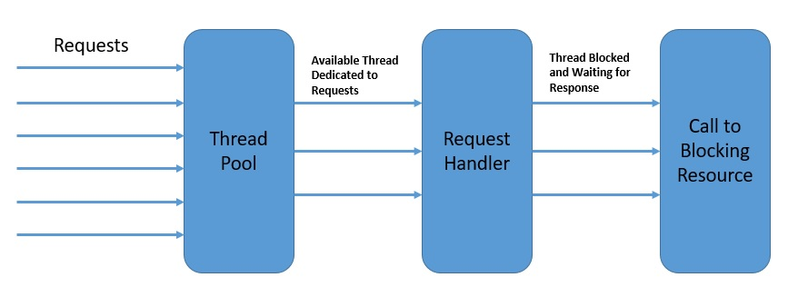

    每个线程一次只处理一个请求。

    虽然基于线程的并发为我们解决了一部分问题，但它没有解决我们在单个线程中的大部分交互仍然是阻塞的问题。此外，我们在Java中用来实现并发的本地线程在上下文切换方面付出了巨大的代价。

    同时，随着Web应用程序面临越来越多的请求，每请求一个线程的模式开始不能满足人们的期望。

    因此，我们需要一个能够帮助我们以相对较少的线程数量处理越来越多的请求的并发模型。这就是采用[反应式编程](https://www.baeldung.com/java-reactive-systems)的主要动机之一。

3. 反应式编程中的并发性

    反应式编程帮助我们从数据流和通过数据流传播变化的角度来构造程序。在一个完全无阻塞的环境中，这可以使我们以更好的资源利用率实现更高的并发性。

    然而，反应式编程是否完全脱离了基于线程的并发性？虽然这是一个强有力的声明，但在使用线程实现并发方面，反应式编程肯定有一个非常不同的方法。因此，反应式编程带来的根本区别是异步性。

    换句话说，程序流从一连串的同步操作转变为一个异步的事件流。

    例如，在反应式模型下，当数据被获取时，对数据库的读取调用并不会阻塞调用线程。该调用立即返回一个其他人可以订阅的发布者。订阅者可以在事件发生后进行处理，甚至可以自己进一步产生事件。

    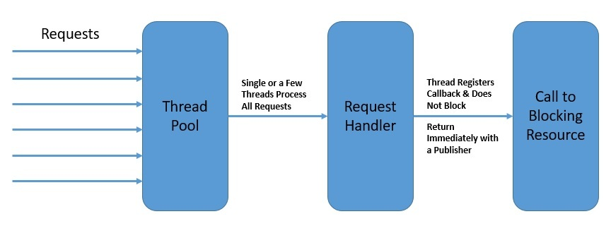

    最重要的是，反应式编程并不强调哪个线程的事件应该被生成和消费。相反，重点是将程序结构化为一个异步的事件流。

    这里的发布者和订阅者不需要是同一个线程的一部分。这有助于我们更好地利用可用的线程，从而实现更高的整体并发性。

4. 事件循环

    有几个编程模型描述了对并发性的反应式方法。

    在本节中，我们将研究其中的几个，以了解反应式编程如何用较少的线程实现更高的并发性。

    其中一个用于服务器的反应式异步编程模型是事件循环模型。

    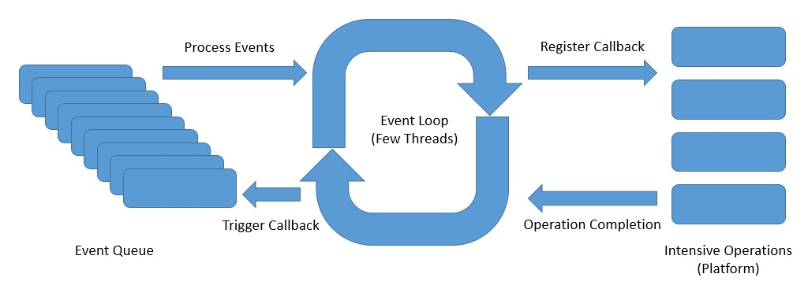

    上面是一个事件循环的抽象设计，展示了反应式异步编程的思想。

    - 事件循环在一个单线程中连续运行，尽管我们可以拥有与可用内核数量一样多的事件循环。
    - 事件循环按顺序处理来自事件队列的事件，并在向平台注册回调后立即返回。
    - 平台可以触发一个操作的完成，如数据库调用或外部服务调用。
    - 事件循环可以在操作完成的通知上触发回调，并将结果发回给原始调用者。

    事件循环模型在许多平台上实现，包括[Node.js](https://nodejs.org/en/)、[Netty](https://netty.io/)和[Ngnix](https://www.nginx.com/)。它们提供了比传统平台更好的可扩展性，如[Apache HTTP Server](https://httpd.apache.org/)、[Tomcat](https://www.baeldung.com/tomcat)或[JBoss](https://www.redhat.com/fr/technologies/jboss-middleware/application-platform)。

5. 使用Spring WebFlux的反应式编程

    现在我们对反应式编程及其并发模型有了足够的了解，可以在Spring WebFlux中探索这一主题。

    WebFlux是Spring的反应式堆栈网络框架，在5.0版本中被加入。

    让我们来探索Spring WebFlux的服务器端栈，以了解它是如何补充Spring的传统Web栈的。

    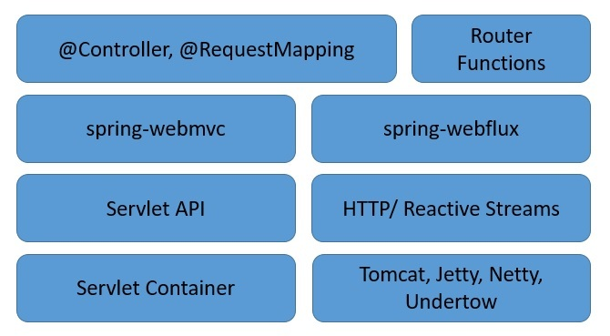

    我们可以看到，Spring WebFlux与Spring中的传统Web框架是平行的，不一定会取代它。

    这里有几个重要的点需要注意。

    - Spring WebFlux用功能路由扩展了传统的基于注解的编程模型。
    - 此外，它将底层的HTTP运行时与Reactive Streams API相适应，使运行时可以互操作。
    - 它能够支持各种反应式运行时，包括Tomcat、Reactor、Netty或[Undertow](https://www.baeldung.com/jboss-undertow)等Servlet 3.1+容器。

    最后，它包括WebClient，一个为HTTP请求提供功能和流畅的API的反应式和非阻塞式客户端。

6. 支持运行时中的线程模型

    正如我们前面所讨论的，反应式程序往往只使用少数线程并充分利用它们。然而，线程的数量和性质取决于我们选择的实际反应流API运行时。

    为了澄清，SpringWebFlux可以通过HttpHandler提供的公共API来适应不同的运行时。这个API是一个简单的契约，只有一个方法提供了对不同服务器API的抽象，如Reactor Netty、Servlet 3.1 API或Undertow API。

    让我们来看看其中一些实现的线程模型。

    虽然Netty是WebFlux应用程序中的默认服务器，但只需声明正确的依赖关系即可切换到任何其他受支持的服务器：

    ```xml
    <dependency>
        <groupId>org.springframework.boot</groupId>
        <artifactId>spring-boot-starter-webflux</artifactId>
        <exclusions>
            <exclusion>
                <groupId>org.springframework.boot</groupId>
                <artifactId>spring-boot-starter-reactor-netty</artifactId>
            </exclusion>
        </exclusions>
    </dependency>
    <dependency>
        <groupId>org.springframework.boot</groupId>
        <artifactId>spring-boot-starter-tomcat</artifactId>
    </dependency>
    ```

    虽然可以通过多种方式观察在Java虚拟机中创建的线程，但只需从Thread类本身中提取它们是非常容易的：

    ```java
    Thread.getAllStackTraces()
    .keySet()
    .stream()
    .collect(Collectors.toList());
    ```

    1. 反应器网

        正如我们所说，Reactor Netty是Spring Boot WebFlux启动器中的默认嵌入式服务器。让我们看看Netty默认创建的线程。首先，我们不会添加任何其他依赖项或使用WebClient。因此，如果我们启动使用SpringBoot启动器创建的SpringWebFlux应用程序，我们可以看到它创建的一些默认线程：

        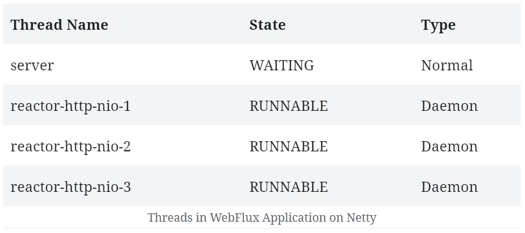

        请注意，除了服务器的正常线程之外，Netty还生成了一组用于请求处理的工作线程。这些通常是可用的CPU内核。这是四核机器的输出。我们还将看到JVM环境中典型的一堆内务线程，但它们在这里并不重要。

        Netty使用事件循环模型以反应式异步方式提供高度可扩展的并发。让我们看看Netty是如何利用Java NIO实现事件循环以提供这种可伸缩性的：

        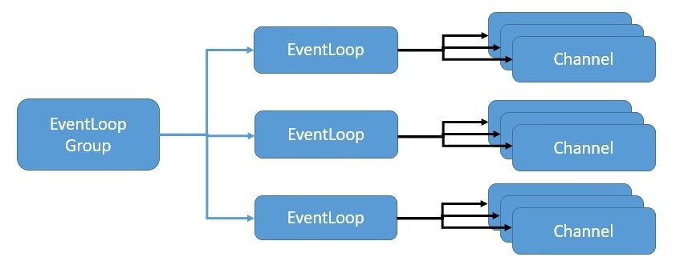

        这里，EventLoopGroup管理一个或多个EventLoop，它必须持续运行。因此，不建议创建比可用内核数量更多的EventLoops。

        EventLoopGroup还为每个新创建的频道分配一个EventLoop。因此，在通道的生命周期内，所有操作都由同一线程执行。

    2. Apache Tomcat

        传统的Servlet容器（如Apache Tomcat）也支持SpringWebFlux。

        WebFlux依赖于具有非阻塞I/O的Servlet 3.1 API。虽然它在低级适配器后面使用Servlet API，但Servlet API不能直接使用。

        让我们看看在Tomcat上运行的WebFlux应用程序中需要什么样的线程：

        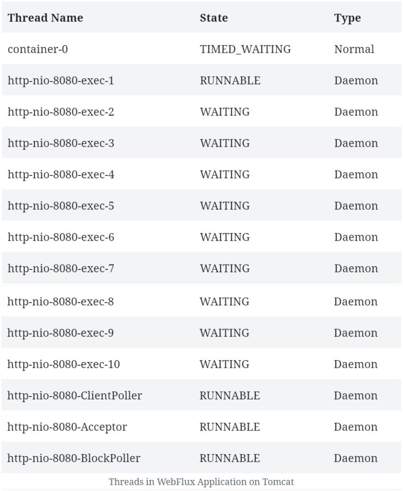

        我们在这里看到的线程的数量和类型与我们之前观察到的完全不同。

        首先，Tomcat从更多的工作线程开始，默认为10个。当然，我们还将看到JVM和Catalina容器的一些典型内务处理线程，在本次讨论中我们可以忽略这些线程。

        我们需要了解Tomcat与Java NIO的体系结构，以将其与上面看到的线程相关联。

        Tomcat 5及其以后版本在其连接器组件中支持NIO，该组件主要负责接收请求。

        另一个Tomcat组件是Container组件，它负责容器管理功能。

        这里我们感兴趣的是连接器组件实现的线程模型，以支持NIO。它由Acceptor、Poller和Worker组成，作为NioEndpoint模块的一部分：

        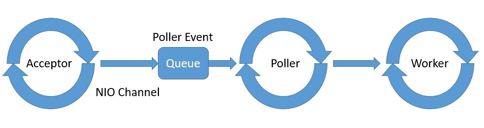

        Tomcat为Acceptor、Poller和Worker生成一个或多个线程，通常使用专用于Worker的线程池。

        虽然对Tomcat体系结构的详细讨论超出了本文的范围，但我们现在应该有足够的洞察力来理解前面看到的线程。

7. WebClient中的线程模型

    WebClient是Spring WebFlux的一部分，是反应式HTTP客户端。我们可以在需要基于REST的通信时使用它，这使我们能够创建端到端反应式的应用。

    正如我们之前所看到的，反应式应用程序只用几个线程来工作，所以应用程序的任何部分都没有余地来阻塞线程。因此，WebClient在帮助我们实现WebFlux的潜力方面起着至关重要的作用。

    1. 使用WebClient

        使用WebClient也很简单。我们不需要包含任何特定的依赖性，因为它是Spring WebFlux的一部分。

        让我们创建一个简单的REST端点，返回一个[Mono](https://www.baeldung.com/java-string-from-mono)。

        ```java
        @GetMapping("/index")
        public Mono<String> getIndex() {
            return Mono.just("Hello World!");
        }
        ```

        然后我们将使用WebClient来调用这个REST端点，并反应性地消耗数据。

        ```java
        WebClient.create("http://localhost:8080/index").get()
        .retrieve()
        .bodyToMono(String.class)
        .doOnNext(s -> printThreads());
        ```

        这里我们也在打印使用我们前面讨论的方法创建的线程。

    2. 了解线程模型

        那么，线程模型在WebClient中是如何工作的呢？

        嗯，毫不奇怪，WebClient也是使用事件循环模型来实现并发的。当然，它依赖于底层运行时来提供必要的基础设施。

        如果我们在Reactor Netty上运行WebClient，它就会共享Netty用于服务器的事件循环。因此，在这种情况下，我们可能不会注意到所创建的线程有什么不同。

        然而，WebClient也支持Servlet 3.1+容器，如Jetty，但它的工作方式是不同的。

        如果我们比较一下运行[Jetty](https://www.eclipse.org/jetty/)的WebFlux应用程序在有无WebClient的情况下所创建的线程，我们会发现有一些额外的线程。

        在这里，WebClient必须创建其事件循环。所以我们可以看到这个事件循环所创建的处理线程的固定数量。

        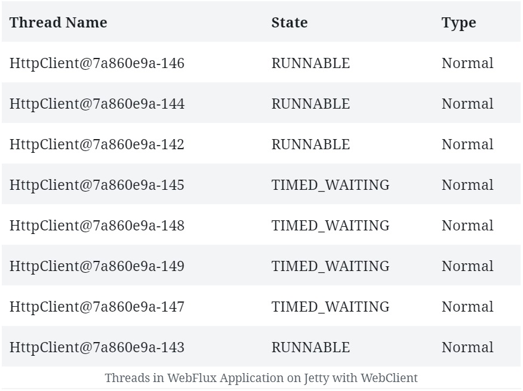

        在某些情况下，为客户端和服务器设置一个单独的线程池可以提供更好的性能。虽然这不是Netty的默认行为，但如果需要，总是可以为WebClient声明一个专用的线程池。

        我们将在后面的章节中看到这是如何做到的。

8. 数据访问库的线程模型

    正如我们前面所看到的，即使是一个简单的应用程序，通常也由几个需要连接的部分组成。

    这些部分的典型例子包括数据库和消息代理。现有的与其中许多部分连接的库仍然是阻塞式的，但这正在迅速改变。

    现在有几个数据库提供了用于连接的反应式库。这些库中有许多在[Spring Data](https://www.baeldung.com/spring-data)中可用，而我们也可以直接使用其他库。

    这些库使用的线程模型是我们特别感兴趣的。

    1. Spring Data MongoDB

        [Spring Data MongoDB](https://www.baeldung.com/spring-data-mongodb-tutorial)为建立在[MongoDB Reactive Streams驱动](https://mongodb.github.io/mongo-java-driver/)之上的MongoDB提供反应式存储库支持。最值得注意的是，该驱动完全实现了Reactive Streams API，以提供具有非阻塞反压的异步流处理。

        在Spring Boot应用程序中设置对MongoDB的反应式存储库的支持，就像添加一个依赖项一样简单。

        org.springframework.boot.spring-boot-starter-data-mongodb-reactive

        这将允许我们创建一个存储库，并使用它以非阻塞的方式对MongoDB进行一些基本操作。

        ```java
        public interface PersonRepository extends ReactiveMongoRepository<Person, ObjectId> {
        }
        .....
        personRepository.findAll().doOnComplete(this::printThreads);
        ```

        那么，当我们在Netty服务器上运行这个应用程序时，我们可以期待看到什么样的线程呢？

        毫不奇怪，我们不会看到太大的区别，因为Spring Data的反应式仓库利用了服务器上的相同事件循环。

    2. 反应式Kafka

        Spring仍在建立对反应式Kafka的全面支持。然而，我们确实有Spring之外的选择。

        [Reactor Kafka](https://projectreactor.io/docs/kafka/release/reference/#_introduction)是一个基于Reactor的Kafka反应式API。Reactor Kafka使消息能够使用功能性API进行发布和消费，也可以使用非阻塞式的反压。

        首先，我们需要在我们的应用程序中添加所需的依赖性，以开始使用Reactor Kafka。

        io.projectreactor.kafka.reactor-kafka.1.3.10

        这应该能让我们以非阻塞的方式向Kafka生产消息。

        ```java
        // producerProps: Map of Standard Kafka Producer Configurations
        SenderOptions<Integer, String> senderOptions = SenderOptions.create(producerProps);
        KafkaSender<Integer, String> sender =  KafkaSender.create(senderOptions);
        Flux<SenderRecord<Integer, String, Integer>> outboundFlux = Flux
        .range(1, 10)
        .map(i -> SenderRecord.create(new ProducerRecord<>("reactive-test", i, "Message_" + i), i));
        sender.send(outboundFlux).subscribe();
        ```

        同样地，我们应该能够从Kafka中消费消息，也是以非阻塞的方式。

        ```java
        // consumerProps: Map of Standard Kafka Consumer Configurations
        ReceiverOptions<Integer, String> receiverOptions = ReceiverOptions.create(consumerProps);
        receiverOptions.subscription(Collections.singleton("reactive-test"));
        KafkaReceiver<Integer, String> receiver = KafkaReceiver.create(receiverOptions);
        Flux<ReceiverRecord<Integer, String>> inboundFlux = receiver.receive();
        inboundFlux.doOnComplete(this::printThreads)
        ```

        这是很简单的，不言自明的。

        我们在Kafka中订阅了一个主题reactive-test，并获得了一个Flux的消息。

        对我们来说，有趣的事情是被创建的线程。

        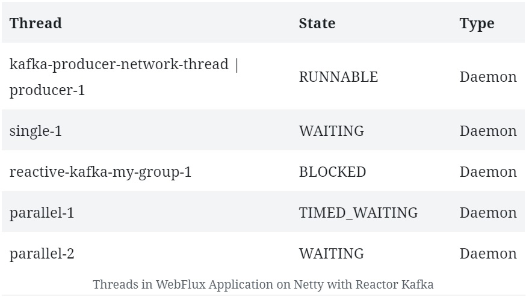

        我们可以看到有几个线程并不是Netty服务器的典型。

        这表明Reactor Kafka管理着自己的线程池，有几个工作线程专门参与Kafka消息处理。当然，我们会看到一堆与Netty和JVM有关的其他线程，我们可以忽略不计。

        Kafka生产者使用一个单独的网络线程来向代理发送请求。此外，他们在一个单线程的池化调度器上向应用程序交付响应。

        另一方面，Kafka消费者，每个消费者组有一个线程，用于阻塞监听传入的消息。然后，传入的消息被安排在不同的线程池上进行处理。

9. WebFlux中的调度选项

    到目前为止，我们已经看到，在只有几个线程的完全无阻塞的环境中，反应式编程确实大放异彩。但这也意味着，如果确实有一个部分是阻塞的，它将导致性能大大降低。这是因为一个阻塞的操作会完全冻结事件循环。

    那么，我们如何在反应式编程中处理长期运行的进程或阻塞操作？

    老实说，最好的选择是直接避免它们。然而，这可能并不总是可能的，我们可能需要一个专门的调度策略来处理我们应用程序的这些部分。

    Spring WebFlux提供了一种机制，在数据流链之间将处理切换到不同的线程池。这可以为我们提供对某些任务所需的调度策略的精确控制。当然，WebFlux能够提供这一点是基于底层反应式库中的线程池抽象，即所谓的调度器。

    1. 反应器

        在[Reactor](https://projectreactor.io/)中，Scheduler类定义了执行模型，以及执行发生的地方。

        [Schedulers](https://projectreactor.io/docs/core/release/api/reactor/core/scheduler/Schedulers.html)类提供了许多执行上下文，如即时、单一、弹性和并行。这些都提供了不同类型的线程池，这对不同的工作是很有用的。此外，我们总是可以用一个预先存在的[ExecutorService](https://docs.oracle.com/en/java/javase/11/docs/api/java.base/java/util/concurrent/ExecutorService.html)来创建我们自己的Scheduler。

        虽然Scheduler给了我们几个执行上下文，但Reactor也为我们提供了不同的方式来切换执行上下文。这些方法是publishOn和subscribeOn。

        我们可以在链中的任何地方与一个Scheduler一起使用publishOn，该Scheduler会影响所有后续的操作者。

        虽然我们也可以在链中的任何地方与一个Scheduler一起使用subscribeOn，但它只会影响排放源的上下文。

        如果我们记得，Netty上的WebClient共享为服务器创建的相同的事件循环作为默认行为。然而，我们可能有合理的理由为WebClient创建一个专门的线程池。

        让我们看看如何在Reactor中实现这一点，它是WebFlux中默认的反应式库。

        ```java
        Scheduler scheduler = Schedulers.newBoundedElastic(5, 10, "MyThreadGroup");
        WebClient.create("http://localhost:8080/index").get()
        .retrieve()
        .bodyToMono(String.class)
        .publishOn(scheduler)
        .doOnNext(s -> printThreads());
        ```

        早些时候，我们没有观察到有无WebClient在Netty上创建的线程有什么不同。但是，如果我们现在运行上面的代码，我们会观察到有一些新的线程被创建。

        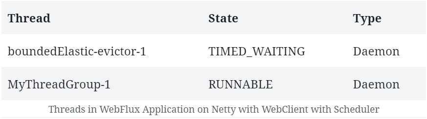

        在这里，我们可以看到创建的线程是我们有边界的弹性线程池的一部分。一旦订阅，WebClient的响应就会在这里发布。

        这使得主线程池可以处理服务器的请求。

    2. RxJava

        [RxJava](https://github.com/ReactiveX/RxJava)中的默认行为与Reactor中的行为没有太大区别。

        观察者（Observable）以及我们应用于它的操作链，在调用订阅的同一线程上完成它们的工作并通知观察者。另外，RxJava和Reactor一样，提供了将前缀或自定义调度策略引入链中的方法。

        RxJava还具有一个Schedulers类，它为[Observable](http://reactivex.io/RxJava/javadoc/io/reactivex/Observable.html)链提供了许多执行模型。其中包括新线程、即时、蹦床、io、计算和测试。当然，它也允许我们从一个Java Executor中定义一个Scheduler。

        此外，RxJava还提供了两个扩展方法来实现这一点，即subscribeOn和observeOn。

        subscribeOn方法通过指定Observable应该操作的不同Scheduler来改变默认行为。另一方面，observeOn方法指定了一个不同的Scheduler，Observable可以用它来向观察者发送通知。

        正如我们之前讨论的，Spring WebFlux默认使用Reactor作为其反应式库。但由于它与Reactive Streams API完全兼容，所以可以切换到另一个Reactive Streams实现，比如RxJava（用于RxJava 1.x及其Reactive Streams适配器）。

        我们需要明确地添加该依赖性。

        io.reactivex.rxjava2.rxjava.2.2.21

        然后我们可以开始在我们的应用程序中使用RxJava类型，如Observable，以及RxJava特定的Schedulers。

        ```java
        io.reactivex.Observable
        .fromIterable(Arrays.asList("Tom", "Sawyer"))
        .map(s -> s.toUpperCase())
        .observeOn(io.reactivex.schedulers.Schedulers.trampoline())
        .doOnComplete(this::printThreads);
        ```

        因此，如果我们运行这个应用程序，除了常规的Netty和JVM相关的线程外，我们应该看到一些与我们的RxJava Scheduler相关的线程。

        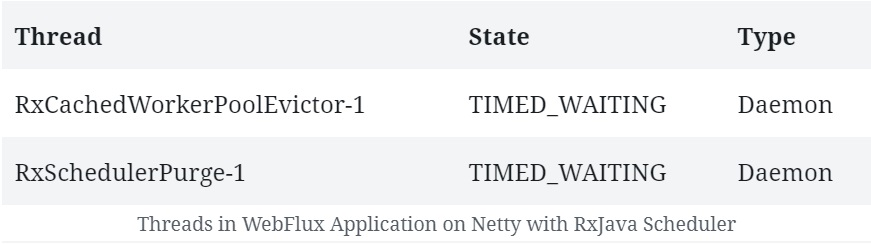

10. 总结

    在这篇文章中，我们从并发性的角度探讨了反应式编程的前提。我们观察了传统编程和反应式编程中并发模型的差异。这使我们能够研究Spring WebFlux中的并发模型，以及它采取的线程模型来实现它。

    然后我们探索了WebFlux中的线程模型与不同的HTTP运行时和反应式库的结合。我们还了解了当我们使用WebClient与数据访问库时，线程模型有什么不同。

    最后，我们谈到了在WebFlux中控制我们的反应式程序的调度策略的选项。

## Relevant articles

- [x] [Intro To Reactor Core](https://www.baeldung.com/reactor-core)
- [x] [Debugging Reactive Streams in Java](https://www.baeldung.com/spring-debugging-reactive-streams)
- [x] [Guide to Spring 5 WebFlux](https://www.baeldung.com/spring-webflux)
- [x] [Introduction to the Functional Web Framework in Spring 5](https://www.baeldung.com/spring-5-functional-web)
- [x] [Spring 5 WebClient](https://www.baeldung.com/spring-5-webclient)
- [x] [Spring WebClient vs. RestTemplate](https://www.baeldung.com/spring-webclient-resttemplate)
- [x] [Spring WebClient Requests with Parameters](https://www.baeldung.com/webflux-webclient-parameters)
- [x] [Handling Errors in Spring WebFlux](https://www.baeldung.com/spring-webflux-errors)
- [x] [Spring Security 5 for Reactive Applications](https://www.baeldung.com/spring-security-5-reactive)
- [x] [Concurrency in Spring WebFlux](https://www.baeldung.com/spring-webflux-concurrency)
