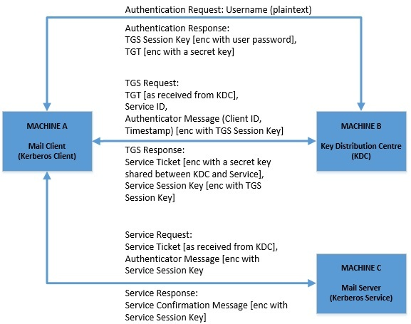
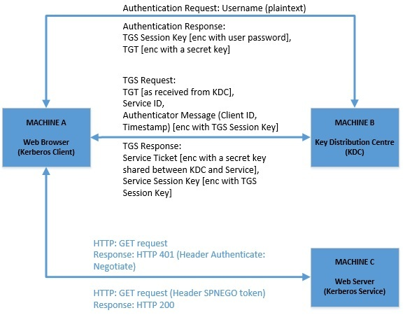

# Kerberos

## Spring Security Kerberos与MiniKdc的集成

1. 概述

    在本教程中，我们将提供Spring Security Kerberos的概述。

    我们将用Java编写一个Kerberos客户端，授权自己访问我们的Kerberized服务。我们将运行我们自己的嵌入式密钥分发中心来执行完整的、端到端的Kerberos认证。所有这些，由于[Spring Security Kerberos](https://docs.spring.io/spring-security-kerberos/docs/1.0.1.RELEASE/reference/htmlsingle/)的存在，无需任何外部基础设施。

2. Kerberos 和它的好处

    Kerberos 是麻省理工学院在 20 世纪 80 年代创建的一个网络认证协议，特别适用于网络上的集中认证。

    1987年，麻省理工学院将其发布到[开源社区](https://github.com/krb5/krb5)，目前仍在积极开发中。2005年，它在[RFC 4120](https://tools.ietf.org/html/rfc4120)中被定为IETF标准。

    通常，Kerberos被用于企业环境中。 在那里，它以这样一种方式来保证环境的安全，即用户不需要分别对每个服务进行认证。这种架构解决方案被称为单点登录。

    简单地说，Kerberos是一个票证系统。用户只需认证一次，就可以收到一张赠票（Ticket-granting Ticket，TGT）。然后，网络基础设施将该TGT交换为服务票。这些服务票允许用户与基础设施服务互动，只要TGT有效，通常是几个小时。

    因此，用户只需登录一次就很好。但也有一个安全方面的好处。在这种环境下，用户的密码永远不会通过网络发送。相反，Kerberos把它作为一个因素来生成另一个秘密密钥，这个密钥将被用于信息加密和解密。

    另一个好处是，我们可以从一个中央地方管理用户，比如说由LDAP支持的地方。因此，如果我们在集中式数据库中禁用某个用户的账户，那么我们就会撤销他在我们基础设施中的访问权限。因此，管理员不需要在每个服务中分别撤销访问权。

    [Spring中的SPNEGO/Kerberos](https://www.baeldung.com/spring-security-kerberos)认证介绍提供了该技术的深入概述。

3. Kerberized环境

    那么，让我们创建一个用Kerberos协议进行认证的环境。这个环境将由三个独立的应用程序组成，它们将同时运行。

    首先，我们将有一个密钥分配中心，它将作为认证点。接下来，我们将编写一个客户端和一个服务应用程序，并将其配置为使用 Kerberos 协议。

    现在，运行Kerberos需要进行一些安装和配置。然而，我们将利用Spring Security Kerberos，所以我们将以编程方式，在嵌入式模式下运行密钥分发中心。另外，下面显示的 MiniKdc 在与 Kerberized 基础设施进行集成测试的情况下很有用。

    1. 运行一个密钥分配中心

        首先，我们将启动我们的密钥分发中心，它将为我们发布TGTs。

        参见：kerberos.kdc/KerberosMiniKdc.java

        > 重要：其中 KRB_WORK_DIR 参数是所有配置文件的基本路径，要全工具统一。

        ```java
        String[] config = MiniKdcConfigBuilder.builder()
            .workDir(prepareWorkDir())
            .principals("client/localhost", "HTTP/localhost")
            .confDir("minikdc-krb5.conf")
            .keytabName("example.keytab")
            .build();
        MiniKdc.main(config);
        ```

        基本上，我们已经给了 MiniKdc 一组原则和一个配置文件；此外，我们还告诉 MiniKdc 它所生成的 [keytab](https://web.mit.edu/kerberos/krb5-devel/doc/basic/keytab_def.html) 应该怎么称呼。

        MiniKdc 将生成一个 [krb5.conf](https://web.mit.edu/kerberos/krb5-1.12/doc/admin/conf_files/krb5_conf.html) 文件，我们将把它提供给我们的客户端和服务应用程序。这个文件包含了如何找到我们的 KDC 的信息 -- 一个特定领域的主机和端口。

        MiniKdc.main 启动 KDC， 其输出结果应类似于

        ```log
        Standalone MiniKdc Running
        ---------------------------------------------------
        Realm           : EXAMPLE.COM
        Running at      : localhost:localhost
        krb5conf        : .\spring-security-sso\spring-security-sso-kerberos\krb-test-workdir\krb5.conf

        created keytab  : .\spring-security-sso\spring-security-sso-kerberos\krb-test-workdir\example.keytab
        with principals : [client/localhost, HTTP/localhost]
        ```

    2. 客户端应用程序

        我们的客户端将是一个Spring Boot应用程序，它使用RestTemplate对外部的REST API进行调用。

        但是，我们将使用KerberosRestTemplate来代替。它将需要keytab和客户的委托人。

        参见：kerberos.client.config/KerberosConfig.java

        就这样了! KerberosRestTemplate为我们协商了Kerberos协议的客户端。

        因此，让我们创建一个快速类，从Kerberized服务中查询一些数据，这些服务托管在端点app.access-url。

        参见：kerberos.client/SampleClient.java

        所以，让我们现在就创建我们的服务应用程序，这样这个类就有东西可以调用了!

    3. 服务应用

        我们将使用Spring Security，用适当的Kerberos专用豆来配置它。

        另外，请注意，该服务也将有它的本金并使用keytab。

        参见：com.baeldung.intro.config/WebSecurityConfig.java

        ```java
        @Configuration
        @EnableWebSecurity
        public class WebSecurityConfig extends AbstractHttpConfigurer<WebSecurityConfig, HttpSecurity> {

            @Value("${app.service-principal}")
            private String servicePrincipal;

            @Value("${app.keytab-location}")
            private String keytabLocation;

            public static WebSecurityConfig securityConfig() {
                return new WebSecurityConfig();
            }

            @Override
            public void configure(HttpSecurity http) throws Exception {
                AuthenticationManager authenticationManager = 
                http.getSharedObject(AuthenticationManager.class);
                http.addFilterBefore(spnegoAuthenticationProcessingFilter(authenticationManager),
                BasicAuthenticationFilter.class);
            }

            @Bean
            public SecurityFilterChain filterChain(HttpSecurity http) throws Exception {
                http.exceptionHandling()
                    .authenticationEntryPoint(spnegoEntryPoint())
                    .and()
                    .authorizeRequests()
                    .antMatchers("/", "/home")
                    .permitAll()
                    .anyRequest()
                    .authenticated()
                    .and()
                    .formLogin()
                    .loginPage("/login")
                    .permitAll()
                    .and()
                    .logout()
                    .permitAll()
                    .and()
                    .apply(securityConfig());
                return http.build();
            }

            @Bean
            public AuthenticationManager authManager(HttpSecurity http) throws Exception {
                return http.getSharedObject(AuthenticationManagerBuilder.class)
                    .authenticationProvider(kerberosAuthenticationProvider())
                    .authenticationProvider(kerberosServiceAuthenticationProvider())
                    .build();
            }

            @Bean
            public KerberosAuthenticationProvider kerberosAuthenticationProvider() {
                KerberosAuthenticationProvider provider = new KerberosAuthenticationProvider();
                // provider configuration
                return provider;
            }

            @Bean
            public SpnegoEntryPoint spnegoEntryPoint() {
                return new SpnegoEntryPoint("/login");
            }

            @Bean
            public SpnegoAuthenticationProcessingFilter spnegoAuthenticationProcessingFilter(
                AuthenticationManager authenticationManager) {
                SpnegoAuthenticationProcessingFilter filter = new SpnegoAuthenticationProcessingFilter();
                // filter configuration
                return filter;
            }

            @Bean
            public KerberosServiceAuthenticationProvider kerberosServiceAuthenticationProvider() {
                KerberosServiceAuthenticationProvider provider = new KerberosServiceAuthenticationProvider();
                // auth provider configuration 
                return provider;
            }

            @Bean
            public SunJaasKerberosTicketValidator sunJaasKerberosTicketValidator() {
                SunJaasKerberosTicketValidator ticketValidator = new SunJaasKerberosTicketValidator();
                // validator configuration
                return ticketValidator;
            }

        }
        ```

        介绍文章中包含了以上所有的实现，所以为了简洁起见，我们在这里省略了全部方法。

        请注意，我们已经将Spring Security配置为[SPNEGO认证](https://tools.ietf.org/html/rfc4559)。这样，我们就可以通过HTTP协议进行认证，尽管我们也可以用[核心Java实现SPNEGO认证](https://docs.oracle.com/en/java/javase/11/security/part-vi-http-spnego-authentication.html)。

4. 测试

    现在，我们将运行一个集成测试，以显示我们的客户端通过Kerberos协议成功地从外部服务器检索数据。为了运行这个测试，我们需要运行我们的基础设施，所以MiniKdc和我们的服务应用程序都必须被启动。

    1. Run KerberosMiniKdc.java
    2. Run KerberizedServerApp.java

        ```log
        Error: Caused by: java.lang.IllegalArgumentException: KrbException: Cannot locate default realm
        at javax.security.auth.kerberos.KerberosPrincipal.(KerberosPrincipal.java:159)
        at javax.security.auth.kerberos.KerberosPrincipal.(KerberosPrincipal.java:120)
        at org.springframework.security.kerberos.client.KerberosRestTemplate.doExecute(KerberosRestTemplate.java:182)
        ```

        macOS 运行时 krb5.conf 读取失败。

        krb5.conf 实际路径：`.\\spring-security-sso\\spring-security-sso-kerberos\\krb-test-workdir\krb5.conf`

        KerberizedServerApp.java 中 `Paths.get(".\\spring-security-sso\\spring-security-sso-kerberos\\krb-test-workdir\\krb5.conf")` 配置错误，改为 `.../krb5.conf` 即可。

    3. Run SampleClientManualTest.java

        使用客户端程序中的SampleClient来向我们的服务程序发出请求。让我们来测试一下。

        SampleClientManualTest.givenKerberizedRestTemplate_whenServiceCall_thenSuccess()

        注意，我们也可以通过在没有KerberizedRestTemplate的情况下点击服务来证明它的重要性。

        SampleClientManualTest.givenRestTemplate_whenServiceCall_thenFail()

        顺便提一下，我们的第二个测试有可能重新使用已经存储在[凭证缓存](https://web.mit.edu/kerberos/krb5-1.12/doc/basic/ccache_def.html)中的票据。这将发生在HttpUrlConnection中使用的自动SPNEGO协商上。

        结果，数据可能真的返回，使我们的测试无效。那么，根据我们的需要，我们可以通过系统属性http.use.global.creds=false来禁止使用票据缓存。

        ```log
        org.springframework.web.client.RestClientException: Error running rest call; nested exception is javax.security.auth.login.LoginException: Unable to obtain password from user

        Debug is  true storeKey true useTicketCache false useKeyTab true doNotPrompt true ticketCache is null isInitiator false KeyTab is /Users/wangkan/git/spring-tutorials-cn/spring-security-modules/spring-security-oauth2-sso/spring-security-sso-kerberos%5Ckrb-test-workdir%5Cexample.keytab refreshKrb5Config is false principal is HTTP/localhost tryFirstPass is false useFirstPass is false storePass is false clearPass is false
        principal is HTTP/localhost@EXAMPLE.COM
        Will use keytab
        Commit Succeeded 
        ```

        macOS 运行时 example.keytab 读取失败。

        example.keytab 实际路径：`@project.basedir@/.\spring-security-sso\spring-security-sso-kerberos\krb-test-workdir/example.keytab`

        application.properties 中 `app.keytab-location=@project.basedir@\\krb-test-workdir\\example.keytab` 配置错误，改为 `=@project.basedir@.\\spring-security-sso\\spring-security-sso-kerberos\\krb-test-workdir/example.keytab` 即可。

        ```log
        2023-02-26 11:19:49.911  WARN 86203 --- [nio-8080-exec-2] w.a.SpnegoAuthenticationProcessingFilter : Negotiate Header was invalid: Negotiate YIICMgYGKwYBBQUCoIICJjCCAiKgDTALBgkqhkiG9xIBAgKhBAMCAXaiggIJBIICBWCCAgEGCSqGSIb3EgECAgEAboIB8DCCAeygAwIBBaEDAgEOogcDBQAgAAAAo4IBCGGCAQQwggEAoAMCAQWhDRsLRVhBTVBMRS5DT02iHDAaoAMCAQChEzARGwRIVFRQGwlsb2NhbGhvc3SjgcswgcigAwIBEaKBwASBvaUXXmNysy8z1uIBgAW263yaqRPu1aXDqXBvC4e5DDUAiAxBlCXpfjv7kvyNxoUOsLVx4zKbJ68evFzdmG5BIezyBQ3FBNsoHxJPwdCKAs26AFlRsk+GHfLz2rOP0zGHj7kchHbCeS5FqkpRypteNNbyr2Xj/tf86tesIkn+/yV4oXfMcTK3VP+zebQzJ8uzK1z59o/yBqHjR65VP4GYfZaTsu3zEk7K9wWqmHvqRe5LTsx/MAdVvuL04a5L5KSByjCBx6ADAgERooG/BIG8DhfHXW7XOI9uEN8YBI+jtfZG14RX5xyTrHwVWDpS6lRCtJAZe74CfxHf7Sg+HHWbr35pQZejFvp3Tr8tGhE22OGgHKPB20NYhwacwCuAydTbyVU2wieyQrV9yGNHhbknIdI9Ht6UgMrKuY4xIOaHM/mCuCkiqGBREcFCkbyxlzlQmzH6upDG8M+/1sG4jKbQW6dHYui9YT+iTfFSssAh8YJLowZbMInZQgy9XphEsKFMvyfRHDbmPDqb1ZM=

        org.springframework.security.authentication.ProviderNotFoundException: No AuthenticationProvider found for org.springframework.security.kerberos.authentication.KerberosServiceRequestToken
        ```

        - [ ] Negotiate Header was invalid

5. 总结

    在本教程中，我们探讨了用于集中式用户管理的Kerberos以及Spring Security如何支持Kerberos协议和SPNEGO认证机制。

    我们使用 MiniKdc 建立了一个嵌入式的 KDC， 并创建了一个非常简单的 Kerberized 客户端和服务器。这个设置对于探索来说很方便，尤其是当我们创建一个集成测试来测试东西的时候。

    现在，我们只是触及了表面。要想深入了解，请查看 Kerberos [维基页面](https://en.wikipedia.org/wiki/Kerberos_(protocol))或[其RFC](https://tools.ietf.org/html/rfc4120)。另外，[官方的文档](https://web.mit.edu/kerberos/krb5-latest/doc/)页面也会很有用。除此之外，要想知道这些事情如何在核心java中完成，下面这个[Oracle的教程](https://docs.oracle.com/en/java/javase/11/security/advanced-security-programming-java-se-authentication-secure-communication-and-single-sign1.html)详细地展示了它。

## Spring中的SPNEGO/Kerberos认证介绍

1. 概述

    在本教程中，我们将了解Kerberos认证协议的基础知识。我们还将介绍与Kerberos有关的[SPNEGO](https://tools.ietf.org/html/rfc4178)的必要性。

    最后，我们将看到如何利用[Spring Security Kerberos](https://spring.io/projects/spring-security-kerberos)扩展来创建通过SPNEGO启用Kerberos的应用程序。

    在我们继续之前，值得注意的是，本教程将为那些不熟悉这一领域的人介绍许多新术语。因此，我们将在前面花一些时间来介绍一下。

2. 了解Kerberos

    [Kerberos](https://web.mit.edu/kerberos/)是麻省理工学院（MIT）在80年代初开发的一个网络认证协议。正如你可能意识到的那样，这相对来说是比较古老的，而且经受住了时间的考验。Windows服务器广泛支持Kerberos作为一种认证机制，甚至将其作为默认的认证选项。

    从技术上讲，Kerberos是一个基于票据的认证协议，它允许计算机网络中的节点相互识别。

    1. Kerberos的简单用例

        让我们拟定一个假想的情况来证明这一点。

        假设一个用户，通过他的机器上的邮件客户端，需要从同一网络上的另一台机器上的邮件服务器上提取他的邮件。这里显然需要进行认证。邮件客户端和邮件服务器必须能够识别和信任对方，以便他们能够安全地通信。

        Kerberos 在这里如何帮助我们？Kerberos 引入了一个叫做密钥分发中心 Key Distribution Centre (KDC) 的第三方，它与网络中的每个节点相互信任。让我们看看这在我们的案例中是如何工作的。

        

    2. Kerberos 协议的主要方面

        虽然这听起来很深奥，但在保证不安全的网络上的通信安全方面，这是相当简单和有创造性的。这里提出的一些问题在TLS遍地开花的时代是相当理所当然的!

        虽然这里不可能对 Kerberos 协议进行详细的讨论，但让我们来看看一些突出的方面。

        - 节点(客户端和服务器)和 KDC 之间的信任被假定存在于同一领域(realm)中
        - 密码不会在网络上被交换
        - 客户端和服务器之间的信任是基于这样一个事实，即他们可以用只与KDC共享的密钥解密信息
        - 客户端和服务器之间的信任是相互的
        - 客户端可以缓存票据以重复使用，直到到期，提供单点登录体验
        - 认证器信息是基于时间戳的，因此只适合于一次性使用。
        - 这里的三方都必须有一个相对同步的时间

        虽然这只是触及了这个美丽的认证协议的表面，但它足以让我们的教程进行下去。

3. 了解SPNEGO

    SPNEGO代表简单和受保护的GSS-API协商机制 [Simple and Protected GSS-API Negotiation Mechanism](https://tools.ietf.org/html/rfc4178)。这是个很好的名字! 让我们先看看GSS-API代表什么。通用安全服务应用程序接口 [Generic Security Service Application Program Interface （GSS-API）](https://tools.ietf.org/html/rfc2743) 只不过是一个IETF标准，用于客户端和服务器以安全的、与厂商无关的方式进行通信。

    SPNEGO是GSS-API的一部分，用于客户端和服务器协商选择使用的安全机制，例如，Kerberos或NTLM。

4. 为什么我们需要SPNEGO和Kerberos？

    正如我们在上一节中所看到的，Kerberos 是一个纯粹的网络认证协议，主要在传输层 (TCP/UDP) 运行。虽然这对许多用例来说是好的，但这并不符合现代网络的要求。如果我们有一个在更高的抽象上操作的应用程序，比如 HTTP，就不可能直接使用 Kerberos。

    这就是SPNEGO来帮助我们的地方。在网络应用程序的情况下，通信主要发生在像Chrome这样的网络浏览器和像Tomcat这样通过HTTP托管网络应用程序的网络服务器之间。如果启用，它们可以通过SPNEGO协商Kerberos作为一种安全机制，并通过HTTP交换票据作为SPNEGO令牌。

    那么，这如何改变我们前面提到的场景呢？让我们把简单的邮件客户端换成一个网络浏览器，把邮件服务器换成一个网络应用。

    

    所以，与我们之前的图相比，除了客户端和服务器之间的通信现在明确地通过HTTP发生之外，没有什么变化。让我们更好地理解这一点。

    - 客户机对KDC进行认证并缓存TGT
    - 客户机上的网络浏览器被配置为使用 SPNEGO 和 Kerberos
    - 网络应用程序也被配置为支持 SPNEGO 和 Kerberos
    - 网络应用程序向试图访问受保护资源的网络浏览器抛出一个 "协商 Negotiate" 挑战。
    - 服务票据被包装成SPNEGO令牌，并作为HTTP标头进行交换。

5. 要求

    在我们继续开发一个支持Kerberos认证模式的Web应用程序之前，我们必须收集一些基本的设置。让我们快速浏览一下这些任务。

    1. 设置 KDC

        建立一个用于生产的 Kerberos 环境已经超出了本教程的范围。不幸的是，这不是一项简单的任务，而且也很脆弱。有几种方法可以获得Kerberos的实现，包括开放源码和商业版本。

        - MIT使[Kerberos v5](http://web.mit.edu/Kerberos/dist/)的实现可用于多种操作系统
        - [Apache Kerby](https://directory.apache.org/kerby/) 是 Apache Directory 的一个扩展，它提供了一个 Java Kerberos 绑定。
        - 微软的 Windows Server 支持由 Active Directory 支持的 Kerberos v5。
        - Heimdel 有一个 [Kerberos v5](https://www.h5l.org/) 的实现。

        KDC 和相关基础设施的实际设置取决于供应商，并应遵循其各自的文档。然而，[Apache Kerby 可以在 Docker 容器中运行](https://coheigea.blogspot.com/2018/06/running-apache-kerby-kdc-in-docker.html)，这使得它不受平台限制。

    2. 在 KDC 中设置用户

        我们需要在 KDC 中设置两个用户 - 或者他们称之为 principals -。我们可以使用 "kadmin" 命令行工具来实现这一目的。假设我们在 KDC 数据库中创建了一个名为 "baeldung.com" 的领域，并以具有管理权限的用户登录到 "kadmin"。

        我们将创建我们的第一个用户，我们希望通过网络浏览器来验证他的身份，方法是。

        ```bash
        $ kadmin: addprinc -randkey kchandrakant -pw password
        Principal "kchandrakant@baeldung.com" created.
        ```

        我们还需要在 KDC 上注册我们的 web 应用程序。

        ```bash
        $ kadmin: addprinc -randkey HTTP/demo.kerberos.baeldung.com@baeldung.com -pw password
        Principal "HTTP/demo.kerberos.baeldung.com@baeldung.com" created.
        ```

        请注意这里命名委托人的惯例，因为这必须与网络浏览器可以访问的应用程序所在的域相匹配。当遇到 "Negotiate" 挑战时，网络浏览器会自动尝试用这个约定创建一个服务主名称（SPN）。

        我们还需要把它导出为一个keytab文件，使其对网络应用程序可用。

        `$ kadmin: ktadd -k baeldung.keytab HTTP/demo.kerberos.baeldung.com@baeldung.com`

        这将给我们一个名为 "baeldung.keytab" 的文件。

    3. 浏览器配置

        我们需要启用我们用来访问网络应用程序上受保护资源的网络浏览器的 "Negotiate" 认证方案。幸运的是，大多数现代网络浏览器，如Chrome，都默认支持 "Negotiate" 作为一种认证方案。

        此外，我们可以将浏览器配置为提供 "Integrated Authentication"。在这种模式下，当遇到 "Negotiate" 挑战时，浏览器会尝试利用主机中的缓存凭证，而这些凭证已经登录到了KDC主账户。不过，为了保持清晰的思路，我们在这里不使用这种模式。

    4. 域配置

        可以理解的是，我们可能没有实际的域来测试我们的 web 应用。但不幸的是，我们不能使用 localhost 或 127.0.0.1 或任何其他 IP 地址进行 Kerberos 认证。不过，有一个简单的解决办法，就是在 "hosts" 文件中设置一些条目，比如。

        `demo.kerberos.bealdung.com 127.0.0.1`

6. Spring来拯救我们!

    最后，由于我们已经清楚了基础知识，现在是测试理论的时候了。但是，创建一个支持SPNEGO和Kerberos的Web应用程序不是很麻烦吗？如果我们使用Spring就不会。Spring有一个Kerberos扩展，作为Spring Security的一部分，可以无缝地支持SPNEGO和Kerberos。

    我们所要做的几乎只是在Spring Security中进行配置，以启用带有Kerberos的SPNEGO。我们将在这里使用Java风格的配置，但XML配置也可以轻松设置。

    1. Maven依赖项

        我们首先要设置的是依赖项。

        参见 pom.xml ：spring-security-kerberos-web、spring-security-kerberos-client

    2. SPNEGO配置

        首先，SPNEGO作为HTTPSecurity的一个过滤器被集成到Spring Security中。

        ```java
        @Override
        public void configure(HttpSecurity http) throws Exception {
            AuthenticationManager authenticationManager = http.getSharedObject(AuthenticationManager.class);
            http.addFilterBefore(spnegoAuthenticationProcessingFilter(authenticationManager),
                BasicAuthenticationFilter.class);
        }
        ```

        这只显示了配置SPNEGO过滤器所需的部分，并不是一个完整的HTTPS安全配置，应该根据应用的安全要求进行配置。

        接下来，我们需要将SPNEGO过滤器作为Bean提供。

        ```java
        @Bean
        public SpnegoAuthenticationProcessingFilter spnegoAuthenticationProcessingFilter(
        AuthenticationManager authenticationManager) {
            SpnegoAuthenticationProcessingFilter filter = new SpnegoAuthenticationProcessingFilter();
            filter.setAuthenticationManager(authenticationManager);
            return filter;
        }
        ```

    3. Kerberos配置

        此外，我们可以通过在Spring Security的AuthenticationManagerBuilder中添加AuthenticationProvider来配置Kerberos。

        ```java
        @Bean
        public AuthenticationManager authManager(HttpSecurity http) throws Exception {
            return http.getSharedObject(AuthenticationManagerBuilder.class)
                .authenticationProvider(kerberosAuthenticationProvider())
                .authenticationProvider(kerberosServiceAuthenticationProvider())
                .build();
        }
        ```

        我们首先要提供的是一个KerberosAuthenticationProvider作为一个Bean。这是AuthenticationProvider的一个实现，在这里我们将SunJaasKerberosClient设置为KerberosClient。

        ```java
        @Bean
        public KerberosAuthenticationProvider kerberosAuthenticationProvider() {
            KerberosAuthenticationProvider provider = new KerberosAuthenticationProvider();
            SunJaasKerberosClient client = new SunJaasKerberosClient();
            provider.setKerberosClient(client);
            provider.setUserDetailsService(userDetailsService());
            return provider;
        }
        ```

        接下来，我们还必须提供一个KerberosServiceAuthenticationProvider作为一个Bean。这是验证Kerberos服务券或SPNEGO令牌的类。

        ```java
        @Bean
        public KerberosServiceAuthenticationProvider kerberosServiceAuthenticationProvider() {
            KerberosServiceAuthenticationProvider provider = new KerberosServiceAuthenticationProvider();
            provider.setTicketValidator(sunJaasKerberosTicketValidator());
            provider.setUserDetailsService(userDetailsService());
            return provider;
        }
        ```

        最后，我们需要提供一个SunJaasKerberosTicketValidator作为一个Bean。这是KerberosTicketValidator的一个实现，使用SUN JAAS登录模块。

        ```java
        @Bean
        public SunJaasKerberosTicketValidator sunJaasKerberosTicketValidator() {
            SunJaasKerberosTicketValidator ticketValidator = new SunJaasKerberosTicketValidator();
            ticketValidator.setServicePrincipal("HTTP/demo.kerberos.bealdung.com@baeldung.com");
            ticketValidator.setKeyTabLocation(new FileSystemResource("baeldung.keytab"));
            return ticketValidator;
        }
        ```

    4. 用户细节

        我们已经在前面的 AuthenticationProvider 中看到了对 UserDetailsService 的引用，那么我们为什么需要它呢？嗯，正如我们所了解的Kerberos，它纯粹是一种基于票据(ticket-based)的认证机制。

        所以，虽然它能够识别用户，但它并不提供与用户有关的其他细节，比如他们的授权。我们需要一个有效的UserDetailsService提供给我们的AuthenticationProvider来填补这个空白。

    5. 运行应用程序

        这几乎就是我们为SPNEGO启用Kerberos的Spring Security设置Web应用程序所需要的。当我们启动Web应用程序并访问其中的任何页面时，Web浏览器应该提示用户名和密码，用服务票准备一个SPNEGO令牌，并将其发送给应用程序。

        应用程序应该能够使用keytab文件中的凭证来处理它，并响应成功的认证。

        然而，正如我们前面所看到的，建立一个有效的Kerberos环境是很复杂的，也是很脆的。如果事情没有按预期进行，值得再次检查所有的步骤。一个简单的错误，如域名不匹配，就会导致失败，而且错误信息并不特别有用。

7. SPNEGO和Kerberos的实际使用

    现在我们已经看到了Kerberos认证是如何工作的，以及我们如何在Web应用程序中使用SPNEGO和Kerberos，我们可能会质疑它的必要性。虽然在企业网络中使用它作为SSO机制是完全合理的，但为什么我们要在Web应用中使用它呢？

    好吧，首先，即使过了这么多年，Kerberos仍然在企业应用中被非常积极地使用，尤其是基于Windows的应用。如果一个组织有几个内部和外部的网络应用，那么将相同的SSO基础设施扩展到所有的应用是有意义的。这使得一个组织的管理员和用户更容易通过不同的应用程序获得无缝体验。

8. 总结

    总而言之，在本教程中，我们了解了Kerberos认证协议的基本知识。我们还讨论了作为GSS-API一部分的SPNEGO，以及我们如何使用它来促进HTTP上的Web应用中基于Kerberos的认证。此外，我们还尝试建立了一个小型Web应用，利用Spring Security内置的对SPNEGO和Kerberos的支持。

    这个教程只是提供了一个快速的偷窥，让我们了解一个强大的、经过时间考验的认证机制。有相当丰富的信息可供我们学习，并有可能得到更多的赞赏。

## Relevant articles

- [x] [Spring Security Kerberos Integration With MiniKdc](https://www.baeldung.com/spring-security-kerberos-integration)
- [x] [Introduction to SPNEGO/Kerberos Authentication in Spring](https://www.baeldung.com/spring-security-kerberos)

## Code

一如既往，代码可以在[GitHub](https://github.com/eugenp/tutorials/tree/master/spring-security-modules/spring-security-oauth2-sso/spring-security-sso-kerberos)上找到。
